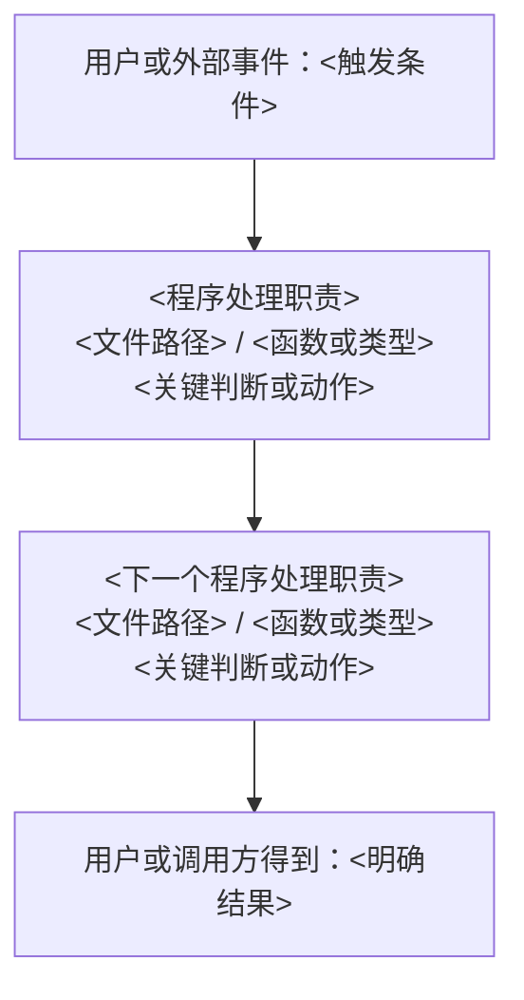

# 代码架构设计文档模板

本模板定义 `spec/architecture_code_design.md` 最终要写什么。文档面向当前和未来的项目维护者，必须说明整个项目的代码怎样落实已经确认的产品设计。

它不是文件目录清单，也不是只写模块名称的高层架构说明。读者看完后，应当能够回答：

1. 产品由哪些功能、场景、边界和规则组成。
2. 这些产品要求为什么需要当前的代码分层和模块。
3. 每个功能经过哪些代码环节完成。
4. 关键判断、状态写入、数据处理和异常返回具体发生在哪里。
5. 哪些测试或运行结果可以证明代码符合产品设计。

## 一、通用要求

### 1. 产品设计决定代码设计

- 代码设计中的每项内容，都必须能追溯到产品功能、产品通用规则或明确的系统约束。
- 先用人能直接理解的话说明产品要求，再给出产品文档链接作为依据。不要只写“某文件 > 某章节 > 某条”。
- 不要求产品历史背景逐项映射代码；只有真正影响代码的产品要求才需要映射。
- 每个产品功能必须指出参与实现的代码层、关键节点、文件、类、函数、类型和测试。
- 每个代码模块必须反向说明它负责哪些产品功能、规则或系统约束，不能出现无法说明用途的孤立模块。

### 2. 代码位置必须能定位

- 已有实现使用真实文件路径和真实符号名称。
- 计划实现使用准备采用的文件路径和符号名称，并明确标记“计划”。
- 出现英文文件名、类名、函数名、类型名或字段名时，紧接着说明它的中文职责。
- 不能只列 `start`、`status` 等名称。必须写清它位于哪个文件、是什么函数或类型、处理什么输入、执行哪些关键判断、调用什么以及产生什么结果。
- 只有文字和完整功能流程仍不能说明关键分支、状态迁移或接口约定时，才使用函数签名、伪代码、状态图或少量代码骨架；不复制大段生产代码代替设计说明。

### 3. 图必须先说明范围

- 架构图只表达代码分层、各层职责和依赖方向，不混入功能执行顺序。
- 功能流程图或时序图只表达一个明确功能或场景的完整实现过程。
- 功能图中的每个程序处理节点必须直接标出对应文件和符号，并写明该节点的关键处理。
- 复杂函数内部确有分支、循环、异步或状态迁移时，再单独画局部流程图、时序图或状态图。
- 不把整个项目架构、一个功能的执行过程和单个函数内部逻辑画在同一张图中。

### 4. 状态和异常写在发生的位置

- 不单独使用含义不明的“状态变化”字段。
- 在对应流程步骤中写清：哪一步读取什么状态，哪一步写入哪个文件、字段或存储，写入前后分别是什么。
- 在对应失败分支中写清：什么条件触发失败、代码在哪里判断、是否重试或回滚、最后向调用方或用户返回什么。
- 没有状态、数据或异常时写“暂无”，不得为了填满结构编造内容。

## 二、`spec/architecture_code_design.md` 模板

````markdown
# <产品名称> — 代码架构设计

## 1. 文档说明

### 1.1 文档目的

说明本文帮助维护者理解什么，以及本文描述的是计划设计、当前实现，还是经过测试和验收后的最终实现。

### 1.2 设计依据

列出本次代码设计使用的产品总说明和功能文档。先写产品要求，再把链接放在后面作为查证依据。

### 1.3 事实状态

从零设计时，明确哪些代码尚未实现。已有项目或最终更新时，说明关键结论分别经过运行、测试、代码、文档或用户中的哪种方式确认；仍未确认或存在冲突的内容也要列出。

## 2. 产品概览

用简短内容说明：

- 产品要解决什么问题。
- 产品包含哪些功能。
- 哪些产品通用规则会影响多个功能的代码。
- 产品明确不支持什么，并因此限制了哪些代码职责。

这里帮助读者理解后续架构，不重复整份产品文档。

## 3. 产品设计如何决定代码架构

说明产品设计中的功能、场景、边界、规则、使用过程和异常情况，分别对代码提出了什么要求，以及这些要求落在哪个代码层或架构关键节点。

| 已确认的产品要求 | 对代码提出的具体要求 | 承担该要求的代码层或关键节点 | 关联功能 |
|---|---|---|---|
| <用产品语言说明要求> | <代码必须具备什么职责、限制或处理> | <代码层或关键节点> | <功能名称> |

不能写“需要良好扩展性”“合理解耦”等无法判断的概括。要写清为什么必须分层、共享或限制依赖。

## 4. 代码架构分层

### 4.1 整体架构图

画一张只表示代码分层和依赖方向的架构图。每个层级节点至少标出：

- 该层承接的产品职责。
- 该层承担的代码职责。
- 关键目录、文件或模块。

箭头表示“谁依赖谁”或“谁可以调用谁”，并在图前写明本图使用的箭头含义。

### 4.2 <代码层名称>

对每一层分别说明：

- **承接的产品内容**：该层负责哪些产品功能、规则或系统约束。
- **代码职责**：该层具体完成什么，不完成什么。
- **代码位置**：关键目录、文件、类、函数、类型或接口，以及每个英文标识的中文含义。
- **对外约定**：调用方传入什么，得到什么，可能产生什么副作用或错误。
- **依赖关系**：该层调用哪些下层代码，哪些上层代码会调用它，为什么这样依赖。
- **关键逻辑**：维护者必须知道的判断、组合或数据处理；普通实现细节不逐行展开。
- **验证位置**：相关测试文件、测试用例或运行入口。

只有承担明确职责、有调用边界并被其他代码使用的部分，才作为架构级模块说明。不要按目录逐个抄写。

## 5. 架构关键节点

架构关键节点是多个功能共同经过，或者一旦行为改变就会影响产品规则、阶段推进、状态一致性或外部交互的代码位置。普通工具函数不必列入。

### 5.1 <关键节点名称>

- **为什么是关键节点**：它影响哪些产品行为，为什么维护者必须理解。
- **对应产品内容**：它落实的产品功能、通用规则或系统约束。
- **代码位置**：真实或计划的文件、类、函数、类型和接口。
- **上游**：谁在什么条件下调用它。
- **主要处理**：按实际顺序写清关键判断和调用。
- **下游**：它继续调用什么，或者把结果交给谁。
- **状态和数据**：在哪一步读取或写入什么，写入后的结果是什么。
- **失败结果**：什么情况下停止、重试、回滚或返回错误。
- **验证位置**：哪个测试或运行结果证明该节点符合产品要求。

## 6. 各产品功能的代码设计

本章按照产品功能组织，不按照代码目录组织。每个功能下面再按照产品文档中的场景说明完整实现过程。

### 6.1 【功能】<功能名称>

#### 6.1.1 产品要求

用直白话说明这个功能帮助谁在什么情况下完成什么事情，以及必须遵守哪些规则和边界。随后提供对应产品总说明或功能文档链接。

#### 6.1.2 场景：<场景名称>

先写清本图只描述哪个场景，以及场景从什么事件开始、以什么结果结束。



图中出现的每个程序节点，都必须在下面逐步解释。

| 图中步骤 | 触发和输入 | 代码位置 | 具体处理逻辑 | 产生的状态、数据或输出 | 失败时的结果 | 验证位置 |
|---|---|---|---|---|---|---|
| <节点名称> | <谁在什么条件下传入什么> | `<文件>` 中的 `<符号>`，即<中文职责> | <判断什么、调用什么、按什么顺序处理> | <在哪一步写入或返回什么> | <什么条件下失败以及最后结果> | <测试或运行入口> |

#### 6.1.3 产品规则和异常怎样落实

只列这个功能实际存在的规则和异常。每一项都要指出它在流程中的位置和对应代码，不能只说“已支持”。

| 产品规则或异常 | 发生条件 | 流程中的处理位置 | 对应代码 | 处理结果 |
|---|---|---|---|---|
| <规则或异常> | <明确条件> | <上图节点或步骤> | `<文件>` 中的 `<符号>` | <系统和用户最后得到什么> |

#### 6.1.4 必要的内部逻辑

只有某个函数内部包含重要分支、循环、异步、状态迁移或关键算法，且仅靠上面的完整流程仍无法说明时，才在这里补充局部流程图、状态图、伪代码、函数签名或少量代码骨架。

## 7. 多个功能共同使用的代码

说明多个功能共同依赖的状态管理、校验、权限、持久化、日志、外部服务适配或其他共享机制。

每项共享代码都要写清：

- 它共同服务哪些产品功能或产品通用规则。
- 为什么需要共享，不能分别实现。
- 对应文件、类、函数、类型或接口。
- 调用约定和关键逻辑。
- 负责的状态、数据和异常。
- 哪些功能会受到修改影响。
- 如何验证。

不列与产品行为无关的普通工具函数。

## 8. 产品设计与代码实现的差异

从零设计时，列出尚未实现的计划内容。已有项目或最终更新时，列出产品文档、代码、测试和运行结果之间仍存在的差异。

| 差异 | 产品设计要求 | 当前代码或计划状态 | 影响 | 处理决定 | 证据状态 |
|---|---|---|---|---|---|
| <具体差异> | <产品应该怎样> | <现在怎样或尚未实现> | <影响哪些功能> | <准备怎样处理；没有决定时写未确认> | <运行确认、测试确认、代码确认、文档或用户确认、未确认、冲突> |

没有差异时写“暂无”。
````

## 三、完成前检查

- 是否先说明产品要求，再说明代码怎样落实，没有从文件目录反推一套孤立架构。
- 是否每个产品功能都有完整的代码实现过程。
- 功能流程图中的每个程序节点是否标出文件、符号和关键处理。
- 是否写清关键状态或数据在哪一步读取和写入，没有孤立的“状态变化”字段。
- 是否写清产品规则和异常在哪个流程步骤、哪段代码中落实。
- 架构图是否只表达分层和依赖，没有混入执行顺序。
- 每个架构级模块是否有明确产品职责和代码边界，不是按目录抄写。
- 每个代码位置是否能定位到文件和符号，并说明英文标识的中文职责。
- 计划代码与已经存在的代码是否明确区分。
- 是否为关键结论提供测试、运行或其他事实依据。
- 是否存在无法追溯到产品要求或系统约束的孤立模块。
- 是否为了填满章节编造状态、异常、模块或技术方案。
