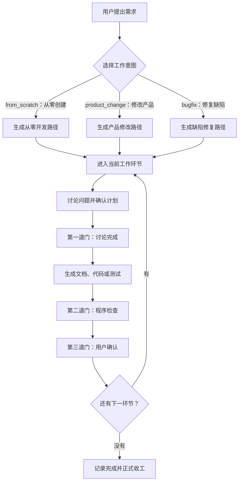

# Workflow Loop

[](https://github.com/yuzyf/workflow_loop/releases)
[](https://pypi.org/project/workflow-loop/)
[](https://www.python.org/downloads/)
[](LICENSE)

为 AI 驱动的软件开发提供有状态、可验证、可回退的工作流管理。

Workflow Loop 把一次软件修改拆成有顺序的工作环节，并用程序保存当前状态、检查阶段产物和控制推进。用户负责提出需求和确认关键决定；AI（人工智能）编码助手负责执行日常 `workflow` 命令，按照命令输出的下一步完成讨论、实施、测试和验收。

## 能力与边界

### 能做什么

- **保存进度**：在项目的 `.workflow_loop/` 目录保存当前工作环节、确认状态和机器执行记录，下一次对话可以从真实状态继续。
- **控制推进**：每个环节依次经过讨论完成、程序检查和用户确认三道门，前一步不满足时不能进入下一步。
- **连接交付证据**：把产品设计、验收条件、测试项、实施记录和最终结果放进同一条可追踪链路。
- **保护项目修改**：实施前保存计划修改文件的原内容；需要退回上游或作废整轮时，按工作流规则使旧结果失效或恢复受管内容。
- **管理三种工作**：分别处理从零创建、修改现有产品和修复缺陷，按工作类型生成对应的环节路径。

### 不做什么

- 不替代 AI 编码助手、版本控制系统或持续集成服务，也不替用户决定产品需求是否正确。
- 不允许跳过必要讨论、程序检查或用户确认，把未经验证的内容当成交付结果。
- 不自动安装 Python，不自动升级或修复已有的异常安装，也不同时维护多个产品版本。
- 当前只支持 `from_scratch`（从零创建）、`product_change`（修改现有产品）和 `bugfix`（修复缺陷）三种正式工作意图。

## 工作流程

`intent`（工作意图）决定一轮工作需要经过哪些环节。各意图的具体环节不同，但每个需要正式确认的环节都遵守同一组三道门。



三道门分别解决不同问题：

1. **讨论完成**：需求、限制和实施计划已经与用户逐项达成共识，允许开始写正式产物。
2. **程序检查**：程序核对必需文件、结构、关联、代码变化或测试记录等可机械判断的事实。
3. **用户确认**：用户确认实际内容符合意图，程序记录确认后才进入下一环节。

## 环境要求

- Python 3.11 或更高版本；安装脚本只检查版本，不会代替用户安装 Python。
- macOS 或 Linux：Bash、`curl`（网络下载命令）、`tar`（归档解压命令），以及 `sha256sum` 或 `shasum`（文件摘要校验命令）。
- 原生 Windows：Windows PowerShell 5.1 或 PowerShell 7，以及可用的网络下载能力。
- 安装时能够访问 GitHub 和 PyPI（Python 公共软件包仓库）。
- 执行安装命令前，先进入要由 Workflow Loop 管理的项目根目录。

## 安装 0.1.0

安装器先进行只读检查并列出项目侧和电脑侧可能发生的全部持久修改。用户确认一次后，安装器才安装或复用全局 `workflow` 命令，并把智能体契约、产物模板和工作规范写入当前项目；用户取消或安装失败时不会留下只完成一部分的安装。

### macOS

```bash
curl -fsSL https://github.com/yuzyf/workflow_loop/releases/download/v0.1.0/install.sh | bash
```

### Linux

```bash
curl -fsSL https://github.com/yuzyf/workflow_loop/releases/download/v0.1.0/install.sh | bash
```

### 原生 Windows

```powershell
powershell -NoProfile -ExecutionPolicy Bypass -Command "irm https://github.com/yuzyf/workflow_loop/releases/download/v0.1.0/install.ps1 | iex"
```

安装命令固定读取 `v0.1.0` 正式发布中的脚本；不会跟随内容可能变化的 `latest`（最新版本）地址。

## 最小使用示例

安装完成后，在当前项目中启动支持读取 `AGENTS.md`（智能体契约文件）的 AI 编码助手，直接用自然语言提出需求：

```text
用户：给当前项目增加 CSV 导出功能，并保证原有导出格式不受影响。
```

之后由 AI 编码助手执行日常流程：

1. 自动运行 `workflow start` 检查当前状态，并根据事实与用户确认本轮工作意图。
2. 严格执行每条命令输出的“下一步”，每次只向用户确认一个问题。
3. 在写代码前完成需求、验收、测试和实施计划，在受保护的回退基线上实施修改。
4. 使用机器记录完成测试，经过主题验收和最终全量回归后正式收工。

用户不需要手工执行日常 `workflow` 命令；用户只负责描述需求、回答讨论问题、确认安装范围和确认各环节结果。

## 命令概览

下表供理解流程和排查当前状态使用，日常命令由 AI 编码助手执行。

| 命令 | 中文含义 |
|---|---|
| `workflow start` | 检查当前轮次；没有进行中的工作时列出三种工作意图 |
| `workflow start --intent <intent>` | 用指定工作意图开始一轮；`<intent>` 表示 `from_scratch`、`product_change` 或 `bugfix` |
| `workflow discuss` | 加载当前环节必须遵守的模板、规范和项目材料 |
| `workflow gate <stage> --discuss-done` | 通过当前环节的讨论完成门；`<stage>` 表示当前环节标识 |
| `workflow gate <stage>` | 让程序检查当前环节的文件、结构和可验证事实 |
| `workflow gate <stage> --confirmed` | 记录用户对当前环节的最终确认并进入下一环节 |
| `workflow status` | 显示当前轮次、环节、门禁状态和下一步 |
| `workflow test ...` | 登记统一测试入口、准备测试项或执行受控测试 |
| `workflow acceptance ...` | 记录需要用户判断的主题验收回答 |
| `workflow return --to <stage> --reason <reason>` | 带具体原因退回上游环节，并使受影响的下游结果失效；`<reason>` 表示退回原因 |
| `workflow abort` | 作废当前整轮，并按回退清单恢复受管内容 |
| `workflow done` | 在最后一个环节确认后记录整轮完成并清理临时回退副本 |

可运行 `workflow --help` 查看当前版本提供的完整参数。

## 源码开发

`uv` 是本项目使用的 Python 项目与环境管理工具。下面的命令会克隆源码、建立隔离环境、安装开发附加依赖，然后运行测试和真实分发包构建：

```bash
git clone https://github.com/yuzyf/workflow_loop.git
cd workflow_loop
uv sync --extra dev
uv run pytest
uv run python -m build
```

`dev`（开发附加依赖）包含 `pytest`（Python 测试工具）、PyYAML（YAML 配置解析库）和 `build`（Python 分发包构建工具）。

## 仓库结构

```text
workflow_loop/
├── src/workflow_loop/     Python 产品代码和随包分发的模板、规范
├── tests/                 自动化测试
├── .workflow_loop/        本仓库自己的工作流状态、模板和规范
├── spec/                  产品设计和代码架构设计
├── acceptance/            验收计划与验收结果
├── qa/                    测试计划与测试结果
├── impl/                  实施计划与实施记录
├── install.sh             macOS 和 Linux 安装脚本
├── install.ps1            Windows 安装脚本
├── CONTEXT.md             产品术语、规则和限制
└── DESIGN.md              实现设计文档
```

## 详细文档

- [产品总说明](spec/产品总说明.md)：产品目的、范围、使用者和通用规则。
- [安装到项目](spec/功能_安装到项目.md)：支持环境、安装行为、异常处理和公开发布要求。
- [代码架构设计](spec/代码架构设计.md)：功能到代码模块、状态和外部依赖的对应关系。
- [实现设计文档](DESIGN.md)：命令、数据模型、工作意图、阶段路径和门禁的实现形态。
- [产品事实与约束](CONTEXT.md)：当前有效的术语、约束和设计决策。
- [需求交付追踪表](需求交付追踪表.md)：每轮需求从设计到验收的完整追踪入口。

## 许可证

本项目使用 [MIT 许可证](LICENSE)。
