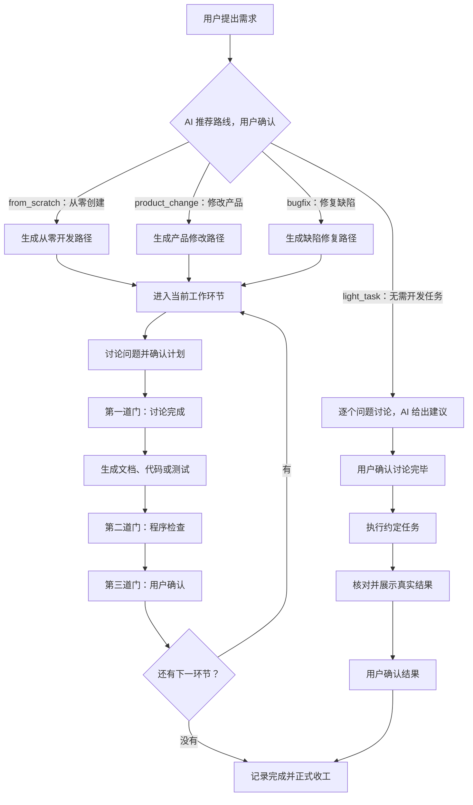

# Workflow Loop

[](https://github.com/yuzyf/workflow_loop/releases)
[](https://pypi.org/project/workflow-loop/)
[](https://www.python.org/downloads/)
[](LICENSE)

为 AI 驱动的软件开发提供有状态、可验证、可回退的工作流管理。

Workflow Loop 把一次软件修改拆成有顺序的工作环节，并用程序保存当前状态、检查阶段产物和控制推进。用户负责提出需求和确认关键决定；AI（人工智能）编码助手负责执行日常 `workflow` 命令，按照命令输出的下一步完成讨论、实施、测试和验收。

## 能力与边界

### 能做什么

- **保存进度**：在项目的 `.workflow_loop/` 目录保存当前工作环节、确认状态和机器执行记录，下一次对话可以从真实状态继续。
- **控制推进**：完整研发任务的每个环节依次经过讨论完成、程序检查和用户确认三道门；无需开发任务走独立的讨论、执行、结果确认简单流程。
- **一次说明门禁问题**：完整研发门禁失败时，一次列出当前能够独立确认的全部问题；每项写明位置、预期、实际、证据、影响和下一动作，无法可靠判断的项目标为“未检查”并说明依赖。同一状态重复检查时，问题清单和顺序保持一致，要求先修改后再检查。
- **给出唯一下一步**：每条命令结束时只给出一条完整有效的下一命令，并说明执行者、是否会自动执行测试或其它实际动作、以及成功条件。AI 必须原样执行，不能追加管道、截断、重定向或命令串联。
- **连接交付证据**：把产品设计、验收条件、测试项、实施记录和最终结果放进同一条可追踪链路。
- **保护项目修改**：实施前保存计划修改文件的原内容，并记录代码、测试、脚本和项目配置的实施观察基线；发现未登记变化时明确报告。需要退回上游或作废整轮时，按工作流规则使旧结果失效或恢复受管内容。
- **管理四种工作**：分别处理从零创建、修改现有产品、修复缺陷和无需开发任务；只有前三种生成研发环节路径。

### 不做什么

- 不替代 AI 编码助手、版本控制系统或持续集成服务，也不替用户决定产品需求是否正确。
- 不允许跳过必要讨论、程序检查或用户确认，把未经验证的内容当成交付结果。
- 不自动安装 Python，不静默更新，也不把残缺项目当成完整安装覆盖；更新必须由用户明确执行并确认。
- `light_task`（无需开发任务）不能用于修改正式产品规则、产品代码、测试代码，或影响运行、构建、测试、部署和依赖的配置；发现需要开发时必须结束简单轮次，经用户确认后改走完整研发路线。

## 工作流程

`intent`（工作意图）决定一轮工作走完整研发流程还是简单流程。AI 先调查并推荐路线，用户确认要进入哪种任务后才能启动。



完整研发路线的三道门分别解决不同问题：

1. **讨论完成**：需求、限制和实施计划已经与用户逐项达成共识，允许开始写正式产物。
2. **程序检查**：程序核对必需文件、结构、关联、代码变化或测试记录等可机械判断的事实；失败时一次列出全部能够独立确认的问题，不把依赖未满足的检查猜成失败。
3. **用户确认**：用户确认实际内容符合意图，程序记录确认后才进入下一环节。

门禁失败的每项问题都会给出具体位置、预期、实际、证据、影响和下一动作；同一状态不会逐次隐藏问题，也不会要求 AI 原样重试。命令末尾只保留一条完整下一命令，AI 应直接照此执行。

`light_task`（无需开发任务）是一类任务，不是“改文档、提交、发布”三个固定选项。它也要求先调查和讨论：AI 用第一性原理梳理需求，每次只问一个问题并给出建议，用户确认讨论完毕后才执行。执行 `commit`（本地 Git 提交）、`push`（推送远端）、发布、删除等难撤销操作前，要按准确操作单独确认；“提交代码”必须先问清是只 `commit`，还是还要 `push`。完成后，AI 按约定方法展示真实结果，用户确认后收工。简单流程不创建研发阶段、三道门、固定全量测试或回退副本；失败或作废时保留真实现场并说明结果，不自动回滚。

## 环境要求

- Python 3.11 或更高版本；安装脚本只检查版本，不会代替用户安装 Python。
- macOS 或 Linux：Bash、`curl`（网络下载命令）、`tar`（归档解压命令），以及 `sha256sum` 或 `shasum`（文件摘要校验命令）。
- 原生 Windows：Windows PowerShell 5.1 或 PowerShell 7，以及可用的网络下载能力。
- 安装时能够访问 GitHub 和 PyPI（Python 公共软件包仓库）。
- 执行安装命令前，先进入要由 Workflow Loop 管理的项目根目录。

## 安装 0.3.4

安装器先进行只读检查并列出项目侧和电脑侧可能发生的全部持久修改。用户确认一次后，安装器才安装或复用全局 `workflow` 命令，并把智能体契约、产物模板和工作规范写入当前项目；用户取消或安装失败时不会留下只完成一部分的安装。

### macOS

```bash
curl -fsSL https://github.com/yuzyf/workflow_loop/releases/download/v0.3.4/install.sh | bash
```

### Linux

```bash
curl -fsSL https://github.com/yuzyf/workflow_loop/releases/download/v0.3.4/install.sh | bash
```

### 原生 Windows

```powershell
powershell -NoProfile -ExecutionPolicy Bypass -Command "irm https://github.com/yuzyf/workflow_loop/releases/download/v0.3.4/install.ps1 | iex"
```

安装命令固定读取 `v0.3.4` 正式发布中的脚本；不会跟随内容可能变化的 `latest`（最新版本）地址。

## 更新与卸载

下面的维护命令都由用户从项目根目录主动执行，并且在持久修改前只确认一次。`workflow update` 默认核对 PyPI 和 GitHub Release 后更新到双方一致的最新正式版本；`--version` 后的版本号必须是比电脑全局命令和当前项目都不低的正式版本。

```bash
workflow update
workflow update --version 0.3.4
```

更新按需补齐电脑全局命令和当前项目，只直接覆盖项目根 `AGENTS.md`、`.workflow_loop/Template_Repository/`、`.workflow_loop/Standardized_Repository/`，以及 `.workflow_loop/project.json` 中的安装版本字段。更新不创建备份，不回滚已经完成的步骤；当前轮次状态、历史、回退资料、业务代码和正式产物保持不变。失败后重新执行同一命令即可继续补齐。

没有 `workflow update` 命令的旧版本，可从项目根目录直接运行最新正式发布提供的脚本：

```bash
# macOS / Linux
curl -fsSL https://github.com/yuzyf/workflow_loop/releases/latest/download/update.sh | bash
```

```powershell
# Windows PowerShell 5.1 / 7
powershell -NoProfile -ExecutionPolicy Bypass -Command "irm https://github.com/yuzyf/workflow_loop/releases/latest/download/update.ps1 | iex"
```

项目卸载和电脑全局命令卸载是两个独立动作：

```bash
# 强制删除当前项目的 AGENTS.md、整个 .workflow_loop/ 和安装事务残留
workflow uninstall

# 只删除电脑全局命令；不会扫描或删除任何项目
workflow uninstall --global
```

项目卸载不检查当前轮次处于进行中、已完成还是已作废，也不恢复本轮业务修改；删除没有备份。全局卸载只清理全局工具和能够由安装来源记录证明是 Workflow Loop 添加的 `PATH`（命令搜索路径）项，来源不明或用户原本就有的 PATH 项会保留并报告。全局命令删除后，其它已安装项目仍保留，但在重新安装全局命令前不能运行 `workflow`。

旧版本没有公开卸载命令时，可从项目根运行 `uninstall.sh` 或 `uninstall.ps1` 的最新正式发布资产；两个脚本默认只卸载当前项目，不会先升级或删除电脑全局命令。

```bash
# macOS / Linux 旧版本项目卸载
curl -fsSL https://github.com/yuzyf/workflow_loop/releases/latest/download/uninstall.sh | bash
```

```powershell
# Windows PowerShell 5.1 / 7 旧版本项目卸载
powershell -NoProfile -ExecutionPolicy Bypass -Command "irm https://github.com/yuzyf/workflow_loop/releases/latest/download/uninstall.ps1 | iex"
```

## 最小使用示例

安装完成后，在当前项目中启动支持读取 `AGENTS.md`（智能体契约文件）的 AI 编码助手，直接用自然语言提出需求：

```text
用户：给当前项目增加 CSV（逗号分隔值）导出功能，并保证原有导出格式不受影响。
```

之后由 AI 编码助手执行日常流程：

1. 自动运行 `workflow start` 检查当前状态，并根据事实与用户确认本轮工作意图。
2. 调查现状并推荐四种路线之一，用户确认进入该任务后才启动轮次。
3. 严格执行每条命令输出的“下一步”，讨论时每次只问用户一个问题；门禁失败先按完整问题清单修改，不能原样重试，也不能自行拼接或截断命令输出。
4. 完整研发路线在写代码前完成需求、验收、测试和实施计划；无需开发任务在用户确认讨论完毕后直接执行约定内容。
5. 把真实结果交给用户核对并确认，再正式收工。

用户不需要手工执行日常 `workflow` 命令，但仍需确认工作路线、回答讨论问题、作出产品和验收决定、批准难撤销操作、确认安装范围及确认各环节结果。

## 命令概览

下表供理解流程和排查当前状态使用，日常命令由 AI 编码助手执行。

| 命令 | 中文含义 |
|---|---|
| `workflow start` | 检查当前轮次；没有进行中的工作时列出四种工作意图 |
| `workflow start --intent <intent>` | 用户确认路线后开始一轮；`<intent>` 表示 `from_scratch`、`product_change`、`bugfix` 或 `light_task` |
| `workflow light --discuss-done --task <任务> --verification <方法>` | 记录无需开发任务已讨论完毕；`<任务>` 是约定范围，`<方法>` 是结果核对方法 |
| `workflow light --approve-action <准确操作>` | 记录用户单独批准的一项难撤销操作，只记录批准，不自动执行 |
| `workflow light --confirmed --result <实际结果>` | 记录用户已经核对无需开发任务的真实结果 |
| `workflow discuss` | 加载当前环节必须遵守的模板、规范和项目材料 |
| `workflow gate <stage> --discuss-done` | 通过当前环节的讨论完成门；`<stage>` 表示当前环节标识 |
| `workflow gate <stage>` | 让程序检查当前环节的文件、结构和可验证事实 |
| `workflow gate <stage> --confirmed` | 记录用户对当前环节的最终确认并进入下一环节 |
| `workflow status` | 显示当前轮次、环节、门禁状态和下一步 |
| `workflow test ...` | 登记统一测试入口、准备测试项或执行受控测试 |
| `workflow acceptance ...` | 记录需要用户判断的主题验收回答 |
| `workflow return --to <stage> --reason <reason>` | 带具体原因退回上游环节，并使受影响的下游结果失效；`<reason>` 表示退回原因 |
| `workflow abort` | 作废完整研发轮次，并按回退清单恢复受管内容 |
| `workflow abort --summary <真实状态>` | 作废无需开发任务，保留已发生状态并记录实际完成、未执行或失败内容 |
| `workflow done` | 在最后一个环节确认后记录整轮完成并清理临时回退副本 |
| `workflow update [--version <version>]` | 更新电脑全局命令和当前项目；`<version>` 表示可选的目标正式版本 |
| `workflow uninstall` | 不管当前轮次状态，强制删除当前项目固定的 Workflow Loop 管理内容 |
| `workflow uninstall --global` | 只卸载电脑全局 Workflow Loop 命令和来源明确的 PATH 项，不扫描项目 |

可运行 `workflow --help` 查看当前版本提供的完整参数。

## 源码开发

`uv` 是本项目使用的 Python 项目与环境管理工具。下面的命令会克隆源码、建立隔离环境、安装开发附加依赖，然后运行测试和真实分发包构建：

```bash
git clone https://github.com/yuzyf/workflow_loop.git
cd workflow_loop
uv sync --extra dev
uv run pytest
uv run python -m build
```

`dev`（开发附加依赖）包含 `pytest`（Python 测试工具）、PyYAML（YAML 配置解析库）和 `build`（Python 分发包构建工具）。

## 发布正式版本

项目维护者确认当前仓库内容可以直接发布后，在仓库根目录执行下面的命令，并把 `0.3.4` 替换成要发布的新版本号：

```bash
uv run python scripts/release.py 0.3.4
```

运行这条命令本身就表示维护者接受当前仓库状态并承担跳过本地发布检查的风险。脚本不会再次确认，也不会在本地运行测试、构建或远程版本查询。它依次执行：

1. 更新源码、README、维护脚本和自动发布配置中的当前版本身份，并运行 `uv lock` 更新依赖锁定结果。
2. 运行 `git add -A`，把当前全部未忽略的新增、修改和删除纳入发布提交。
3. 创建说明为 `release: prepare workflow-loop <新版本号>` 的发布提交。
4. 把当前提交推送到远程 `main`（默认分支）。
5. 创建带说明的 `v<新版本号>` 标签。
6. 推送该标签，触发现有 GitHub Actions（GitHub 自动任务）完成测试、构建和公开发布。

任一步失败时，脚本会显示失败步骤和退出码并立即停止。它不会强推、自动重试或回滚已经完成的文件修改、提交、分支推送和标签操作。标签推送成功只表示远程发布流程已经触发；是否最终发布成功，以 GitHub Actions 的运行结果为准。

## 仓库结构

```text
workflow_loop/
├── src/workflow_loop/     Python 产品代码和随包分发的模板、规范
├── tests/                 自动化测试
├── scripts/release.py     维护者直接发布当前仓库的脚本
├── .workflow_loop/        本仓库自己的工作流状态、模板和规范
├── spec/                  产品设计和代码架构设计
├── acceptance/            验收计划与验收结果
├── qa/                    测试计划与测试结果
├── impl/                  实施计划与实施记录
├── install.sh             macOS 和 Linux 安装脚本
├── install.ps1            Windows 安装脚本
├── update.sh              macOS 和 Linux 旧版本更新脚本
├── update.ps1             Windows 旧版本更新脚本
├── uninstall.sh           macOS 和 Linux 旧版本卸载脚本
├── uninstall.ps1          Windows 旧版本卸载脚本
└── docs/adr/              已经发生的架构决策及其取代关系
```

## 详细文档

- [产品总说明](spec/产品总说明.md)：产品目的、范围、使用者和通用规则。
- [安装到项目](spec/功能_安装到项目.md)：支持环境、安装行为、异常处理和公开发布要求。
- [更新已安装项目](spec/功能_更新已安装项目.md)：目标版本、覆盖范围、保留范围和失败重试规则。
- [卸载 Workflow Loop](spec/功能_卸载_Workflow_Loop.md)：项目强制卸载和电脑全局卸载的独立边界。
- [发布正式版本](spec/功能_发布正式版本.md)：人工发布命令、版本更新范围、执行顺序和失败边界。
- [处理无需开发任务](spec/功能_处理无需开发任务.md)：简单流程适用边界、逐项确认、完成和异常处理规则。
- [代码架构设计](spec/代码架构设计.md)：功能到代码模块、状态和外部依赖的对应关系。
- [原生 Windows PowerShell 决策](docs/adr/0001-support-native-windows-powershell.md)：为什么正式支持原生 Windows PowerShell。
- [首版版本策略决策](docs/adr/0002-fix-product-version-at-0-1-0.md)：首版版本号决定及其被后续功能取代的状态。
- [需求交付追踪表](需求交付追踪表.md)：每轮需求从设计到验收的完整追踪入口。

## 许可证

本项目使用 [MIT 许可证](LICENSE)。
