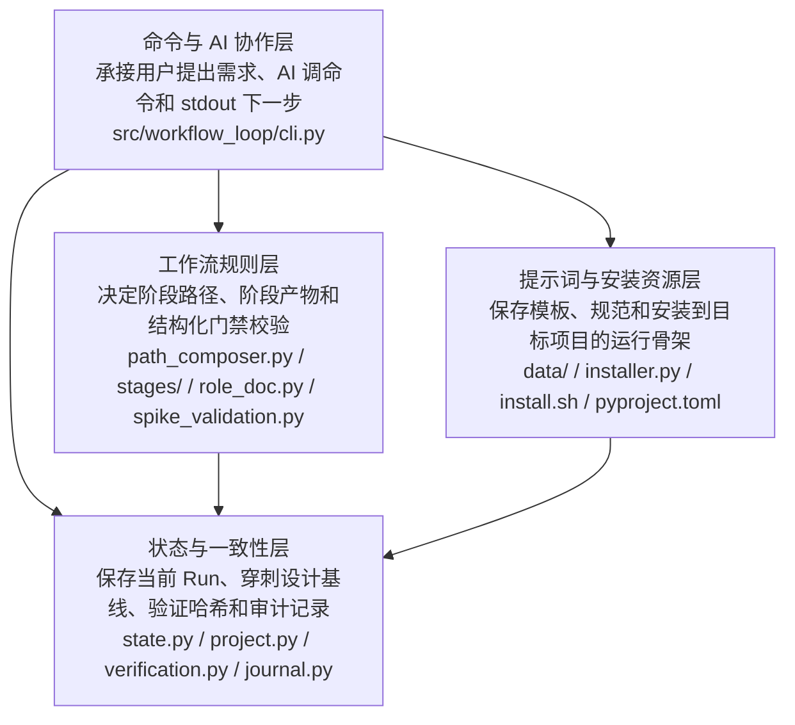
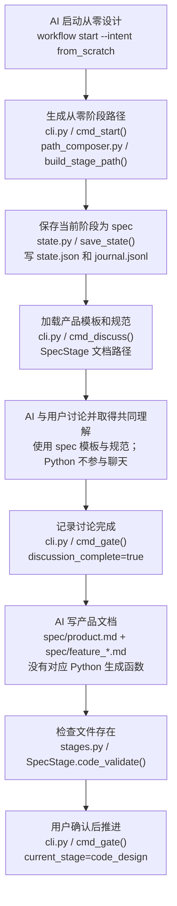
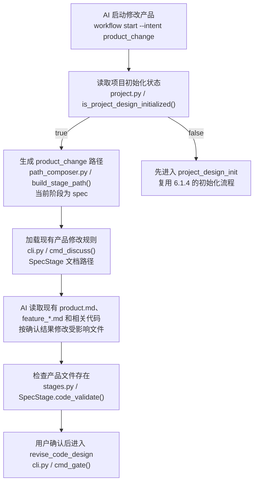
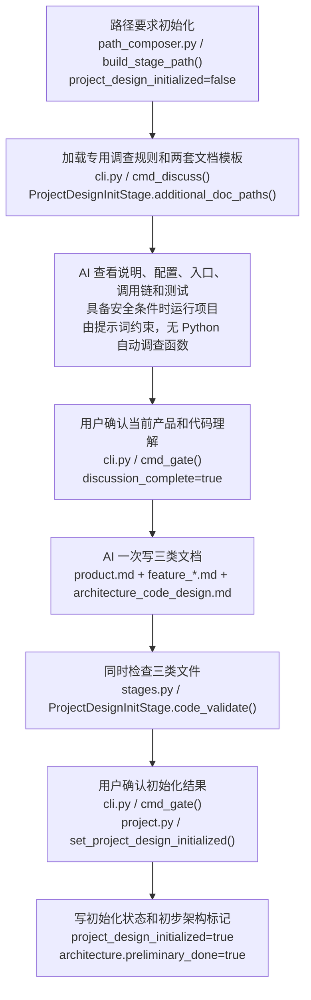
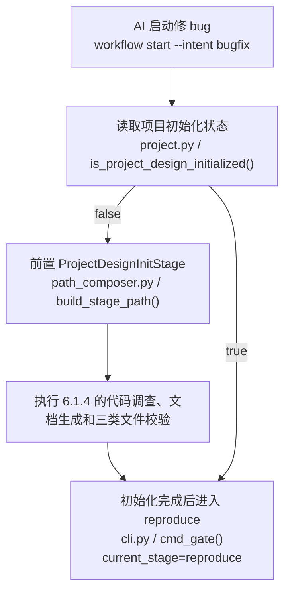
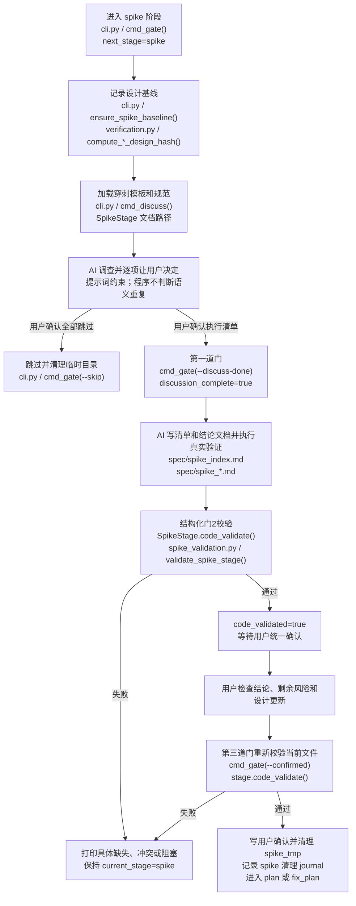

# Workflow Loop — 代码架构设计

## 1. 文档说明

### 1.1 文档目的

本文说明 Workflow Loop 的代码怎样落实当前已经确认的产品设计，主要给维护项目的人阅读。

维护者可以从本文看清：产品设计文档生成和技术不确定性验证分别经过哪些代码环节；命令、阶段规则、状态文件、提示词和门禁怎样协作；关键判断和文件写入发生在哪里；哪些行为已经有测试或运行证据；哪些内容仍只能由 AI 和用户判断。

本文最初由 `code_design`（初步代码架构）阶段生成，当前仍处于 `spike`（技术不确定性验证）阶段。此前把正式功能实施写成穿刺结论不符合穿刺代码边界，相关穿刺清单和结论文档已经移除；本文只记录当前真实代码和已经通过的测试，不能代替后续实施记录、测试结果和用户验收。

### 1.2 设计依据

当前产品设计定义了两个功能：

1. “生成产品设计文档”：AI 和用户先形成共同理解，再生成或修改产品总说明和功能文档；从零设计、修改已有产品、根据已有代码初始化产品设计、修 bug 前初始化产品设计使用同一套文档结构，但进入条件和处理方式不同。
2. “验证技术不确定性”：AI 先查现有事实，用户决定执行哪些穿刺项；AI 使用真实场景取得证据，门禁检查清单、结论文档、阻塞状态和设计文档变化；从零开发、修改产品和修 bug 都可以执行或明确跳过。

- [产品总说明](./product.md)
- [【功能】生成产品设计文档](./feature_product_design_document_generation.md)
- [【功能】验证技术不确定性](./feature_technical_uncertainty_validation.md)
- [项目设计说明](../DESIGN.md)
- [领域词汇与已确认决定](../CONTEXT.md)

### 1.3 事实状态

| 结论 | 证据状态 | 依据 |
|---|---|---|
| 命令入口、阶段路径、三道门禁、穿刺结构化校验和状态写入按本文所述工作 | 测试确认、代码确认 | 2026-07-23 运行完整测试，74 项通过；新增测试确认不能跨阶段执行门禁、门3会重新校验当前文件、旧状态不会补造设计基线、穿刺临时目录会清理并记录 journal |
| 当前项目处于 `spike` 阶段，产品设计和初步代码设计阶段已经完成 | 运行确认 | 2026-07-23 使用当前仓库代码执行 `.venv/bin/workflow status` |
| 包内穿刺模板、穿刺规范与当前项目运行副本内容一致 | 文件确认 | 2026-07-23 对两组文件执行逐字节比较，结果一致 |
| 新项目安装后会得到包内保存的阶段提示词和规范 | 运行确认、测试确认 | 安装器从 `src/workflow_loop/data/` 复制资源；安装和提示词内容测试通过 |
| AI 是否真的完成事实调查、证据是否来自真实场景、两个候选是否语义重复 | 未由程序确认 | 当前由穿刺规范要求 AI 展示证据，再由用户审查；程序只检查工作流编号、结构、状态、阻塞和设计哈希等可明确判断的内容 |

## 2. 产品概览

Workflow Loop 用命令和状态文件管理 AI 驱动的软件开发过程。用户不直接填写状态文件，而是提出需求；AI 根据 `AGENTS.md` 调用 `workflow` 命令，并按照每条命令输出的“下一步”继续。

当前产品文档正式定义了两个产品功能。

**生成产品设计文档**包含四种场景：

1. 从零生成产品设计文档。
2. 更新已有产品设计文档。
3. 根据已有代码建立产品设计文档。
4. 修 bug 前初始化产品设计。

**验证技术不确定性**包含三类正常使用方式：

1. 从零开发和修改产品时，在实施计划前验证接口、文件、平台、性能或算法等具体不确定性。
2. 修 bug 时，在复现根因后、修复计划前验证修复仍依赖的未知事实。
3. AI 调查后没有发现需要实际验证的不确定性时，由用户明确决定跳过。

代码仓库还实现了计划、实施、测试、验收和代码设计更新等后续阶段。这些阶段构成完整 Workflow Loop，但当前产品文档还没有把它们分别定义为独立产品功能。第 8 章继续列出尚未建立产品映射或仍缺少程序校验的部分。

影响代码的主要产品规则是：

- 用户确认共同理解后，AI 才能生成或修改正式产品文档。
- 从零设计、修改产品、已有代码初始化和修 bug 使用不同进入条件。
- 已有代码初始化时必须查看代码和测试，具备安全条件时实际运行。
- 产品设计文档必须包含 `spec/product.md` 和至少一个英文文件名的 `spec/feature_*.md`。
- 修 bug 时，项目设计尚未初始化才先建立产品设计；需要改变产品行为时应改走 `product_change`（修改产品）。
- 穿刺只验证现有事实无法回答、必须实际运行才能确认的技术不确定性；候选和跳过决定都由用户确认。
- 穿刺必须使用真实场景，不修改正式代码；有外部写入、扣费、发送或删除时再次取得用户同意。
- 任意穿刺项仍阻塞后续时不能进入计划；结论影响设计时必须先更新相应文档。

## 3. 产品设计如何决定代码架构

| 已确认的产品要求 | 对代码提出的具体要求 | 承担该要求的代码层或关键节点 | 关联功能 |
|---|---|---|---|
| AI 必须根据项目现状选择从零设计、修改产品或修 bug | 命令必须接收工作意图，并按意图和项目初始化状态生成不同阶段路径 | 命令编排层的 `cmd_start()`；工作流规则层的 `build_stage_path()` | 生成产品设计文档的四个场景 |
| 用户确认共同理解后才能写正式文档 | 每个阶段必须先记录讨论完成，再允许产物校验和用户确认 | `cmd_gate()` 和 `GateState` 三道门禁 | 所有场景 |
| AI 需要得到产品模板、讨论规范和全局写作规则 | 当前阶段必须加载完整提示词、规范、角色和产出要求 | `cmd_discuss()`、`load_doc_content()`、`StageStrategy` 文档路径方法 | 所有场景 |
| 从零设计和修改已有产品都要生成产品总说明与功能文档 | 产品设计阶段必须声明产物，并检查 `product.md` 和至少一个 `feature_*.md` 存在 | `SpecStage.artifact_paths()`、`SpecStage.code_validate()` | 从零生成、更新已有产品 |
| 已有代码初始化要同时建立产品文档和代码架构文档 | 初始化阶段必须同时加载产品与代码设计规则，并校验三类文件 | `ProjectDesignInitStage.additional_doc_paths()`、`ProjectDesignInitStage.code_validate()` | 根据已有代码建立文档、修 bug 前初始化 |
| 从零开发、修改产品和修 bug 都可能需要验证技术不确定性 | 三种路径都必须包含可明确跳过的 `SpikeStage`；修 bug 放在复现和修复计划之间 | `FROM_SCRATCH_PATH`、`PRODUCT_CHANGE_BASE`、`BUGFIX_BASE` | 验证技术不确定性 |
| 用户决定穿刺清单，旧文档不能冒充当前结果 | 清单和详情必须绑定当前 `workflow_id`，每项使用唯一 `SP-xxx` 编号和真实文档链接 | `spike_validation.py` 的 `parse_spike_index()`、`parse_spike_detail()`、`validate_spike_stage()` | 验证技术不确定性 |
| 结论要求修改设计时必须证明文档发生变化 | 进入穿刺时记录产品设计和代码设计哈希；门2根据影响字段比较当前哈希 | `SpikeBaselineState`、`ensure_spike_baseline()`、`compute_product_design_hash()`、`compute_code_design_hash()` | 验证技术不确定性 |
| 任意穿刺项仍阻塞后续时不能进入计划 | 门2必须解析固定状态字段，拒绝“待验证”、非法状态和“是否阻塞后续：是” | `validate_spike_stage()`、`SpikeStage.code_validate()` | 验证技术不确定性 |
| 修 bug 的穿刺不能改变产品行为 | `bugfix` 中出现“产品设计影响：需要修改”时门2直接拒绝 | `validate_spike_stage()` 的意图分支 | 为修 bug 验证技术不确定性 |
| 修 bug 时只在项目设计未初始化时先生成产品文档 | 项目必须保存跨工作流的初始化状态，路径生成时据此决定是否前置初始化阶段 | `ProjectState.project_design_initialized`、`build_stage_path()` | 修 bug 前初始化 |
| 从零重做不能沿用旧设计产物 | 开始时发现旧产物必须先获得清场确认，确认后删除约定目录并重置初始化状态 | `detect_clean_artifacts()`、`clean_artifacts()`、`cmd_start()` | 从零生成 |
| 后续验证只对当前代码和计划有效 | 上游实施、测试计划或验收计划改变时，已通过的下游门禁必须失效 | `VerificationState`、`check_invalidation()` | 当前产品文档未单独定义；属于全项目约束 |
| 每条命令都要告诉 AI 下一步做什么 | 所有改变流程的命令必须在输出末尾给出下一条操作 | `print_next_step()` 和各 `cmd_*()` 命令 | 所有场景及后续阶段 |

## 4. 代码架构分层

### 4.1 整体架构图

下图只表示代码职责和依赖方向。箭头表示上层代码会调用或读取下层代码，不表示某个产品场景的执行顺序。

### 4.2 命令与 AI 协作层

- **承接的产品内容**：用户通过 AI 使用产品；命令输出驱动 AI 继续；用户确认后工作流才推进。
- **代码职责**：解析命令参数，定位项目，调用工作流规则和状态模块，打印当前结果与下一步。
- **代码位置**：[src/workflow_loop/cli.py](../src/workflow_loop/cli.py)。
- **主要符号**：
  - `main()`：命令行总入口，中文职责是解析 `start`、`discuss`、`gate`、`status`、`done`、`abort` 和 `install-project`。
  - `cmd_start()`：启动或检查工作流。
  - `cmd_discuss()`：完整打印当前阶段的角色、全局写作规范、模板、流程规范和产出要求。
  - `cmd_gate()`：执行讨论完成、代码校验、用户确认三道门禁，并推进阶段。
  - `print_next_step()`：在命令输出末尾打印下一条操作。
  - `current_stage_next_instruction()`：中文职责是根据当前阶段和三道门的状态，生成不会跨阶段的下一步命令。
- **对外约定**：调用方传入命令行参数；成功时得到当前状态和下一步；调用了错误阶段时同时得到当前阶段和正确的下一步命令；其它门禁顺序错误或项目未安装时打印明确错误并退出。
- **依赖关系**：调用工作流规则层决定当前阶段；调用状态与一致性层读写状态；读取提示词与安装资源层中的 Markdown 文件。
- **验证位置**：[tests/test_commands.py](../tests/test_commands.py)。

### 4.3 工作流规则层

- **承接的产品内容**：不同场景走不同流程；每个阶段知道自己需要什么提示词、产生什么文件、怎样检查产物。
- **代码职责**：组合阶段路径；为每个阶段提供名称、提示词路径、规范路径、产物路径、校验规则和推进钩子。
- **代码位置**：
  - [src/workflow_loop/path_composer.py](../src/workflow_loop/path_composer.py)：`build_stage_path()`，即根据工作意图和项目初始化状态拼出阶段路径。
  - [src/workflow_loop/stages/base.py](../src/workflow_loop/stages/base.py)：`StageStrategy`，即所有阶段共同遵守的代码接口。
  - [src/workflow_loop/stages/stages.py](../src/workflow_loop/stages/stages.py)：`SpecStage`、`ProjectDesignInitStage` 等具体阶段。
  - [src/workflow_loop/role_doc.py](../src/workflow_loop/role_doc.py)：`ROLE_DOC_MAP`，即阶段角色和中文职责说明。
  - [src/workflow_loop/spike_validation.py](../src/workflow_loop/spike_validation.py)：解析穿刺清单和结论文档，执行穿刺门2的结构化校验。
- **对外约定**：`build_stage_path()` 接收 `from_scratch`、`product_change` 或 `bugfix`，返回有顺序的阶段对象；未知意图直接抛出错误。每个阶段对象提供统一方法供 CLI 调用。
- **关键逻辑**：`product_change` 和 `bugfix` 只有在 `project_design_initialized=false` 时前置 `ProjectDesignInitStage`；三种意图都包含可选 `SpikeStage`；`bugfix` 的顺序是 `reproduce → spike → fix_plan`。
- **验证位置**：[tests/test_path_composer.py](../tests/test_path_composer.py)、[tests/test_stages.py](../tests/test_stages.py)。

### 4.4 状态与一致性层

- **承接的产品内容**：工作流不能跳过门禁；项目初始化状态跨多次工作流保留；穿刺结论要求修改设计时必须证明文档变化；上游内容改变后旧测试和验收不能继续有效。
- **代码职责**：把当前状态写入 JSON；把历史动作追加到 JSONL；记录穿刺开始时的设计基线；计算产品、代码和验证产物哈希；发现变化时执行门禁判断或清零下游门禁。
- **代码位置**：
  - [src/workflow_loop/state.py](../src/workflow_loop/state.py)：`WorkflowState` 是单次工作流快照，`GateState` 是三道门禁状态，`SpikeBaselineState` 是穿刺开始时的设计基线，`save_state()` 和 `load_state()` 负责 `.workflow_loop/state.json`。
  - [src/workflow_loop/project.py](../src/workflow_loop/project.py)：`ProjectState` 是跨工作流项目状态，`project_design_initialized` 表示项目设计是否已经初始化。
  - [src/workflow_loop/verification.py](../src/workflow_loop/verification.py)：`compute_product_design_hash()` 只计算产品总说明实际链接的功能文档，`compute_code_design_hash()` 计算代码设计文档，`check_invalidation()` 检查实施、测试计划和验收计划是否变化。
  - [src/workflow_loop/journal.py](../src/workflow_loop/journal.py)：`append_entry()` 向 `.workflow_loop/journal.jsonl` 追加历史记录。
- **对外约定**：状态模块接收项目根目录和数据对象；成功后文件落盘。读取不到状态时返回 `None`，由命令层决定提示用户启动或安装。
- **验证位置**：[tests/test_state.py](../tests/test_state.py)、[tests/test_project.py](../tests/test_project.py)、[tests/test_verification.py](../tests/test_verification.py)。

### 4.5 提示词与安装资源层

- **承接的产品内容**：所有项目获得同一套产品设计模板、代码设计模板、阶段规范和全局写作规则。
- **代码职责**：保存随 Python 包发布的 Markdown 资源；安装时复制到目标项目；写入最小 `AGENTS.md` 契约和项目级状态。
- **代码位置**：
  - [src/workflow_loop/data/Template_Repository](../src/workflow_loop/data/Template_Repository)：最终文档模板和阶段任务提示。
  - [src/workflow_loop/data/Standardized_Repository](../src/workflow_loop/data/Standardized_Repository)：讨论、调查、生成和写作规范。
  - [src/workflow_loop/installer.py](../src/workflow_loop/installer.py)：`install_project()` 复制资源并创建项目运行骨架。
  - [install.sh](../install.sh)：用户确认项目目录后，检查全局 `workflow` 命令并调用 `workflow install-project`。
  - [pyproject.toml](../pyproject.toml)：声明 `workflow = workflow_loop.cli:main` 命令入口，并把 `data/**/*` 打包。
- **对外约定**：首次安装会覆盖目标项目的 `AGENTS.md`，创建 `.workflow_loop/Template_Repository`、`.workflow_loop/Standardized_Repository` 和 `.workflow_loop/project.json`；同版本重复安装不修改文件。
- **验证位置**：[tests/test_installer.py](../tests/test_installer.py)。

## 5. 架构关键节点

### 5.1 工作意图与阶段路径生成

- **为什么关键**：它决定用户进入产品设计、已有项目初始化还是修 bug；路径错误会让整个后续工作流走错。
- **对应产品内容**：四种产品设计文档生成场景、三种意图都可执行或跳过穿刺，以及修 bug 时是否需要先初始化产品设计。
- **代码位置**：`src/workflow_loop/cli.py` 中的 `cmd_start()`；`src/workflow_loop/path_composer.py` 中的 `build_stage_path()`。
- **上游**：AI 调用 `workflow start --intent <意图>`。
- **主要处理**：检查安装和活跃工作流；从零设计时检查是否需要清场；读取项目初始化状态；生成阶段对象；初始化每个阶段的门禁状态。修 bug 路径固定包含 `reproduce → spike → fix_plan`。
- **下游**：调用 `save_state()` 写入 `.workflow_loop/state.json`，调用 `append_entry()` 记录启动和路径，最后提示执行 `workflow discuss`。
- **状态和数据**：写入 `workflow_id`、`intent`、`stage_path`、`current_stage`、每个阶段的 `GateState`；从零设计同时把 `project_design_initialized` 重置为 `false`。
- **失败结果**：项目未安装、已有活跃工作流或意图非法时停止；发现旧产物但没有清场确认时不删除、不启动。
- **验证位置**：`test_start_*`、`test_active_run_guard`、`test_from_scratch_path`、`test_product_change_*`、`test_bugfix_*`。

### 5.2 当前阶段提示词装配

- **为什么关键**：Python 程序本身不和用户讨论产品，也不生成产品语义；AI 能否正确工作取决于这里是否完整加载正确提示词。
- **对应产品内容**：需求讨论、共同理解确认、正式产品文档生成、已有代码调查和穿刺候选识别。
- **代码位置**：`src/workflow_loop/cli.py` 中的 `cmd_discuss()`、`load_doc_content()`；`src/workflow_loop/stages/stages.py` 中各阶段的文档路径方法。
- **上游**：当前工作流已经启动，AI 调用 `workflow discuss`。
- **主要处理**：根据当前阶段获得角色；读取全局写作规范；读取阶段模板和规范；对 `ProjectDesignInitStage` 继续读取产品模板、产品规范、代码架构模板和代码设计规范。当前阶段是 `spike` 且旧状态没有入场基线时，只标记“旧基线无法还原”，不使用当前文件冒充穿刺开始前的设计。
- **下游**：完整打印给 AI，并记录“提示词加载”和“角色文档加载”。
- **状态和数据**：只追加 journal，不改变阶段门禁。
- **失败结果**：没有工作流、工作流已结束、阶段实现不存在时停止；某个 Markdown 不存在时把缺失路径打印出来。
- **验证位置**：`test_discuss_loads_global_writing_standard_before_stage_docs`、`test_code_design_discuss_prints_product_driven_architecture_rules`、`test_project_design_init_discuss_prints_investigation_and_output_rules`。

### 5.3 三道门禁与阶段推进

- **为什么关键**：它是“讨论完成、产物存在、用户确认”不能跳步的实际执行位置。
- **对应产品内容**：用户确认共同理解或穿刺执行清单后才能写正式产物，用户检查产物后才能作为后续依据。
- **代码位置**：`src/workflow_loop/cli.py` 中的 `cmd_gate()`；`src/workflow_loop/state.py` 中的 `GateState`。
- **上游**：AI 分别调用 `workflow gate <stage> --discuss-done`、`workflow gate <stage>`、`workflow gate <stage> --confirmed`。
- **主要处理**：所有门禁先检查命令中的阶段是否等于 `current_stage`（当前阶段）；不相等时拒绝操作，并根据当前阶段的三道门状态打印正确的下一步。第一道门写 `discussion_complete=true`；第二道门调用当前阶段的 `code_validate()`；第三道门推进前重新执行上游失效检查和 `code_validate()`，当前文件仍有效时才写 `user_confirmed=true`、阶段状态 `done` 并进入下一阶段。真正进入 `spike` 时调用 `ensure_spike_baseline()`；`gate spike --skip` 清理临时目录并直接进入后续计划阶段。
- **下游**：更新状态文件和 journal；架构阶段更新架构标记；项目设计初始化完成时更新项目级初始化状态。
- **状态和数据**：写 `.workflow_loop/state.json`、`.workflow_loop/project.json` 和 `.workflow_loop/journal.jsonl`。
- **失败结果**：跨阶段调用时不推进，并显示当前阶段和正确命令；跳过前一道门、产物缺失、门2后产物被改坏或上游验证失效时也不推进。
- **验证位置**：`test_gate_order_enforced`、`test_gate_rejects_all_normal_operations_for_non_current_stage`、`test_spike_confirmation_revalidates_documents_after_gate_two`、各阶段 `code_validate` 测试和命令测试。

### 5.4 产品设计产物校验

- **为什么关键**：这是程序判断产品设计文档是否已经出现的唯一位置。
- **对应产品内容**：产品设计阶段必须产生产品总说明和至少一份功能文档；已有项目初始化必须同时产生代码架构文档。
- **代码位置**：`src/workflow_loop/stages/stages.py` 中的 `SpecStage.code_validate()` 和 `ProjectDesignInitStage.code_validate()`。
- **上游**：`cmd_gate()` 执行第二道门。
- **主要处理**：检查 `spec/product.md`；使用 `glob` 查找英文前缀 `feature_*.md`；初始化阶段额外检查 `spec/architecture_code_design.md`。
- **下游**：返回 `(是否通过, 具体说明)` 给 `cmd_gate()`。
- **状态和数据**：校验通过后，`cmd_gate()` 写 `code_validated=true` 和 `artifact_produced_at`。
- **失败结果**：缺少任一必需文件时列出缺失项并停留在当前阶段。
- **验证位置**：`tests/test_stages.py`。

### 5.5 项目级设计初始化状态

- **为什么关键**：修 bug 或修改产品时，是否先建立产品和代码设计基线由它决定，不能只看某个文件是否存在。
- **对应产品内容**：项目设计未初始化时先建立文档；已经初始化时直接使用已有设计。
- **代码位置**：`src/workflow_loop/project.py` 中的 `ProjectState`、`is_project_design_initialized()`、`set_project_design_initialized()`；`cmd_gate()` 中的初始化状态更新分支。
- **上游**：安装时初始为 `false`；路径生成时读取；项目初始化或从零设计的产品与代码设计都确认后写为 `true`。
- **主要处理**：跨工作流保存在 `.workflow_loop/project.json`，不随新 `state.json` 覆盖。
- **下游**：`build_stage_path()` 据此决定 `product_change` 和 `bugfix` 是否前置 `ProjectDesignInitStage`。
- **失败结果**：文件缺失时按未初始化处理；从零设计开始时强制重置为 `false`。
- **验证位置**：`tests/test_project.py`、`tests/test_path_composer.py`。

### 5.6 上游变化后的验证失效

- **为什么关键**：代码或计划改变后，旧测试和验收结果不能继续被当作有效证据。
- **对应产品内容**：当前产品文档没有单独定义该行为；它是整个 Workflow Loop 的一致性约束。
- **代码位置**：`src/workflow_loop/verification.py` 中的 `compute_impl_hash()`、`check_invalidation()` 和 `clear_stage_gates()`。
- **上游**：实施、测试计划或验收计划确认时记录哈希；后续执行第二道门时重新计算。
- **主要处理**：发现实施变化时清零测试和验收；测试计划变化时清零测试和验收；验收计划变化时清零验收并退回测试计划检查。
- **状态和数据**：读写 `WorkflowState.verification` 和下游阶段门禁。
- **失败结果**：发现变化时不继续当前校验，要求重新生成下游产物。
- **验证位置**：`tests/test_verification.py`。

### 5.7 穿刺清单、证据和设计回写校验

- **为什么关键**：旧实现只要 `spec/` 中存在任意 `spike_*.md` 就通过，无法证明文档属于当前工作流、所有用户选择的项目都已完成、阻塞已经解决或设计已经按结论更新。
- **对应产品内容**：[【功能】验证技术不确定性](./feature_technical_uncertainty_validation.md)的用户选择、真实证据、阻塞处理、设计回写和修 bug 产品边界。
- **代码位置**：`src/workflow_loop/spike_validation.py`；`src/workflow_loop/stages/stages.py` 中的 `SpikeStage.code_validate()`；`src/workflow_loop/cli.py` 中的 `ensure_spike_baseline()`。
- **上游**：AI 和用户确认执行清单；AI 写 `spec/spike_index.md`、每项结论文档，并根据结论更新产品设计或代码设计。
- **主要处理**：解析固定 Markdown 字段；检查当前工作流编号、穿刺项编号、文档链接、八个章节、实际执行字段、结果状态、阻塞状态、剩余风险和后续阶段；根据影响字段比较进入穿刺时与当前的设计哈希。旧工作流缺少入场基线时，只允许全部设计影响为“无需修改”。
- **下游**：全部检查通过后，第二道门写 `code_validated=true`；用户在第三道门统一确认结果和设计，随后清理临时内容并进入 `plan` 或 `fix_plan`。
- **状态和数据**：读 `WorkflowState.workflow_id`、`intent` 和 `spike_baseline`；读 `spec/spike_index.md`、`spec/spike_*.md`、产品设计和代码设计；写门禁状态和 journal。
- **失败结果**：旧工作流文档、缺少结论、非法状态、仍然阻塞、未写剩余风险、设计哈希未变化、旧工作流没有基线却要求证明设计变化，或者 `bugfix` 要求修改产品设计时，返回具体错误并停留在穿刺阶段。
- **验证位置**：`tests/test_spike_validation.py`、`tests/test_commands.py`、`tests/test_stages.py`、`tests/test_verification.py`。

## 6. 各产品功能的代码设计

### 6.1 【功能】生成产品设计文档

#### 6.1.1 产品要求

AI 和用户先形成共同理解。用户确认后，AI 根据统一模板生成或修改 `spec/product.md` 和 `spec/feature_<english-name>.md`。已有代码项目首次初始化时，还要同时生成 `spec/architecture_code_design.md`。对应产品说明见[功能文档](./feature_product_design_document_generation.md)。

Python 程序负责选择阶段、打印提示词、保存门禁状态和检查文件是否存在。产品内容本身由 AI 根据提示词写入文件，不是由 Python 函数自动拼接生成。

#### 6.1.2 场景：从零生成产品设计文档

本图描述从 AI 启动 `from_scratch` 工作流，到产品设计文件通过程序校验。用户最终确认产物后，工作流进入代码设计阶段。

| 图中步骤 | 触发和输入 | 代码位置 | 具体处理逻辑 | 产生的状态、数据或输出 | 失败时的结果 | 验证位置 |
|---|---|---|---|---|---|---|
| 生成从零阶段路径 | AI 传入 `from_scratch` | `cli.py` 的 `cmd_start()`；`path_composer.py` 的 `build_stage_path()` | 检查安装和活跃工作流；发现清场范围内存在旧产物时进入清场确认；返回以 `spec` 开始的固定阶段列表 | `state.json` 中 `current_stage=spec` | 有活跃工作流时拒绝；有旧产物但未确认清场时不启动 | `test_start_with_intent_from_scratch_no_artifacts`、清场测试、路径测试 |
| 加载产品模板和规范 | 当前阶段为 `spec` | `cli.py` 的 `cmd_discuss()`；`SpecStage.prompt_doc_path()` 和 `standard_doc_path()` | 完整读取全局写作规范、产品模板、产品流程规范和角色说明 | stdout 给 AI 完整工作材料；journal 追加加载记录 | 文档缺失时打印具体缺失路径 | `test_discuss_loads_global_writing_standard_before_stage_docs` |
| 记录讨论完成 | 用户已经明确同意共同理解 | `cli.py` 的 `cmd_gate()` | 处理 `--discuss-done`，把第一道门写为通过 | `GateState.discussion_complete=true` | 没有当前工作流或阶段不存在时停止 | `test_gate_order_enforced` 反向证明不能跳过 |
| 写产品文档 | 已经通过讨论完成门禁 | 无 Python 生成函数；依据 `Template_Repository/spec/spec.md` | AI 按九章产品总说明和六章功能文档模板写文件 | `spec/product.md`、至少一个 `spec/feature_*.md` | 内容错误由用户审查；程序当前只检查文件存在 | 产品文档本身、安装提示词测试 |
| 校验并推进 | 文件已写完，随后用户确认 | `SpecStage.code_validate()`；`cmd_gate()` | 第二道门检查文件；第三道门标记用户确认并进入 `code_design` | 阶段状态 `done`，下一阶段 `in_progress` | 文件缺失时停留在 `spec`；未过第二道门不能确认 | `tests/test_stages.py`、命令门禁测试 |

#### 6.1.3 场景：更新已有产品设计文档

本图描述项目设计已经初始化时，`product_change` 直接进入产品设计阶段。若尚未初始化，系统先走下一节的已有项目初始化流程。

| 图中步骤 | 触发和输入 | 代码位置 | 具体处理逻辑 | 产生的状态、数据或输出 | 失败时的结果 | 验证位置 |
|---|---|---|---|---|---|---|
| 判断是否需要初始化 | AI 传入 `product_change` | `project.py` 的 `is_project_design_initialized()`；`path_composer.py` 的 `build_stage_path()` | 读取 `.workflow_loop/project.json`，决定是否在 `spec` 前加入 `ProjectDesignInitStage` | 不同的 `stage_path` | 项目状态文件缺失时按未初始化处理 | `test_product_change_with_uninitialized`、`test_product_change_with_initialized` |
| 修改受影响文档 | 用户已经确认本次变化 | 无 Python 修改函数；依据产品设计流程规范 | AI 自行读取现有文档和代码，只修改确认受影响的内容 | 更新 `product.md` 和一个或多个 `feature_*.md` | 程序不能判断是否误改无关内容 | 产品流程规范；当前无自动内容测试 |
| 文件校验 | AI 写完文档 | `SpecStage.code_validate()` | 检查产品总说明和至少一份英文功能文件存在 | 第二道门可通过 | 当前不会校验文件是否真的发生变化 | `tests/test_stages.py`；差异见第 8 章 |

#### 6.1.4 场景：根据已有代码建立产品设计文档

本图描述 `product_change` 或 `bugfix` 在项目设计未初始化时，共用的 `project_design_init` 流程。

| 图中步骤 | 触发和输入 | 代码位置 | 具体处理逻辑 | 产生的状态、数据或输出 | 失败时的结果 | 验证位置 |
|---|---|---|---|---|---|---|
| 加载组合规则 | 当前阶段为 `project_design_init` | `ProjectDesignInitStage.prompt_doc_path()`、`standard_doc_path()`、`additional_doc_paths()`；`cmd_discuss()` | 先打印专用调查提示词和规范，再附加打印产品文档模板/规范与代码架构模板/规范 | AI 同时获得调查方法和三类文档结构 | 任一资源缺失时打印缺失路径 | `test_project_design_init_discuss_prints_investigation_and_output_rules`、`test_project_design_init_loads_specialized_and_shared_documents` |
| 查看和运行代码 | 已有代码项目可安全调查 | 无 Python 自动调查函数；由 `project_design_init` 规范约束 AI | AI 阅读项目并执行测试、构建或主要入口，把结论分成运行确认、测试确认、代码确认、未确认和冲突 | 形成用户确认的当前产品与代码理解 | 是否真的执行只能由运行记录、聊天和用户审查确认 | 当前提示词测试；本项目本次实际运行提供示例证据 |
| 一次写三类文档 | 用户确认当前理解 | 无 Python 生成函数；依据三套模板 | AI 写产品总说明、全部必要功能文档和代码架构文档 | 三类 `spec/` 文件 | 文档之间是否一致目前没有程序语义校验 | 用户审查；差异见第 8 章 |
| 校验和标记初始化 | 三类文件已经存在并经用户确认 | `ProjectDesignInitStage.code_validate()`；`cmd_gate()`；`set_project_design_initialized()` | 第二道门检查文件；第三道门更新阶段、架构标记和项目级初始化状态 | 后续工作流可跳过重复初始化 | 任一文件缺失时不推进 | `tests/test_stages.py`、项目状态和路径测试 |

#### 6.1.5 场景：修 bug 前初始化产品设计

本场景复用上一节的初始化代码，只是入口和初始化后的下一阶段不同。

| 图中步骤 | 触发和输入 | 代码位置 | 具体处理逻辑 | 产生的状态、数据或输出 | 失败时的结果 | 验证位置 |
|---|---|---|---|---|---|---|
| 生成 bugfix 路径 | AI 传入 `bugfix` | `path_composer.py` 的 `build_stage_path()` | 未初始化时返回 `project_design_init → reproduce → spike → fix_plan → ...`；已初始化时从 `reproduce` 开始并同样经过可选 `spike` | `state.json` 保存固定阶段路径 | 未知意图时抛出错误 | `test_bugfix_with_uninitialized`、`test_bugfix_with_initialized` |
| 初始化后推进 | 三类文档通过校验并由用户确认 | `cli.py` 的 `cmd_gate()` | 设置项目初始化状态和初步架构标记，进入下一阶段 `reproduce` | 修复过程获得产品和代码设计基线 | 未通过门禁时不能进入复现阶段 | 项目状态、阶段和命令测试 |

#### 6.1.6 产品规则和异常怎样落实

| 产品规则或异常 | 发生条件 | 流程中的处理位置 | 对应代码或提示词 | 处理结果 |
|---|---|---|---|---|
| 用户确认共同理解后才能写文档 | 产品设计讨论结束 | 所有场景的第一道门 | `cmd_gate()` 的 `--discuss-done` 分支；产品流程规范 | `discussion_complete=true` 后命令才提示写产物 |
| 未确认就尝试校验 | 第一门仍为 `false` | 产品文件校验前 | `cmd_gate()` 第二道门前置检查 | 打印错误并停止，不执行 `code_validate()` |
| 产品总说明缺失 | 执行产品设计文件校验 | `SpecStage.code_validate()` | `stages.py` | 返回失败并指出 `spec/product.md` 不存在 |
| 没有英文功能文档 | `spec/` 中没有 `feature_*.md` | `SpecStage.code_validate()` | `glob.glob(..., "feature_*.md")` | 返回失败，旧中文文件名不能冒充功能文档 |
| 已有项目三类文档不完整 | 执行初始化文件校验 | `ProjectDesignInitStage.code_validate()` | `stages.py` | 列出缺少的产品总说明、功能文档或代码架构文档 |
| 从零设计发现旧产物 | `spec/`、`plan/` 等约定目录已有文件 | `cmd_start()` 的清场分支 | `detect_clean_artifacts()`、`clean_artifacts()` | 未确认时只列清单；确认后才删除并启动 |
| 已有活跃工作流 | 再次执行带意图的 `start` | `cmd_start()` 开始位置 | `state.is_active_run()` | 拒绝启动，要求先完成或作废旧工作流 |
| 产品历史没有依据 | AI 准备写产品背景或历史原因 | 产品讨论和写文档阶段 | 产品模板、产品流程规范、全局写作规范 | 要求继续询问或标记未确认；程序当前不能自动发现编造 |
| 已有项目运行有风险 | 需要生产账号、真实数据、付费服务或外部写入 | `project_design_init` 调查阶段 | 专用初始化规范 | AI 必须先取得用户同意；程序当前没有运行权限记录字段 |
| 修 bug 需要改变产品行为 | 缺陷修复会改变规则、边界或用户结果 | 工作意图判断和修复讨论 | 产品流程规范；`INTENT_CHOICES` 支持 `product_change` | 应停止按普通 bugfix 处理，重新以修改产品启动；程序不能自动判断语义变化 |

### 6.2 【功能】验证技术不确定性

#### 6.2.1 产品要求

AI 必须先查看现有产品设计、代码设计、代码、测试、日志和已有运行结果，只把仍缺少真实证据、必须实际验证并会改变后续决定的内容列为候选。用户决定执行哪些穿刺项，或者决定全部跳过。正常执行时，每个穿刺项必须绑定当前工作流，记录真实执行证据、结论、阻塞状态和设计影响。对应产品说明见[功能文档](./feature_technical_uncertainty_validation.md)。

程序不判断两个候选在语义上是否重复，也不能证明证据一定来自真实场景。这两项由提示词要求 AI 调查和比较，再由用户确认。程序负责可以明确检查的编号、字段、文件、状态和哈希。

#### 6.2.2 完整代码过程

| 图中步骤 | 触发和输入 | 代码位置 | 具体处理逻辑 | 产生的状态、数据或输出 | 失败时的结果 | 验证位置 |
|---|---|---|---|---|---|---|
| 记录设计基线 | 前一阶段确认后真正进入 `spike` | `cli.py` 的 `ensure_spike_baseline()`；`verification.py` 的 `compute_product_design_hash()`、`compute_code_design_hash()` | 从 `product.md` 解析实际链接的 `feature_*.md`，计算产品设计整体哈希；单独计算代码设计哈希 | `WorkflowState.spike_baseline` 保存时间、产品路径和两个哈希；journal 写“穿刺设计基线” | 旧状态没有基线时标记 `legacy_unavailable=true`，不使用当前文件补造；要求修改设计时门2失败 | `test_entering_spike_records_product_and_code_design_baseline`、`test_old_spike_state_marks_missing_baseline_without_using_current_files`、哈希测试 |
| 加载穿刺规则 | 当前阶段为 `spike` | `SpikeStage.prompt_doc_path()`、`standard_doc_path()`；`cmd_discuss()`；`role_doc.py` | 完整打印全局写作规则、穿刺结论文档模板、调查执行规范和“技术不确定性验证工程师”角色 | AI 获得候选说明、真实场景、固定字段和三道门规则 | 资源缺失时打印具体路径 | `test_spike_discuss_prints_real_uncertainty_rules` |
| 用户决定全部跳过 | AI 调查后没有需要实际验证的不确定性，用户明确同意 | `cli.py` 的 `cmd_gate()` `--skip` 分支 | 只允许当前阶段是 `spike`；写三道门通过、`spike_skipped=true`，清理临时目录并推进 | 不生成 `spike_index.md` 和结论文档；进入 `plan` 或 `fix_plan` | 从其它阶段调用时拒绝，防止跨阶段跳转 | `test_gate_skip_only_for_spike`、`test_gate_cannot_skip_spike_before_current_stage` |
| 写穿刺文档 | 用户确认执行清单且第一道门已通过 | AI 按两份 spike Markdown 资源写文件；Python 没有生成函数 | 清单记录当前工作流和每个穿刺项；详情记录八章、实际命令、输入、观察、结论和影响 | `spec/spike_index.md`、`spec/spike_<english-name>.md`；临时内容可进入 `.workflow_loop/spike_tmp/` | 内容不完整时门2返回具体字段或章节错误 | 模板本身、`tests/test_spike_validation.py` |
| 解析并校验文档 | AI 调用 `workflow gate spike` | `SpikeStage.code_validate()`；`spike_validation.py` 的 `parse_spike_index()`、`parse_spike_detail()`、`validate_spike_stage()` | 检查当前工作流编号、唯一编号、链接、八章、固定字段、状态一致性、阻塞、剩余风险、意图边界和设计哈希 | 全部通过后 `code_validated=true` | 任一项目待验证、仍阻塞、旧文档、非法字段、设计未变化或 bugfix 要改产品时失败 | `tests/test_spike_validation.py`、`tests/test_stages.py` |
| 用户确认并清理 | 门2已经通过，用户检查全部结果和更新后的设计 | `cmd_gate()`；`SpikeStage.on_advance()`；`clean_spike_tmp()` | 门3先重新校验当前文件；通过后写用户确认和阶段完成，删除临时代码、样本和原始输出并记录清理 journal | 从零开发和改产品进入 `plan`；修 bug 进入 `fix_plan` | 文件在门2后发生无效变化时清除旧通过标记并停留在 spike | `test_spike_confirmation_revalidates_documents_after_gate_two`、`test_spike_confirmation_cleans_tmp_and_records_journal` |

#### 6.2.3 清单和详情怎样对应

`spec/spike_index.md` 是当前工作流的唯一执行清单。它不使用过宽表格，而是每个穿刺项一个二级标题和固定字段。每份详情通过两层标识与清单对应：

- `工作流编号` 必须等于 `WorkflowState.workflow_id`，防止旧工作流文档冒充当前结果。
- `穿刺项编号` 必须等于清单中的 `SP-001` 等编号，防止一份详情被多个项目复用。

清单中的穿刺状态必须与详情中的结果状态一致。门2前不允许“待验证”，也不提供“已取消”状态。AI 在门1前负责合并重复候选；有前置依赖的后续候选等前一项出结果后再由用户决定是否新增。

#### 6.2.4 产品规则和异常怎样落实

| 产品规则或异常 | 发生条件 | 程序检查位置 | 处理结果 |
|---|---|---|---|
| 旧穿刺文档不能用于当前工作流 | 清单或详情工作流编号不同 | `validate_spike_stage()` | 门2失败并打印当前编号和文档编号 |
| 任意项目仍阻塞后续 | `是否阻塞后续=是` | `validate_spike_stage()` | 门2失败，不能进入计划 |
| 仍未确认但不阻塞 | `结果状态=仍未确认`且不阻塞 | `validate_spike_stage()` | 必须同时填写剩余风险、后续处理阶段和后续检查内容；是否接受由用户在门3确认 |
| 结论要求修改产品设计 | 任意详情写“产品设计影响：需要修改” | 基线哈希比较 | 当前产品设计整体哈希必须与进入穿刺时不同 |
| 结论要求修改代码设计 | 任意详情写“代码设计影响：需要修改” | 基线哈希比较 | 当前 `architecture_code_design.md` 哈希必须与进入穿刺时不同 |
| 修 bug 需要修改产品设计 | `intent=bugfix` 且产品设计影响为需要修改 | `validate_spike_stage()` 意图分支 | 门2失败，提示结束当前流程后启动 `product_change` |
| 旧工作流缺少入场基线 | 旧 `state.json` 已停在 spike，但没有设计基线 | `ensure_spike_baseline()`、`validate_spike_stage()` | 标记基线无法还原；无需修改设计时可继续，需要证明设计变化时门2失败 |
| 模拟数据冒充真实证据 | 文档文字声称使用真实场景但实际没有执行 | 程序无法可靠判断 | 由流程规范要求 AI 记录命令和输入，用户在门3审查；代码不声称完成语义判断 |
| 敏感信息进入文档 | AI 把密钥或令牌写进正文 | 程序当前没有秘密扫描器 | 模板和规范明确禁止，用户审查；发现后必须删除和脱敏 |

## 7. 多个功能共同使用的代码

### 7.1 阶段策略接口

`StageStrategy` 是所有阶段共同使用的代码接口。它统一提供阶段名称、产物路径、提示词路径、规范路径、代码校验和推进钩子。`cmd_discuss()` 和 `cmd_gate()` 因此不需要为每个阶段分别写一套加载与门禁代码。

修改该接口会影响产品设计、代码设计、穿刺、计划、实施、测试、验收和缺陷复现全部阶段。验证位置是阶段单元测试、路径测试和命令测试。

### 7.2 单次工作流状态

`WorkflowState` 保存一轮工作流的意图、当前阶段、阶段路径、三道门禁、架构完成度、穿刺设计基线和验证哈希。`SpikeBaselineState` 保存进入穿刺时的产品设计整体哈希、参与计算的产品文档路径、代码设计哈希，以及旧工作流基线是否无法还原。所有改变阶段的命令都必须通过 `load_state()` 读取，再通过 `save_state()` 写回。

`.workflow_loop/state.json` 是“现在在哪里”；它会在下一轮工作流启动时被覆盖。状态序列化和字段完整性由 `tests/test_state.py` 验证。

### 7.3 项目级初始化状态

`ProjectState` 单独保存 `project_design_initialized`，因为它要跨工作流保留，不能随 `state.json` 覆盖。产品修改和修 bug 都读取这个字段决定是否先建立产品与代码设计基线。

`.workflow_loop/project.json` 是“这个项目是否已经完成初始设计”。它的持久化由 `tests/test_project.py` 验证。

### 7.4 历史审计记录

`journal.append_entry()` 把启动、提示词加载、门禁结果、门3前复核、穿刺基线缺失、临时内容清理、阶段推进、架构标记和工作流结束追加到 `.workflow_loop/journal.jsonl`。它不会改写旧记录；`workflow status` 读取最近十条供用户查看。

当前 journal 证明命令被调用过，但不能单独证明 AI 的讨论内容正确或用户理解了文档。

### 7.5 全局写作规范和阶段提示词

所有阶段共同加载 `Standardized_Repository/global/document_writing.md`。产品设计阶段、项目初始化阶段和穿刺阶段再加载各自模板与规范。穿刺模板只定义 `spike_index.md` 和详情文档怎样写；穿刺规范定义怎样调查、让用户选择、执行真实验证、更新设计和通过门禁。这样全局表达规则、产物结构和执行流程各自只维护一处。

当前安装器会把包内资源复制到目标项目的 `.workflow_loop/`。同版本重复安装采用零修改策略，因此已经安装的其他项目不会自动获得本次提示词更新。

### 7.6 验证失效机制

`verification.py` 为实施记录和代码快照、测试计划、验收计划、测试结果保存哈希。后续门禁发现上游变化时清零相关下游门禁，防止旧测试或旧验收继续有效。

该机制服务整个工作流。穿刺设计基线同样使用 SHA256，但用途不同：它不清零下游门禁，而是在穿刺门2检查结论要求的设计修改是否真实发生。

## 8. 产品设计与代码实现的差异

| 差异 | 产品设计要求 | 当前代码状态 | 影响 | 处理决定 | 证据状态 |
|---|---|---|---|---|---|
| 计划、验收计划、测试计划、实施、测试、验收和代码设计更新尚未分别建立产品功能文档 | 代码设计应当能追溯到产品功能或产品通用规则 | 产品设计文档已经覆盖产品设计生成和技术不确定性验证，其余后续阶段仍只有代码和 DESIGN.md 说明 | 穿刺代码现在已有产品依据，但其余后续阶段仍不能完整从产品设计确认行为 | 后续按功能逐个补齐产品文档和产品到代码映射，不在本次穿刺改造中编造 | 代码确认、文档确认，仍有部分覆盖范围差异 |
| 产品模板要求产品总说明九章、功能文档六章 | 程序应防止空文件或错误结构冒充完成 | `SpecStage.code_validate()` 只检查文件存在和 `feature_*.md` 文件名，不检查章节、链接或内容 | 不完整文档也能通过第二道门 | 当前依靠 AI 对抗性审查和用户确认；若要程序硬性保证，需要新增 Markdown 结构校验 | 代码确认、测试确认 |
| 修改已有产品时应只修改受影响内容 | 本轮必须证明 `product.md` 有变化，并且至少一个功能文档新增、修改或删除 | `SpecStage` 没有记录进入阶段时的文件哈希，也没有比较前后变化；`DESIGN.md` 对此有设计说明但代码未实现 | 旧文件不变也可能通过校验，无法证明产物属于本轮修改 | 保留为明确实现缺口，后续实施基线快照和变更校验 | 代码确认、设计文档确认，存在冲突 |
| 已有代码初始化时必须查看代码并在安全条件下运行 | 调查结论应有代码、测试和运行证据 | Python 只打印规范，不自动执行代码调查，也不保存“已运行哪些命令”的结构化证据 | AI 跳过运行时，程序无法自动拦截 | 当前由提示词、聊天记录、用户审查和测试结果约束；后续可增加调查证据清单或门禁校验 | 代码确认 |
| 产品功能清单中的链接必须真实可用 | `product.md` 中每个功能应链接到存在的文件 | 当前只检查至少一个 `feature_*.md`，不解析 `product.md` 链接 | 链接错误仍可能通过第二道门 | 后续可使用 Markdown 解析器校验功能链接和文件对应关系 | 代码确认 |
| 产品规则、边界、使用过程和异常必须与代码一致 | 初始化时三类文档应描述同一个实际产品 | `ProjectDesignInitStage.code_validate()` 只检查三类文件存在，不比较名称、规则、流程和异常 | 三类互相矛盾的文档也可能通过程序校验 | 当前靠组合提示词和用户确认；后续需要明确可机器检查的结构后再增加一致性校验 | 代码确认 |
| 同版本已安装项目应怎样获得规范更新尚未定义 | 本次更新希望当前项目和未来安装使用新提示词 | 安装器检测版本相同后直接退出，其他已安装项目不会自动同步；当前项目已手动同步运行副本 | 不同项目可能继续使用旧提示词 | 保持当前零修改策略；升级机制另行设计，不在本次范围内 | 代码确认、用户先前决定 |
