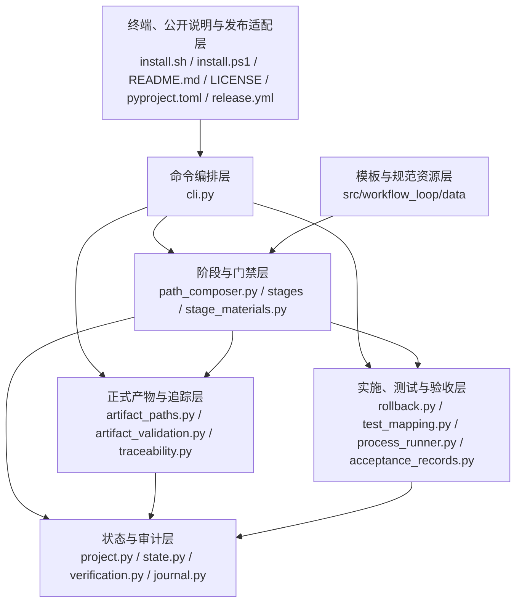

# Workflow Loop 代码架构设计

## 1. 文档说明

### 1.1 文档目的

本文记录 Workflow Loop 当前已经实现并完成验收的代码架构，以及本轮已确认但尚未实施的公开说明与发布变化。维护者可以从每个产品功能直接找到真实代码入口、关键处理、状态或数据、失败结果和具体测试函数；对于本轮新增的公开文件和发布配置，本文明确标记为“计划”。

本文覆盖从安装到项目、开始或继续一轮工作、逐环节确认、设计与穿刺、验收与测试计划、实施、测试、验收、返回、整轮作废到正式收工的完整流程。

### 1.2 设计依据

当前产品范围以[产品总说明](./产品总说明.md)链接的 13 份功能文档为准：

1. [安装到项目](./功能_安装到项目.md)
2. [开始或继续一轮工作](./功能_开始或继续一轮工作.md)
3. [推进并确认工作环节](./功能_推进并确认工作环节.md)
4. [维护产品设计](./功能_维护产品设计.md)
5. [维护代码设计](./功能_维护代码设计.md)
6. [复现产品缺陷](./功能_复现产品缺陷.md)
7. [验证技术不确定性](./功能_验证技术不确定性.md)
8. [制定验收与测试计划](./功能_制定验收与测试计划.md)
9. [实施并保护项目修改](./功能_实施并保护项目修改.md)
10. [编写并执行测试](./功能_编写并执行测试.md)
11. [验收并完成交付](./功能_验收并完成交付.md)
12. [返回上游重新处理](./功能_返回上游重新处理.md)
13. [整轮作废并恢复](./功能_整轮作废并恢复.md)

共同约束来自[领域词汇与已确认决定](../CONTEXT.md)、[项目设计说明](../DESIGN.md)和[需求交付追踪表](../需求交付追踪表.md)。

### 1.3 当前事实

| 核对项 | 当前事实 | 依据 |
|---|---|---|
| 正式版本 | 当前源码和本轮首发计划均为 `0.1.0`；产品不把 `0.1.0` 永久固定为唯一版本，未来公开新内容时使用未发布过的新版本号 | `pyproject.toml`、`src/workflow_loop/__init__.py`、安装脚本、发布流程和已确认的产品设计 |
| 正式文档 | 使用中文文件名；模板与规范仓库内部文件名保留英文 | `src/workflow_loop/artifact_paths.py` 和包内资源 |
| 公开项目身份 | 当前远程仓库仍是 `yuzyf/workflow_loop_spike`，仓库简介仍是穿刺说明；本轮计划把公开仓库和本地目录改为 `workflow_loop`，把远程地址与简介同步到新身份 | 当前 Git 远程地址、GitHub 仓库设置和已确认的产品设计 |
| 公开说明与许可证 | 当前没有 `README.md`（项目说明文档）和 `LICENSE`（许可证文件）；`pyproject.toml`（Python 打包配置）仍缺少 README、作者、许可证和项目链接，简介也不是已确认文字 | 当前仓库文件清单、Python 打包配置和已确认的产品设计 |
| 正式发布状态 | 当前还没有 `v0.1.0`（版本 0.1.0 标签）对应的 GitHub 正式发布页或 PyPI（Python 公共软件包仓库）项目；发布配置已有验证和上传顺序，但正式发布名称仍使用分发包名且没有发布说明 | GitHub 正式发布页、PyPI 当前查询结果、`.github/workflows/release.yml`（自动发布配置）和已确认的产品设计 |
| 支持平台 | macOS、Linux、Windows；Windows 安装同时兼容 Windows PowerShell 5.1 和 PowerShell 7 | `install.sh`、`install.ps1` 和 `.github/workflows/release.yml` |
| 测试入口 | 由被管理项目按操作系统保存参数数组；安装包不下发通用全量测试脚本 | `src/workflow_loop/test_entry.py` 和 `src/workflow_loop/project.py` |
| 最终交付 | 主题验收、最终全量回归、整体验收、最终代码设计同步和正式收工均已形成真实实现 | 本文第 6.11 节和本轮验收记录 |

## 2. 产品概览

Workflow Loop 让 AI 执行日常工作流命令，用程序状态和门禁阻止跳步。用户负责说明需求、确认关键选择、判断人工验收结果，不手工维护机器状态。

完整过程是：

1. 用户在目标项目根运行适合当前终端的官方安装命令。
2. 安装器检查 Python 3.11 或更高版本、现有命令身份和完整写入范围；用户确认后，安装本轮固定为 `0.1.0` 的全局命令与项目骨架。
3. 用户提出需求后，AI 调用 `workflow start`，中文含义是“开始或继续一轮工作”。程序继续进行中的轮次，或者按从零创建、修改产品、修复缺陷生成阶段路径。
4. 每个阶段由 `workflow discuss`，中文含义是“列出当前阶段必读材料”，指出文件；AI 读取并讨论后，依次通过讨论确认、程序检查和用户确认。
5. 程序完成设计、穿刺、验收与测试计划、实施、测试代码、主题测试和主题验收。
6. 所有主题通过后，程序在最终完整代码上执行项目自己的全量测试入口；用户确认整轮需求是否完成。
7. AI 把真实实现同步到本文；用户确认后，AI 立即执行 `workflow done`，中文含义是“正式收工”。
8. 进行中的轮次可以返回真实上游重新处理，也可以整轮作废并恢复开工前内容。

公开使用入口是仓库根目录的中文 `README.md`（项目说明文档）。它展示四个公开状态徽章，说明产品定位、能力边界、三种工作意图、三道门、环境要求、三平台正式安装命令、最小使用示例、简洁命令表、使用 `uv`（Python 项目管理工具）的源码开发方式、仓库结构和详细设计入口。本轮发布适配层把同一份 `0.1.0` Python 分发包和两个安装脚本按 `v0.1.0`（版本 0.1.0 标签）发布到 PyPI（Python 公共软件包仓库）与 GitHub 正式发布页；README 只引用当前发布的固定地址。未来新版本需要在新的工作流中同步更新这些版本位置。

通用规则：

- 显示名称与稳定文件标识分离，用户文字不直接拼接成路径。
- Bash 与 PowerShell 只负责终端差异，共同安装事务由 Python 实现。
- 修改前不要求全量测试通过；最终收工前必须执行一次全量回归。
- 门禁能核对文件和状态事实，不能声称证明 AI 已经理解正文。
- 第一版不升级已安装项目、不自动修改 `.gitignore`、不静默安装项目所需工具链。
- 公开身份使用固定映射：仓库和本地目录为 `workflow_loop`，Python 导入包为 `workflow_loop`，产品显示名为 `Workflow Loop`，PyPI 分发包和命令版本身份为 `workflow-loop`；同一次公开发布的版本位置必须一致，已发布版本不能复用。

## 3. 产品设计如何决定代码架构

| 产品规则 | 代码职责 | 实际承担位置 |
|---|---|---|
| 本轮版本一致、跨平台、事务安装 | 终端适配与共同安装事务分离；本轮所有安装身份保持 `0.1.0` | `install.sh`、`install.ps1`、`src/workflow_loop/installer.py` |
| 公开说明、包元数据和本轮版本发布 | 在不改变运行时模块的情况下，生成用户入口与许可证，写入准确分发元数据，并按 `v0.1.0`（版本 0.1.0 标签）先验证后发布；未来版本在新的工作流中协同更新 | `README.md`（计划的项目说明文档）、`LICENSE`（计划的许可证文件）、`pyproject.toml`（Python 打包配置）、`.github/workflows/release.yml`（自动发布配置） |
| 公开仓库名称、简介和本地身份一致 | 更新 GitHub 外部仓库设置、本地目录和 Git 远程地址；历史记录可以保留旧名称，当前入口不得继续指向旧仓库 | GitHub 仓库设置（计划）、本地项目目录（计划）、Git `origin`（远程仓库地址，计划） |
| 有进行中轮次必须继续 | 命令先只读状态，再决定是否创建轮次 | `src/workflow_loop/cli.py`、`src/workflow_loop/state.py` |
| 三种工作意图有固定阶段路径 | 根据项目设计初始化状态组合阶段 | `src/workflow_loop/path_composer.py` |
| AI 先读当前阶段材料 | 统一生成有顺序、可读、带指纹的材料清单 | `src/workflow_loop/stage_materials.py`、`src/workflow_loop/stages/base.py` |
| 中文正式路径和稳定文件标识 | 所有固定与动态产物路径集中生成 | `src/workflow_loop/artifact_paths.py`、`src/workflow_loop/project.py` |
| 产品、代码设计和穿刺不能互相伪造事实 | 阶段策略和结构校验分别核对产品、实现与技术证据 | `src/workflow_loop/stages/stages.py`、`src/workflow_loop/artifact_validation.py`、`src/workflow_loop/spike_validation.py` |
| 验收主题、测试项和实施记录要完整追踪 | 主题关系、测试标识和追踪表使用同一组稳定键 | `src/workflow_loop/topic_relations.py`、`src/workflow_loop/test_mapping.py`、`src/workflow_loop/traceability.py` |
| 项目自行定义全量测试入口 | 按平台保存参数数组，直接执行，不解析 Shell 字符串 | `src/workflow_loop/test_entry.py`、`src/workflow_loop/process_runner.py` |
| 修改前必须保存真实原内容 | 开工、实施、测试代码和入口脚本共用首次副本 | `src/workflow_loop/rollback.py` |
| 正式测试结果必须来自真实执行 | 每个测试项有独立机器记录，验收绑定精确记录编号 | `src/workflow_loop/test_execution.py`、`src/workflow_loop/acceptance_records.py` |
| 最终回归只执行一次 | 第二道门实际运行，第三道门只复核当前机器记录 | `src/workflow_loop/test_runner.py`、`src/workflow_loop/cli.py` |
| 返回只失效直接受影响主题 | AI 调查、用户确认，程序精确清除指定范围 | `src/workflow_loop/cli.py`、`src/workflow_loop/verification.py`、`src/workflow_loop/traceability.py` |
| 作废成功才标记整轮已作废 | 先完整预检，再逐项恢复和清理 | `src/workflow_loop/rollback.py`、`src/workflow_loop/cli.py` |

## 4. 代码架构分层

### 4.1 整体架构图

### 4.2 终端与发布适配层

`install.sh` 负责 macOS 和 Linux 终端适配，`install.ps1` 负责 Windows PowerShell 5.1 与 PowerShell 7 适配。二者检查环境、打印范围、取得一次确认、下载并校验固定 `uv 0.11.33`（Python 安装工具及其固定版本），然后调用 Python 安装事务。`.github/workflows/release.yml`（自动发布配置）在本轮固定 `0.1.0` 身份、构建顺序和三平台安装验证；它不负责自动选择未来版本。

本轮新增的 `README.md`（项目说明文档）和 `LICENSE`（MIT 许可证文件）属于同一公开说明与发布适配层，不被运行时命令调用。`pyproject.toml`（Python 打包配置）提供 README、作者 `yuzyf`、MIT 许可证、固定项目简介和新仓库链接等分发元数据，并使说明与许可证进入构建产物。发布流程在 `v0.1.0`（版本 0.1.0 标签）上构建同一分发包，验证完成后再上传 PyPI（Python 公共软件包仓库），并创建名称、说明和两个安装附件完整的 GitHub 正式发布页。

GitHub 仓库名称和简介、本地目录名及 Git `origin`（远程仓库地址）不由 Python 运行时管理。本轮实施通过 GitHub 仓库设置和本地 Git 操作更新这些外部状态；测试与验收分别核对公开页面、本地目录和远程地址，不增加运行时配置层。

### 4.3 命令编排层

`src/workflow_loop/cli.py` 解析命令，解释当前动作和边界，安排下一步，并在固定记录更新成功后才推进状态。主要入口包括 `cmd_start()`，中文含义是“开始或继续”；`cmd_discuss()`，中文含义是“列出必读材料”；`cmd_gate()`，中文含义是“执行阶段门禁”；`cmd_return()`，中文含义是“返回上游”；`cmd_abort()`，中文含义是“整轮作废”；`cmd_done()`，中文含义是“正式收工”。

### 4.4 阶段与门禁层

`src/workflow_loop/path_composer.py` 组合阶段路径。`StageStrategy`，中文含义是“阶段共同接口”，以及具体阶段类定义产物、材料、程序检查和阶段说明。`src/workflow_loop/stage_materials.py` 统一检查材料文件并计算内容指纹。

### 4.5 正式产物与追踪层

`src/workflow_loop/artifact_paths.py` 是正式产物路径的唯一生成位置。`artifact_file_keys`，中文含义是“显示名称到稳定文件标识的映射”，保存在项目状态中。结构校验、主题关系和追踪表模块只消费这些路径，不自行猜文件名。

### 4.6 实施、测试与验收层

`src/workflow_loop/rollback.py` 保存首次原内容并负责恢复。`src/workflow_loop/test_mapping.py` 连接主题、测试项、验收条件和测试函数。`src/workflow_loop/process_runner.py` 受控运行子进程。`src/workflow_loop/test_execution.py` 保存逐测试项机器事实。`src/workflow_loop/acceptance_records.py` 把当前机器记录或用户实际回答固化为验收记录。

### 4.7 状态与审计层

`ProjectState`，中文含义是“跨轮次项目状态”，保存在 `.workflow_loop/project.json`。`WorkflowState`，中文含义是“当前单轮工作流状态”，保存在 `.workflow_loop/state.json`。`verification.py` 计算当前文档和代码哈希并判断下游结果是否仍有效；`journal.py` 只追加命令事实，不保存正式文档正文和回退副本内容。

### 4.8 模板与规范资源层

`src/workflow_loop/data/Template_Repository/` 保存正式产物模板，`src/workflow_loop/data/Standardized_Repository/` 保存 AI 工作规范。安装时复制到项目 `.workflow_loop/`，包内源文件与项目运行副本保持逐字节一致。

## 5. 架构关键节点

### 5.1 正式产物寻址

`make_file_key()`，中文含义是“把显示名称转换为安全文件标识”，处理 Unicode 规范化、危险字符、Windows 保留名、长度和冲突。登记后的映射跨轮次保存；动态产物路径只由对应路径函数生成。路径冲突、越界或映射漂移会停止门禁，不覆盖文件。

### 5.2 阶段材料清单

`build_checklist()`，中文含义是“生成当前阶段材料清单”，按全局规范、模板、阶段规范和附加材料排序，逐项检查文件存在、是普通文件且 UTF-8 可读。`compute_fingerprint()`，中文含义是“计算材料内容指纹”，让第一道门确认讨论依据仍是当前内容，但不冒充 AI 已经理解正文。

### 5.3 安装事务

安装脚本先完成零写入预检和范围确认。`install_project_transaction()`，中文含义是“执行项目安装事务”，验证一次性令牌、准备临时骨架、保存原内容、替换项目文件并复核完整性。失败时 `_restore_from_manifest()`，中文含义是“按安装清单恢复”，只撤销本次动作；恢复不完整会保留事务并停止。

### 5.4 整轮回退清单

`prepare_start_baseline()`，中文含义是“保存开工前基线”，先记录受管文档、项目字段和已有入口脚本。`prepare_impl()`，中文含义是“保存实施文件首次副本”，以及测试代码准备函数只补新路径，不覆盖首次原内容。作废时 `preflight_abort()`，中文含义是“完整预检作废范围”，通过后才由 `restore_full_run()`，中文含义是“逐项恢复整轮内容”，执行恢复。

### 5.5 项目全量测试入口与跨平台执行

`select_entry()`，中文含义是“选择当前操作系统的测试入口”，按 `windows`、`linux`、`darwin`、`default` 顺序选参数数组。`run_process()`，中文含义是“受控执行进程”，使用 `shell=False` 直接运行；POSIX 清理进程组，Windows 清理进程树。入口缺失或环境不可用时不静默安装环境，也不进入整体验收。

### 5.6 实施中重新确认

实施记录变化后，门禁保存最新版确认哈希；`prepare_impl()` 只为新增且尚未修改的路径保存首次原内容。已经确认的测试文件清单由 `accept_test_code_inventory()`，中文含义是“保存已确认测试文件及其内容哈希”，记录；返回实施时，只有从确认后未再变化的测试文件可被排除在实施变化之外。

### 5.7 返回与直接影响失效

`cmd_return()` 只接受当前真实阶段路径中的更早目标，并要求明确主题或全部主题。`reset_topics_for_return()`，中文含义是“按返回目标重置直接主题追踪状态”，只清除用户确认的范围；不根据主题依赖自动扩大。返回穿刺时同时清除原跳过标记。

### 5.8 公开发布身份与安装入口

- **为什么是关键节点**：仓库地址、分发包元数据和安装脚本地址不一致时，用户会得到错误的安装入口，或安装脚本找不到与版本匹配的包。
- **对应产品内容**：公开产品身份、项目简介、作者、MIT 许可证和新仓库链接保持一致；本轮 GitHub 正式发布页与 PyPI（Python 公共软件包仓库）同时提供 `0.1.0`；README（项目说明文档）只展示真实可用的正式安装入口，未来版本必须使用新的未发布版本号。
- **代码位置**：`pyproject.toml`（计划加入 README、作者、许可证、固定简介和项目链接）；`README.md`（计划加入四个徽章及已确认正文结构）；`LICENSE`（计划写入 MIT 许可证和版权）；`.github/workflows/release.yml`（计划补充发布名称、说明和附件检查）；`install.sh`（现有 macOS 和 Linux 固定版本入口）、`install.ps1`（现有 Windows 固定版本入口）；GitHub 仓库设置、本地目录和 Git `origin`（计划更新的外部项目身份）。
- **上游**：维护者先完成仓库改名、说明、许可证、元数据和发布配置，把最终提交推送到主分支，再让 `v0.1.0`（版本 0.1.0 标签）准确指向该提交；GitHub Actions（GitHub 自动任务）读取标签并启动发布流程。
- **主要处理**：先核对版本身份并运行全量测试，再构建分发包，使用三平台安装冒烟测试验证同一包，最后按 PyPI 可信发布和 GitHub 正式发布顺序公开两个渠道。手动任务只验证，不公开发布。
- **下游**：用户从 README 复制当前系统的安装命令；安装脚本从 GitHub 正式发布页取得脚本，并从 PyPI 安装 `workflow-loop==0.1.0`（明确版本的 Python 分发包）。
- **状态和数据**：本轮发布流程使用 `v0.1.0`（版本 0.1.0 标签）、`0.1.0` 项目包版本、名称为 `Workflow Loop 0.1.0` 的正式发布、固定发布说明和两个安装脚本；成功后产生公开的 PyPI 版本和 GitHub 正式发布页。未来版本不由本轮代码自动调度。
- **失败结果**：版本、标签、可信发布身份、构建、测试或任一平台安装验证失败时，发布任务停止，不覆盖或重发已有版本。
- **验证位置**：扩展 `tests/test_release_workflow.py`（发布流程测试）核对触发条件、顺序、发布名称、说明和附件；新增 `tests/test_public_distribution.py`（公开分发内容测试）核对 README、许可证、打包元数据和构建产物。公开仓库名称、简介、标签提交和线上页面由本轮测试与验收保存真实外部证据。

## 6. 各产品功能的代码设计

### 6.1 【功能】安装到项目

产品要求见[功能_安装到项目.md](./功能_安装到项目.md)。本轮安装必须使用现有 Python 3.11 或更高版本、固定 `0.1.0`、一次确认和完整事务；取消或失败不能留下半套项目。用户先从公开 README 了解产品和环境要求，再使用当前系统的正式安装入口。

| 场景 | 代码位置 | 关键逻辑与状态 | 异常结果 | 验证位置 |
|---|---|---|---|---|
| 项目事务安装 | `src/workflow_loop/installer.py::install_project_transaction` | 验证令牌和范围，保存原内容，写入 `AGENTS.md`、模板规范与项目标记，成功后清理事务 | 令牌、骨架或写入失败时恢复本次修改 | `tests/test_installer.py::test_transaction_installs_complete_project_skeleton` |
| 安装失败恢复 | `src/workflow_loop/installer.py::recover_pending_transaction` | 安装前先继续未完成恢复，只有恢复完整才允许新安装 | 恢复不完整时保留事务并停止 | `tests/test_installer.py::test_failed_install_restores_existing_content` |
| 骨架身份检查 | `src/workflow_loop/project.py::check_skeleton` | 核对本轮 `0.1.0` 版本、项目状态、两套资源仓库和智能体契约 | 残缺或版本异常时写入前停止 | `tests/test_project.py::test_is_installed_rejects_project_state_without_complete_skeleton` |
| 三平台发布验证 | `src/workflow_loop/cli.py::_configure_utf8_output` | 命令入口强制 UTF-8 输出，避免 Windows 非 UTF-8控制台无法打印中文 | 输出配置失败时仍由命令错误路径返回非零结果 | `tests/test_release_workflow.py::test_prepublish_matrix_covers_platforms_and_partial_install_states` |
| 公开说明入口（计划） | `README.md`（根目录项目说明文档），无运行时函数 | 展示四个徽章、统一产品身份、能力边界、三种工作意图与三道门、环境要求、三平台命令、最小示例、简洁命令表、`uv`（Python 项目管理工具）源码开发方式、仓库结构和详细文档链接；不写已排除内容，不执行安装 | 文件缺失、结构不完整、出现旧仓库当前链接或命令版本不一致时，公开分发测试失败，不允许形成最终发布提交 | `tests/test_public_distribution.py`（计划新增的公开分发内容测试） |
| 分发元数据与许可证（计划） | `pyproject.toml`（Python 打包配置）的 `[project]`（项目元数据）和 `project.urls`（项目链接）；`LICENSE`（MIT 许可证文件） | 将 README、作者 `yuzyf`、MIT 许可证、固定简介、主页和源码链接写入分发元数据，并让 README 与许可证进入构建产物 | 元数据缺失、文字不一致、链接仍指向旧仓库或构建产物缺少 README/许可证时，构建检查失败 | `tests/test_public_distribution.py`（计划新增的公开分发内容测试） |
| 公开仓库身份（计划） | GitHub 仓库设置、本地目录、Git `origin`（远程仓库地址） | 把公开仓库和本地目录改为 `workflow_loop`，设置固定中文简介并更新远程地址；历史记录中的旧名称不改写 | 任一当前入口仍指向旧仓库、公开仓库不是目标名称或简介不同，不能推送最终标签 | 本轮测试与验收核对真实本地状态和 GitHub 公开状态 |
| 本轮 v0.1.0 标签发布（计划） | `.github/workflows/release.yml`（自动发布配置）；`github-release`（GitHub 发布任务） | 只让最终 `v0.1.0` 标签公开发布；先完成测试、构建和三平台验证，再上传 PyPI，最后创建名称为 `Workflow Loop 0.1.0`、说明完整且带两个安装脚本的 GitHub 正式发布页 | 任一前置任务失败时不继续后续发布；PyPI 已存在版本时停止，不覆盖或重发；手动任务只验证 | `tests/test_release_workflow.py`（发布流程测试）的触发、顺序、说明和附件断言 |

### 6.2 【功能】开始或继续一轮工作

产品要求见[功能_开始或继续一轮工作.md](./功能_开始或继续一轮工作.md)。无工作意图时只读；存在进行中轮次时继续；新轮次按真实意图生成阶段路径并先保存开工基线。

| 场景 | 代码位置 | 关键逻辑与状态 | 异常结果 | 验证位置 |
|---|---|---|---|---|
| 只读检查与开工 | `src/workflow_loop/cli.py::cmd_start` | 先读项目和单轮状态；无意图只说明现状，有意图才创建状态 | 未安装、已有进行中轮次或前置不满足时不覆盖状态 | `tests/test_commands.py::test_start_creates_one_run_and_refuses_to_overwrite_active_run` |
| 组合阶段路径 | `src/workflow_loop/path_composer.py::build_stage_path` | 根据从零创建、修改产品、修复缺陷和设计初始化状态返回具体阶段对象 | 未知意图直接报错 | `tests/test_commands.py::test_three_intents_produce_complete_project_specific_paths` |
| 保存开工基线 | `src/workflow_loop/rollback.py::prepare_start_baseline` | 清场或写新状态前保存受管文档、旧状态、项目字段和入口脚本 | 无可靠基线时不清场 | `tests/test_commands.py::test_from_scratch_confirmation_cleans_declared_scope_and_starts` |

### 6.3 【功能】推进并确认工作环节

产品要求见[功能_推进并确认工作环节.md](./功能_推进并确认工作环节.md)。AI 先读取当前材料，每阶段依次完成讨论确认、程序检查和用户确认，命令输出必须说明中文含义和用户是否参与。

| 场景 | 代码位置 | 关键逻辑与状态 | 异常结果 | 验证位置 |
|---|---|---|---|---|
| 生成材料清单 | `src/workflow_loop/stage_materials.py::build_checklist` | 按固定顺序检查材料并返回绝对路径、用途和指纹 | 文件缺失、不是普通文件或不可读时不登记 | `tests/test_stage_materials.py::test_material_checklist_is_ordered_and_contains_absolute_paths` |
| 列出必读材料 | `src/workflow_loop/cli.py::cmd_discuss` | 只打印路径和用途，并把当前清单指纹登记到本轮阶段 | 不把正文倾倒到终端，也不声称 AI 已读懂 | `tests/test_commands.py::test_discuss_prints_ordered_material_paths_without_document_bodies` |
| 三道门推进 | `src/workflow_loop/cli.py::cmd_gate` | 只操作当前阶段，重新检查当前产物后按讨论、程序、用户顺序推进 | 跳步、材料变化或产物失效时留在当前阶段 | `tests/test_commands.py::test_three_gates_advance_in_the_required_order` |

### 6.4 【功能】维护产品设计

产品要求见[功能_维护产品设计.md](./功能_维护产品设计.md)。产品总说明定义共同规则和当前功能入口，功能范围只取它实际链接的中文功能文档。

| 场景 | 代码位置 | 关键逻辑与状态 | 异常结果 | 验证位置 |
|---|---|---|---|---|
| 功能路径登记 | `src/workflow_loop/artifact_paths.py::register_file_keys` | 把功能显示名称登记为跨平台安全且稳定的文件标识 | 空名称、保留名或大小写冲突时停止 | `tests/test_artifact_paths.py::test_registered_file_keys_remain_stable_and_case_insensitive_unique` |
| 产品文档门禁 | `src/workflow_loop/stages/stages.py::SpecStage` | 校验产品总说明、实际链接功能文档、修改记录和当前轮次变化 | 链接缺失、结构不完整或中英两套正式入口时拒绝 | `tests/test_stages.py::test_spec_stage_accepts_linked_chinese_product_documents` |
| 产品哈希范围 | `src/workflow_loop/verification.py::compute_product_design_hash` | 只计算产品总说明及其当前链接的功能文档，不扫描历史残留文件 | 当前链接目标不存在时不能形成有效基线 | `tests/test_verification.py::test_product_design_hash_uses_only_linked_feature_documents` |

### 6.5 【功能】维护代码设计

产品要求见[功能_维护代码设计.md](./功能_维护代码设计.md)。同一份架构文档先描述可实施设计，最后再逐功能核对真实代码；代码现状不能反写成新的产品规则。

| 场景 | 代码位置 | 关键逻辑与状态 | 异常结果 | 验证位置 |
|---|---|---|---|---|
| 初步与修订设计 | `src/workflow_loop/stages/stages.py::ReviseCodeDesignStage` | 以已确认产品设计为基线，只修改受影响架构并保存初步完成状态 | 产品未确认或设计文档未真实变化时不推进 | `tests/test_verification.py::test_product_and_code_design_hash_change_with_content` |
| 最终设计同步 | `src/workflow_loop/stages/stages.py::UpdateCodeDesignStage` | 锁定产品文档基线，只允许本文发生变化，并核对最终交付前置 | 产品文档在本阶段变化时停止并要求返回产品设计 | `tests/test_architecture_validation.py::test_update_code_design_rejects_product_document_change` |
| 真实映射校验 | `src/workflow_loop/artifact_validation.py::validate_final_code_design_document` | 逐个当前功能检查真实代码文件、可定位符号、验证位置和精确机器记录集合 | 任一映射虚假、遗漏或仍写未完成状态时拒绝收工 | `tests/test_architecture_validation.py::test_final_architecture_requires_feature_to_code_mapping` |

### 6.6 【功能】复现产品缺陷

产品要求见[功能_复现产品缺陷.md](./功能_复现产品缺陷.md)。一轮修复只处理一个具体缺陷，必须记录真实输入、实际结果、期望结果、根因位置、证据和一个验收主题。

| 场景 | 代码位置 | 关键逻辑与状态 | 异常结果 | 验证位置 |
|---|---|---|---|---|
| 复现阶段门禁 | `src/workflow_loop/stages/stages.py::ReproduceStage` | 读取当前缺陷记录和索引，确认当前轮次与唯一主题 | 没有真实复现或主题不唯一时不进入后续阶段 | `tests/test_bug_validation.py::test_reproduce_document_requires_real_evidence_root_cause_and_one_topic` |
| 复现文档校验 | `src/workflow_loop/artifact_validation.py::validate_reproduce_documents` | 校验输入、步骤、实际与期望结果、根因文件位置和证据字段 | 根因未确认、证据占位或工作流编号不符时失败 | `tests/test_bug_validation.py::test_reproduce_document_rejects_unconfirmed_root_cause` |
| 主题登记 | `src/workflow_loop/topic.py::list_reproduce_topics` | 从当前轮次缺陷记录读取并返回唯一验收主题 | 同轮多个缺陷或多个主题时拒绝 | `tests/test_bug_validation.py::test_reproduce_document_requires_real_evidence_root_cause_and_one_topic` |

### 6.7 【功能】验证技术不确定性

产品要求见[功能_验证技术不确定性.md](./功能_验证技术不确定性.md)。只有会改变后续决定且现有事实无法回答的问题进入穿刺；用户也可以明确跳过。

| 场景 | 代码位置 | 关键逻辑与状态 | 异常结果 | 验证位置 |
|---|---|---|---|---|
| 解析穿刺结论 | `src/workflow_loop/spike_validation.py::parse_spike_detail` | 读取当前轮次、方法、观察、结论、风险和设计影响 | 字段缺失或占位时形成明确问题列表 | `tests/test_spike_validation.py::test_validate_spike_stage_requires_unresolved_risk_fields` |
| 穿刺门禁 | `src/workflow_loop/spike_validation.py::validate_spike_stage` | 对照穿刺清单、详情、工作流编号、阻塞状态和设计基线哈希 | 旧轮次、阻塞项或设计变化未写回时拒绝 | `tests/test_spike_validation.py::test_validate_spike_stage_accepts_complete_current_run` |
| 设计基线 | `src/workflow_loop/cli.py::ensure_spike_baseline` | 进入穿刺前保存产品和代码设计哈希，供结论判断是否真实改变设计 | 需要证明变化却没有可靠基线时不放行 | `tests/test_spike_validation.py::test_validate_spike_stage_requires_design_hash_change` |

### 6.8 【功能】制定验收与测试计划

产品要求见[功能_制定验收与测试计划.md](./功能_制定验收与测试计划.md)。验收主题先定义可判断条件，测试项再映射条件、直接依赖和项目自己的分平台全量入口；本阶段不运行修改前全量回归。

| 场景 | 代码位置 | 关键逻辑与状态 | 异常结果 | 验证位置 |
|---|---|---|---|---|
| 验收条件结构 | `src/workflow_loop/artifact_validation.py::validate_acceptance_plan_documents` | 校验主题、条件、触发、预期结果、产品依据、范围和上下游链接 | 条件不可判断或主题文档不完整时拒绝 | `tests/test_stages.py::test_acceptance_plan_requires_complete_judgable_fields` |
| 主题关系 | `src/workflow_loop/topic_relations.py::read_topic_index` | 按验收索引读取有序主题及直接前置关系并检查图结构 | 重名、歧义、循环或不稳定文件路径时失败 | `tests/test_topic_relations.py::test_topic_index_rejects_ambiguous_or_invalid_graph` |
| 测试项映射 | `src/workflow_loop/test_mapping.py::parse_test_plan_items` | 每条测试项绑定主要验收条件、方法和直接依赖 | 重复编号、人工依赖或循环时失败 | `tests/test_test_mapping.py::test_test_plan_parses_method_primary_criterion_and_direct_dependencies` |
| 分平台入口 | `src/workflow_loop/test_entry.py::select_entry` | 从项目配置选择当前系统参数数组，不解析 Shell 字符串 | 缺少当前平台与默认入口时停止 | `tests/test_test_entry.py::test_platform_entry_prefers_exact_platform_then_default` |

### 6.9 【功能】实施并保护项目修改

产品要求见[功能_实施并保护项目修改.md](./功能_实施并保护项目修改.md)。全部主题的实施内容先经用户确认并保存真实原内容；同阶段调整只能补充尚未修改的新路径。

| 场景 | 代码位置 | 关键逻辑与状态 | 异常结果 | 验证位置 |
|---|---|---|---|---|
| 实施记录门禁 | `src/workflow_loop/stages/stages.py::ImplStage` | 检查全部主题记录、代码修改表、开发检查和未完成内容 | 主题缺失或有未解决问题时第一道门失败 | `tests/test_stages.py::test_impl_discussion_requires_every_topic_plan_and_no_unresolved_question` |
| 保存首次副本 | `src/workflow_loop/rollback.py::prepare_impl` | 按确认内容保存原文件或“原本不存在”，并记录确认哈希 | 路径已经提前变化或副本不可信时拒绝实施 | `tests/test_rollback.py::test_impl_backup_records_existing_and_originally_missing_files` |
| 调整实施内容 | `src/workflow_loop/rollback.py::validate_prepared` | 复核最新版确认哈希，只补新增且仍保持原状的文件 | 重复准备不能覆盖首次副本 | `tests/test_rollback.py::test_adjusted_plan_keeps_first_backup_and_only_adds_trustworthy_paths` |
| 返回实施复用测试文件 | `src/workflow_loop/rollback.py::accept_test_code_inventory` | 保存用户确认时的测试文件清单和哈希，返回实施时只忽略确认后未变的测试文件 | 测试文件在确认后变化时仍按实施变化处理 | `tests/test_rollback.py::test_impl_reentry_allows_only_unchanged_confirmed_test_files` |

### 6.10 【功能】编写并执行测试

产品要求见[功能_编写并执行测试.md](./功能_编写并执行测试.md)。测试代码必须追踪到主题、测试项、验收条件和产品入口；正式结果按测试项真实执行并保存独立机器记录。

| 场景 | 代码位置 | 关键逻辑与状态 | 异常结果 | 验证位置 |
|---|---|---|---|---|
| 测试标识校验 | `src/workflow_loop/test_mapping.py::validate_workflow_test_markers` | 核对测试文件附近的主题、测试项、验收条件、方法和产品入口标识 | 数据字符串中的伪标识或一函数绑定多项时拒绝 | `tests/test_test_mapping.py::test_marker_inside_python_test_data_string_cannot_satisfy_gate` |
| 登记执行任务 | `src/workflow_loop/test_execution.py::prepare_task` | 保存真实参数数组、工作目录、测试入口和依赖；纯人工项不登记 | Shell 运算符、路径越界或命令未选择登记入口时失败 | `tests/test_test_execution.py::test_prepare_registers_real_argv_and_plan_dependencies` |
| 受控执行 | `src/workflow_loop/process_runner.py::run_process` | 记录开始结束时间、退出码、时长和有限输出；超时后等待进程树清理 | 非零退出、无法启动或超时均形成真实失败结果 | `tests/test_process_runner.py::test_process_runner_times_out_and_waits_for_cleanup` |
| 逐项机器记录 | `src/workflow_loop/test_execution.py::run_prepared_tasks` | 按主题和测试依赖执行，每个测试项生成独立当前记录；失败替换旧成功 | 前置失败时停止依赖项，失败重跑会清除旧成功 | `tests/test_test_execution.py::test_failed_rerun_clears_previous_current_success_and_result` |

### 6.11 【功能】验收并完成交付

产品要求见[功能_验收并完成交付.md](./功能_验收并完成交付.md)。主题验收绑定当前机器记录或用户实际回答；全部主题通过后执行一次最终全量回归，再由用户判断整轮需求，最终同步本文并正式收工。

| 场景 | 代码位置 | 关键逻辑与状态 | 异常结果 | 验证位置 |
|---|---|---|---|---|
| 主题验收记录 | `src/workflow_loop/acceptance_records.py::ensure_automated_records` | 自动化条件从当前测试任务取得精确机器记录编号，人工部分保存用户原话和证据 | 记录替换、失败或失效时旧验收不能复用 | `tests/test_acceptance_records.py::test_automated_acceptance_record_is_created_from_current_test` |
| 最终全量回归 | `src/workflow_loop/test_runner.py::run_final_regression` | 选择当前系统入口，在项目根执行一次并保存参数、时间、退出码、输出和代码哈希 | 非零退出、超时、入口或代码变化时不进入整体验收 | `tests/test_test_runner.py::test_final_regression_runs_registered_entry_and_records_machine_facts` |
| 缺陷关闭时机 | `src/workflow_loop/bug_record.py::record_overall_acceptance_pass` | 主题验收后保持待回归，回归通过后保持待整体验收，整体验收通过才关闭 | 回归失败时写重新处理中且保留原复现事实 | `tests/test_bug_record.py::test_overall_acceptance_closes_bug_and_preserves_reproduction` |
| 正式收工 | `src/workflow_loop/cli.py::cmd_done` | 只在全部阶段确认后清理临时回退副本，再把整轮标为完成 | 清理失败时保持完成前状态，重试只继续清理 | `tests/test_commands.py::test_done_marks_completed_and_preserves_formal_documents` |

### 6.12 【功能】返回上游重新处理

产品要求见[功能_返回上游重新处理.md](./功能_返回上游重新处理.md)。AI 调查真实问题来源，用户确认更早目标和直接受影响主题，程序只清除该范围的旧结果。

| 场景 | 代码位置 | 关键逻辑与状态 | 异常结果 | 验证位置 |
|---|---|---|---|---|
| 目标与范围校验 | `src/workflow_loop/cli.py::cmd_return` | 目标必须位于当前真实阶段之前；有主题时必须明确单个主题或全部主题 | 当前、后续、不存在阶段或模糊主题范围均拒绝 | `tests/test_commands.py::test_return_accepts_only_real_earlier_stage` |
| 精确失效 | `src/workflow_loop/traceability.py::reset_topics_for_return` | 按目标清除指定主题的追踪列，整轮结论按目标单独清除 | 未指定的独立主题行保持不变 | `tests/test_traceability.py::test_reset_topic_test_results_only_resets_selected_topics` |
| 内容有效性恢复 | `src/workflow_loop/verification.py::reset_stages_and_move_current` | 清除目标及下游门禁，设置恢复上下文并切换当前阶段 | 修改上游后才调用返回属于非法顺序 | `tests/test_verification.py::test_recovery_actions_distinguish_recheck_from_rerun` |

### 6.13 【功能】整轮作废并恢复

产品要求见[功能_整轮作废并恢复.md](./功能_整轮作废并恢复.md)。作废恢复受管文档、代码、测试、入口脚本和项目字段，并删除本轮新文件；清单外文件不动，本轮内容不归档。

| 场景 | 代码位置 | 关键逻辑与状态 | 异常结果 | 验证位置 |
|---|---|---|---|---|
| 完整预检 | `src/workflow_loop/rollback.py::preflight_abort` | 合并开工与实施清单，检查副本、哈希、路径安全和恢复目标 | 任一问题都保持整轮进行中且不开始恢复 | `tests/test_rollback.py::test_tampered_backup_blocks_restore_before_project_change` |
| 逐项恢复 | `src/workflow_loop/rollback.py::restore_full_run` | 恢复旧内容、删除本轮新文件、恢复项目受管字段，并持久化逐项进度 | 中断后重试不覆盖恢复后出现的新修改 | `tests/test_rollback.py::test_abort_retry_detects_change_after_restore_progress_write_failure` |
| 项目字段恢复 | `src/workflow_loop/project.py::restore_managed_fields` | 只恢复安装版本、设计状态、主题历史、文件标识和测试入口等受管字段 | 非受管字段保持用户当前内容 | `tests/test_rollback.py::test_full_abort_restores_managed_content_and_project_fields_only` |
| 作废命令编排 | `src/workflow_loop/cli.py::cmd_abort` | 预检、恢复和清理全部成功后才写作废时间与状态 | 任一步失败都保留临时副本和进行中状态供重试 | `tests/test_rollback.py::test_full_abort_restores_managed_content_and_project_fields_only` |

## 7. 多个功能共同使用的代码

### 7.1 正式产物引用

`artifact_paths.py` 和项目状态中的 `artifact_file_keys`，中文含义是“正式产物显示名称与稳定文件标识的映射”，共同服务产品、穿刺、验收、测试、实施、缺陷、追踪和作废。任何模块都不能自行拼接动态正式文件名。

### 7.2 阶段策略和材料

`StageStrategy` 是阶段共同接口，具体阶段只提供本阶段产物、材料、校验和说明。`stage_materials.py` 负责文件事实，`cmd_discuss()` 负责用户可读指路，`cmd_gate()` 负责门禁和推进，三者不复制彼此职责。

### 7.3 项目状态、单轮状态和流水

`ProjectState` 保存跨轮次事实，`WorkflowState` 保存当前轮次与门禁，Journal 保存追加式命令事实。正式文档正文不写进机器状态或流水，真实回退副本只存在于当前轮次临时回退目录。

### 7.4 验证失效

`verification.py` 分别计算产品、代码设计、验收计划、测试计划、实施、测试代码、主题结果和最终回归的当前哈希。返回上游只清除用户确认的直接受影响主题；最终全量回归负责发现跨主题或间接影响。

### 7.5 受控进程执行

`process_runner.py` 同时服务主题测试与最终回归，接受工作目录、参数数组、环境和超时，返回机器事实。它不解析 Shell 字符串、不安装依赖，也不替用户判断失败应返回哪个业务阶段。

### 7.6 整轮回退

`rollback.py` 把开工、测试入口、实施和测试代码纳入同一轮首次副本体系。追加路径不得覆盖第一次保存的原内容；正式收工和成功作废删除临时副本，失败作废保留恢复依据和进度。

## 8. 产品设计与代码实现的差异

| 核对范围 | 产品要求 | 当前实现 | 结论 |
|---|---|---|---|
| 13 个当前功能 | 每个功能都有真实入口、关键逻辑、状态或数据、异常结果和验证位置 | 第 6 章已逐项定位到现存代码符号和测试函数 | 一致 |
| 跨平台安装 | 本轮使用 `0.1.0`，使用现有 Python，失败整体恢复；未来公开版本使用新版本号 | Bash、PowerShell、Python 事务和三平台发布验证已经连通；未来版本需要在新的发布工作流中同步更新 | 本轮一致，未来版本不在本轮实现范围 |
| 中文正式产物 | 中文正式文件名与稳定文件标识分离 | 路径模块、项目映射和所有阶段均使用中文正式入口 | 一致 |
| 测试与验收事实 | 项目自定义入口、逐项机器记录、最终回归和用户验收分层 | 测试登记、受控执行、验收记录和最终回归状态已分开保存 | 一致 |
| 返回、作废和收工 | 精确失效、完整恢复、最后确认后直接收工 | 返回、整轮恢复、清理重试和完成状态已实现 | 一致 |
| 公开说明与正式发布 | README 四个徽章和已确认内容、MIT 版权、固定简介和作者、新仓库身份、完整分发元数据，以及 GitHub 正式发布页与 PyPI 同时公开 `0.1.0` | README 和许可证不存在；打包元数据不完整且简介仍是旧文字；仓库、本地目录和远程地址仍是旧名称；发布任务已有验证与上传顺序，但正式发布名称和说明尚未补齐，正式标签尚未创建 | 本轮按第 5.8 节和第 6.1 节实施并取得真实公开证据后才能确认一致；当前只有产品与代码设计确认 |
| 版本策略的说明文字 | 本次发布各位置统一为 `0.1.0`；以后公开新内容使用未发布过的新版本号 | `CONTEXT.md` 和 `src/workflow_loop/__init__.py` 的注释仍写成“只有一个版本” | 实施阶段更新说明文字和注释，不增加版本调度或升级代码；产品文档与用户决定已经确认 |

除上表列出的公开说明、正式发布和版本策略说明文字外，当前没有未处理的产品、代码、测试或运行差异。本轮变化尚未实施，不能把上一轮最终验收结论当作本轮发布已完成的证据。

第 9 章末尾保留上一轮最终同步的机器记录；本轮完成最终同步时必须补充本轮主题验收、最终全量回归和整体验收事实。

## 9. 最终同步结论

- 工作流编号：2026-07-30-0740-product_change
- 本次同步类型：架构未变化
- 产品设计核对：一致
- 功能文档核对：一致
- 代码实现核对：一致
- 功能到代码映射：完整
- 未处理差异：暂无
- 核对依据：本轮七个主题的正式验收结果见[验收索引](../acceptance/索引.md)，完整阶段关系见[需求交付追踪表](../需求交付追踪表.md)；主题验收实际使用的机器测试记录为 RUN-20260803T062645+0000-a5fe6cce、RUN-20260803T062646+0000-71d54495、RUN-20260803T062646+0000-76c3d323、RUN-20260803T062646+0000-89aad0b5、RUN-20260803T062647+0000-0f4b2f7c、RUN-20260803T062647+0000-366c51a8、RUN-20260803T062647+0000-3830f642、RUN-20260803T062647+0000-5632bec6、RUN-20260803T062647+0000-708ec907、RUN-20260803T062647+0000-a7adbd3b、RUN-20260803T062648+0000-0812f8e8、RUN-20260803T062648+0000-2405dc4f、RUN-20260803T062648+0000-2e9d2118、RUN-20260803T062648+0000-3499ca83、RUN-20260803T062648+0000-85b8ef4d、RUN-20260803T062648+0000-8c701316、RUN-20260803T062648+0000-ae70c0a4、RUN-20260803T062648+0000-b72cd59a、RUN-20260803T062648+0000-d9f630f5、RUN-20260803T062649+0000-62c07a97、RUN-20260803T062649+0000-d3a4ea28、RUN-20260803T062650+0000-15acf631、RUN-20260803T062651+0000-48f1fdae、RUN-20260803T062651+0000-5cca0bd2、RUN-20260803T062651+0000-fb7bc472、RUN-20260803T062652+0000-4996e4f6、RUN-20260803T062652+0000-97c78772、RUN-20260803T062652+0000-c4cc1c34、RUN-20260803T092142+0000-1d7afcfc、RUN-20260803T092142+0000-29cef493、RUN-20260803T092142+0000-38a55627、RUN-20260803T092142+0000-5c6c172b、RUN-20260803T092142+0000-9b242ed1、RUN-20260803T092142+0000-9e9598f8、RUN-20260803T092142+0000-d264c2e2、RUN-20260803T095855+0000-3d95edf9、RUN-20260803T095855+0000-4081a6b6、RUN-20260803T095855+0000-639c3639、RUN-20260803T095855+0000-7859514e、RUN-20260803T095855+0000-80032deb、RUN-20260803T095855+0000-cc1774c1、RUN-20260803T095855+0000-f5829c46；最终完整代码在项目根执行 `[".venv/bin/python", "-m", "pytest", "-q"]`，155 项全部通过，机器记录为 REG-20260803T113357+0000-61065e30；用户随后确认七个主题组合后已经完成本次需求。

本次实施没有改变第 4 章的分层、依赖方向或模块职责，所以同步类型是“架构未变化”；本次修改把实施前描述替换为最终真实代码映射和验收依据。
