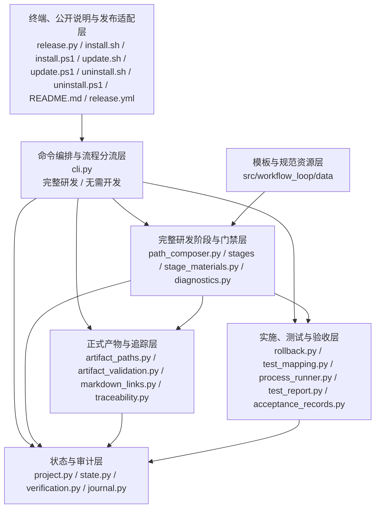
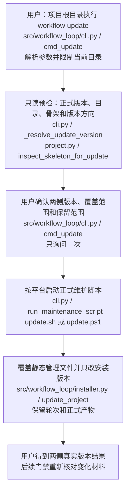
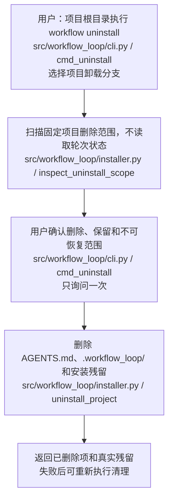
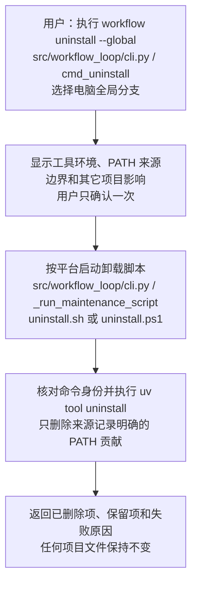
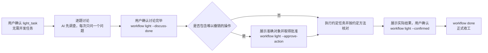
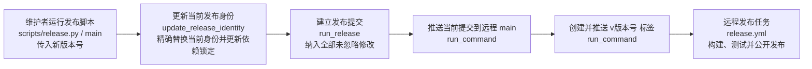

# Workflow Loop 代码架构设计

## 1. 文档说明

### 1.1 文档目的

本文描述当前源码已经实现的代码架构，包括分层、关键节点、状态、文件边界、失败结果和验证位置。未实现、未验证或与真实代码冲突的内容只能写入差异记录，不得混入当前架构事实。本轮是否已经完成测试、验收和最终同步，由工作流状态和第 9 节的当轮结论单独记录。

本文覆盖发布正式版本、安装到项目、更新已安装项目、卸载 Workflow Loop、开始或继续一轮工作、处理无需开发任务、逐环节确认、产品设计与穿刺、验收计划、代码实施、测试验证、验收、返回、整轮作废到正式收工的完整流程。

### 1.2 设计依据

当前产品范围以[产品总说明](./产品总说明.md)链接的 17 份功能文档为准：

1. [安装到项目](./功能_安装到项目.md)
2. [开始或继续一轮工作](./功能_开始或继续一轮工作.md)
3. [处理无需开发任务](./功能_处理无需开发任务.md)
4. [推进并确认工作环节](./功能_推进并确认工作环节.md)
5. [维护产品设计](./功能_维护产品设计.md)
6. [维护代码设计](./功能_维护代码设计.md)
7. [复现产品缺陷](./功能_复现产品缺陷.md)
8. [验证技术不确定性](./功能_验证技术不确定性.md)
9. [制定验收与测试计划](./功能_制定验收与测试计划.md)
10. [实施并保护项目修改](./功能_实施并保护项目修改.md)
11. [编写并执行测试](./功能_编写并执行测试.md)
12. [验收并完成交付](./功能_验收并完成交付.md)
13. [返回上游重新处理](./功能_返回上游重新处理.md)
14. [整轮作废并恢复](./功能_整轮作废并恢复.md)
15. [更新已安装项目](./功能_更新已安装项目.md)
16. [卸载 Workflow Loop](./功能_卸载_Workflow_Loop.md)
17. [发布正式版本](./功能_发布正式版本.md)

产品规则来自[产品总说明](./产品总说明.md)及其功能文档，已经发生的设计取舍保存在[架构决策记录](../docs/adr/0001-support-native-windows-powershell.md)，交付关系见[需求交付追踪表](../需求交付追踪表.md)。本文只描述当前真实代码结构。

### 1.3 当前事实

| 核对项 | 当前事实 | 依据 |
|---|---|---|
| 当前版本身份 | 源码、命令身份、六个维护脚本、README、项目安装标记和自动发布配置统一为 `0.3.7` | `pyproject.toml`、`src/workflow_loop/__init__.py`、`install.sh`、`install.ps1`、`update.sh`、`update.ps1`、`uninstall.sh`、`uninstall.ps1`、`README.md`、`.workflow_loop/project.json`和 `.github/workflows/release.yml` |
| 正式文档 | 使用中文文件名；模板与规范仓库内部文件名保留英文 | `src/workflow_loop/artifact_paths.py` 和包内资源 |
| 公开项目身份 | 本地目录、Git `origin`（远程仓库地址）和 GitHub 公开仓库均为 `workflow_loop`；GitHub 仓库为 `yuzyf/workflow_loop`，简介与 Python 分发元数据一致 | 本地项目根、`git remote get-url origin`、GitHub 仓库公开接口和 `tests/public_repository_checks.py::test_local_and_public_repository_identity_are_canonical` |
| 公开说明与许可证 | 根目录 `README.md`（项目说明文档）提供中文说明、四种工作意图和简单流程规则；完整研发流程保留三道门，无需开发任务使用独立确认流程；`LICENSE`（许可证文件）为 MIT；`pyproject.toml`（Python 打包配置）包含 README、作者、许可证、固定简介和项目链接 | `README.md`、`LICENSE`、`pyproject.toml` 和 `tests/test_public_project.py` |
| 最近保存的公开发布证据 | `0.2.0` 的标签、GitHub Actions 任务、PyPI 页面和 GitHub 正式发布页是已完成历史证据；当前 `0.3.7` 身份是现行源码和发布配置事实，不用旧任务编号冒充新版本已发布证明 | [0.2.0 主题测试结果](../qa/0_2_0_在_GitHub_和_PyPI_完成正式发布_测试结果.md)、`tests/release_publication_checks.py`和当前版本身份文件 |
| 支持平台 | macOS、Linux、Windows；Windows 安装同时兼容 Windows PowerShell 5.1 和 PowerShell 7 | `install.sh`、`install.ps1` 和 `.github/workflows/release.yml` |
| 测试入口 | 由被管理项目按操作系统保存参数数组；安装包不下发通用全量测试脚本 | `src/workflow_loop/test_entry.py` 和 `src/workflow_loop/project.py` |
| 最近已完成的交付证据 | 当前轮次“登记测试项时入口填不对当场说清而不是测完才失败”的主题验收、最终全量回归和整体验收已通过；更早轮次的交付状态只作为历史证据保留 | [登记测试项时入口填不对当场说清而不是测完才失败_验收结果](../acceptance/登记测试项时入口填不对当场说清而不是测完才失败_验收结果.md)、[对应测试结果](../qa/登记测试项时入口填不对当场说清而不是测完才失败_测试结果.md)和本文第 9 节 |
| 更新与卸载 | `workflow update`、`workflow uninstall`、`workflow uninstall --global` 和四个跨平台维护脚本均已实现；相关专题验收、跨平台发布任务和全量回归均已通过 | 对应产品文档、本文第 6.14 和 6.15 节及对应专题验收结果 |
| 无需开发任务 | `light_task`（无需开发任务）已经作为第四种工作意图实现；它在开工入口分流，使用最小单轮状态，按讨论、执行、结果确认推进，不创建研发阶段、研发文档、固定测试或回退副本 | [处理无需开发任务](./功能_处理无需开发任务.md)、`src/workflow_loop/path_composer.py`、`src/workflow_loop/state.py`、`src/workflow_loop/cli.py`、本轮测试与验收结果 |
| 当前研发流程结构 | 三种完整研发意图共用“验收计划→`impl`（代码实施）→`qa`（测试验证）→主题验收→最终回归→整体验收→最终代码设计同步”主干；`impl` 保存代码计划、实施和代码结果，`qa` 保存范围、计划、测试代码、任务、机器记录和测试结果 | `src/workflow_loop/path_composer.py`、`src/workflow_loop/stages/stages.py`、`src/workflow_loop/state.py`、`src/workflow_loop/cli.py`和 `tests/test_current_workflow_qa.py` |
| 人工发布脚本 | `scripts/release.py` 已提供一条命令完成当前版本身份更新、依赖锁定、提交、分支推送和标签推送；调用即表示维护者承担跳过本地发布检查的风险 | [发布正式版本](./功能_发布正式版本.md)、`scripts/release.py` 和 `.github/workflows/release.yml` |

## 2. 产品概览

Workflow Loop 让 AI 执行日常工作流命令，用程序状态和门禁阻止跳步。用户负责说明需求、确认关键选择、判断人工验收结果，不手工维护机器状态。

完整过程是：

1. 用户在目标项目根运行适合当前终端的官方安装命令。
2. 安装器检查 Python 3.11 或更高版本、现有命令身份和完整写入范围；用户确认后，安装 `0.3.7` 的全局命令与项目骨架。
3. 用户提出需求后，AI 调用 `workflow start`，中文含义是“开始或继续一轮工作”。程序继续进行中的轮次；没有进行中轮次时，AI 根据事实推荐从零创建、修改产品、修复缺陷或无需开发任务，用户确认路线后才开始。
4. 从零创建、修改产品和修复缺陷组成完整研发环节路径。每个环节由 `workflow discuss`，中文含义是“列出当前环节必读材料”，指出文件；AI 读取并讨论后，依次经过讨论完成、程序检查和用户确认三道门。
5. 研发主干是“验收计划→代码实施→测试验证→主题验收”。代码实施内部固定完成代码计划、代码实施和代码结果；测试验证内部连续完成范围确认、计划检查、测试代码准备、任务登记、正式执行和结果整理。
6. 完整研发流程的所有主题通过后，程序在最终完整代码上执行项目自己的全量测试入口；用户确认整轮需求是否完成。
7. `light_task`，中文含义是“无需开发任务”，不生成研发阶段路径。AI 先调查事实，每次只问一个需要用户决定的问题；用户确认讨论完毕后直接执行约定操作，难以撤销的操作另行取得准确批准，再按任务约定核对结果。
8. AI 展示无需开发任务的实际结果；用户确认后执行 `workflow done`，中文含义是“正式收工”。该结果只证明约定操作及核对已经完成，不代表代码质量、产品测试或研发验收通过。
9. 完整研发轮次可以返回真实上游重新处理，也可以整轮作废并恢复开工前内容。无需开发轮次没有回退副本，作废时保留文件和外部系统的实际状态。
10. 已安装项目需要新版本时，用户在项目根目录执行更新命令；程序更新全局命令和当前项目管理文件，但保留运行状态、历史、回退资料、业务代码和正式产物。
11. 用户不再需要当前项目时执行项目卸载；用户不再需要电脑级命令时执行全局卸载。两者都由用户确认后执行，项目卸载不检查当前轮次状态。
12. 维护者决定直接发布当前仓库内容时，运行人工发布脚本并提供新版本号；脚本更新当前发布身份、纳入全部未忽略修改、提交并推送主分支，再创建和推送版本标签，由现有远程发布任务继续构建、测试和公开发布。

公开使用入口是仓库根目录的中文 `README.md`（项目说明文档）。当前 README 展示四个公开状态徽章，说明产品定位、能力边界、四种工作意图、完整研发三道门和无需开发任务简单流程、环境要求、三平台正式安装命令、最小使用示例、简洁命令表、使用 `uv`（Python 项目管理工具）的源码开发方式、仓库结构和详细设计入口。README 的安装入口和本地版本身份均为 `0.3.7`；无需开发任务规则同步到安装器生成的 `AGENTS.md`（AI 契约文件）和 README。

通用规则：

- 显示名称与稳定文件标识分离，用户文字不直接拼接成路径。
- Bash 与 PowerShell 只负责终端差异，共同安装事务由 Python 实现。
- 三种完整研发流程修改前不要求全量测试通过，最终收工前必须执行一次全量回归；无需开发任务只使用共同确认的针对性核对方法。
- 完整研发门禁能核对文件和状态事实，不能声称证明 AI 已经理解正文；无需开发任务不使用这套门禁。
- 每条验收条件都必须写明开始前状态、触发动作、可检查结果、通过标准和不通过标准；删除、清空和覆盖只是其中一类，不设特例。
- 正式文档中的本地链接必须打开真实文件；带文档内位置的链接必须命中显式且唯一的稳定定位编号，不依赖阅读器根据标题自动生成的地址。
- 正式主题测试不只看退出码；还必须证明登记目标确实被执行、执行数大于零且跳过数为零。
- 无需开发任务只保存最基本的任务、确认、操作和结果状态，不生成研发过程文档、文件哈希或回退副本。
- 更新直接覆盖 Workflow Loop 管理文件，不保存旧版本备份；不自动修改 `.gitignore`，不静默安装项目所需工具链。
- 公开身份使用固定映射：仓库和本地目录为 `workflow_loop`，Python 导入包为 `workflow_loop`，产品显示名为 `Workflow Loop`，PyPI 分发包和命令版本身份为 `workflow-loop`；同一次公开发布的版本位置必须一致，已发布版本不能复用。

### 2.1 当前研发工作流结构

安装、发布、卸载、无需开发任务和最终全量回归保持各自的产品边界。完整研发流程的当前实现如下：

| 职责 | 当前实现 | 主要代码位置 |
|---|---|---|
| 环节路径 | 从零创建、修改产品和修复缺陷共用 `acceptance_plan → impl → qa → topic_acceptance → regression_test → overall_acceptance → update_code_design`；`spec`、`project_design_init`、`reproduce` 和 `spike` 按工作意图与项目状态插入 | `src/workflow_loop/path_composer.py::build_stage_path`（组成环节路径函数） |
| 代码实施 | `ImplStage`（代码实施环节策略）使用代码计划、代码实施和代码结果三个内部步骤；从零创建的最低限度实现设计写入代码计划 | `src/workflow_loop/stages/stages.py::ImplStage`、实施模板和 `src/workflow_loop/rollback.py` |
| 测试验证 | `QaStage`（测试验证环节策略）开始时确认范围和通过标准，随后连续完成计划检查、测试代码准备、任务登记、正式执行和机器结果生成，结束时由用户确认最终结果 | `src/workflow_loop/stages/stages.py::QaStage`、`src/workflow_loop/test_execution.py`和 `src/workflow_loop/test_report.py` |
| 门禁复核 | 第二道门完整校验并保存 `verification_credential`（第二道门校验凭据）；第三道门只比较凭据绑定的输入指纹，输入不变时不重复完整校验或测试 | `src/workflow_loop/cli.py::cmd_gate`、`src/workflow_loop/verification.py`和 `src/workflow_loop/state.py` |
| 穿刺资产 | 已形成结论并登记的穿刺代码保留在 `.workflow_loop/spike_tmp/<工作流编号>/<穿刺项标识>/`，只登记能重新运行并得出结论的代码和最小依赖；后续复用时重新运行，半成品按状态清理 | `src/workflow_loop/stages/base.py::clean_spike_tmp`、`src/workflow_loop/spike_validation.py`、`src/workflow_loop/spike_reuse.py`和 `src/workflow_loop/traceability.py` |

## 3. 产品设计如何决定代码架构

| 产品规则 | 代码职责 | 实际承担位置 |
|---|---|---|
| 当前版本一致、跨平台、事务安装 | 终端适配与共同安装事务分离；所有当前安装身份均为 `0.3.7` | `install.sh`、`install.ps1`、`src/workflow_loop/installer.py` |
| 已安装项目可更新 | 公开命令负责版本目标和确认，发布脚本负责旧版本启动与全局命令替换，Python 内部入口只更新当前项目管理文件 | `src/workflow_loop/cli.py`、`src/workflow_loop/installer.py`、`src/workflow_loop/project.py`、`update.sh`、`update.ps1` |
| 项目和全局卸载分离 | 项目卸载只删除当前项目管理内容；全局卸载只删除共享命令和能够确认的命令搜索路径 | `src/workflow_loop/cli.py`、`src/workflow_loop/installer.py`、`uninstall.sh`、`uninstall.ps1` |
| 更新保留运行资料 | 项目更新不能重建 `.workflow_loop/state.json`、`.workflow_loop/journal.jsonl`、`.workflow_loop/rollback/` 或 `project.json` 的非版本字段 | `src/workflow_loop/installer.py::update_project`、`src/workflow_loop/project.py::inspect_skeleton_for_update` |
| 强制卸载不看轮次状态 | 项目卸载不调用 `cmd_abort()`，确认后直接删除项目管理目录；业务代码和正式产物位于删除范围之外 | `src/workflow_loop/installer.py::uninstall_project`、`src/workflow_loop/cli.py::cmd_uninstall` |
| 公开说明、包元数据和当前版本发布 | 版本常量、静态说明、许可证、打包配置和发布任务共同承载 `0.3.7`；发布任务按 `v0.3.7`（版本 0.3.7 标签）先验证、再发布 PyPI、最后创建 GitHub 正式发布页 | `src/workflow_loop/__init__.py`（产品版本常量）、`README.md`（项目说明文档）、`LICENSE`（许可证文件）、`pyproject.toml`（Python 打包配置）、`.github/workflows/release.yml`（自动发布配置） |
| 人工发布当前仓库内容 | 一条脚本只编排当前版本身份更新和 Git 操作，不复制远程构建发布逻辑；调用即确认风险，不做本地测试、构建、远程查询或二次确认 | `scripts/release.py::main`（人工发布入口函数）、`scripts/release.py::update_release_identity`（更新当前发布身份函数）、`scripts/release.py::run_release`（依次执行发布动作函数） |
| 公开仓库名称、简介和本地身份一致 | GitHub 外部仓库设置、本地目录和 Git 远程地址共同保持当前项目身份；历史记录保留旧名称，当前入口只指向新仓库 | GitHub 仓库 `yuzyf/workflow_loop`、本地项目目录、Git `origin`（远程仓库地址）和 `src/workflow_loop/__init__.py` 中的产品身份常量 |
| 有进行中轮次必须继续 | 命令先只读状态，再决定是否创建轮次 | `src/workflow_loop/cli.py`、`src/workflow_loop/state.py` |
| 三种完整研发意图使用同一主干顺序 | `build_stage_path()`（组成环节路径函数）统一返回“验收计划→代码实施→测试验证”主干；`stage_path_version < 2`（环节路径版本早于 2）的进行中轮次由首个写状态的继续命令迁移，只读开始命令只预览 | `src/workflow_loop/path_composer.py::build_stage_path`、`src/workflow_loop/cli.py::ensure_stage_path_current`、`src/workflow_loop/verification.py::inspect_invalidation`、`src/workflow_loop/traceability.py::reset_topics_for_return` |
| 无需开发任务保持简单流程 | `light_task`（无需开发任务）由命令编排层直接记录讨论、准确操作批准和结果确认，不创建研发阶段、研发文档、文件哈希或回退副本 | `src/workflow_loop/cli.py::cmd_start`、`src/workflow_loop/cli.py::cmd_light`、`src/workflow_loop/state.py::LightTaskState`、`src/workflow_loop/journal.py::append_entry` |
| AI 先读当前阶段材料 | 统一生成有顺序、可读、带指纹的材料清单 | `src/workflow_loop/stage_materials.py`、`src/workflow_loop/stages/base.py` |
| 中文正式路径和稳定文件标识 | 所有固定与动态产物路径集中生成 | `src/workflow_loop/artifact_paths.py`、`src/workflow_loop/project.py` |
| 正式本地链接真正可导航 | Markdown 结构解析器检查每个受管文档的目标文件和显式定位编号；未生成产物不创建链接；历史标准坏链接使用独立预览和全有或全无修复事务 | `src/workflow_loop/markdown_links.py::validate_managed_markdown_links`、`src/workflow_loop/markdown_links.py::apply_legacy_anchor_repairs`、`src/workflow_loop/cli.py::cmd_repair_links` |
| 首次初始化不漏功能 | 用户确认入口归属与排除清单后，程序对产品总说明功能、当前功能文档、代码架构功能章节和初始化证据做精确集合比较；产品文档另拒绝能够明确识别的内部代码路径、路由、数据库对象和代码符号 | `src/workflow_loop/stages/stages.py::SpecStage`、`src/workflow_loop/stages/stages.py::ProjectDesignInitStage`、`src/workflow_loop/artifact_validation.py::validate_project_design_feature_consistency` |
| 产品、代码设计和穿刺不能互相伪造事实 | 阶段策略和结构校验分别核对产品、实现与技术证据 | `src/workflow_loop/stages/stages.py`、`src/workflow_loop/artifact_validation.py`、`src/workflow_loop/spike_validation.py` |
| 验收条件覆盖全部行为且可判断 | 每条 `AC`（验收条件）解析为开始前状态、触发动作、可检查结果、通过标准、不通过标准和产品依据；固定占位词直接失败，不做自然语言评分 | `src/workflow_loop/artifact_validation.py::validate_acceptance_plan_documents` 和验收模板 |
| 实施后才制定可执行测试计划 | `ImplStage`（代码实施环节）只依赖产品设计、现状架构基线、验收计划和穿刺结论；`QaStage`（测试验证环节）读取已确认代码结果和真实代码，逐项核对入口、准备、动作、观察位置和判定边界，再继续测试代码、登记、执行和结果整理 | `src/workflow_loop/stages/stages.py::ImplStage`、`src/workflow_loop/stages/stages.py::QaStage`、`src/workflow_loop/test_mapping.py::parse_test_plan_items` |
| 计划说明预期，实际改动必须可解释 | 计划不再是文件白名单；实施门禁读取 Git 和入场观察得到的实际文件，逐项核对实际逻辑、修改理由、验收条件和测试证据。计划未修改或实际文件未列在计划中本身不失败，缺少事实或证据才失败 | `src/workflow_loop/rollback.py::validate_actual_implementation_changes_report`、`src/workflow_loop/stages/stages.py::ImplStage` |
| 验收主题、测试项和实施记录要完整追踪 | 主题关系、测试标识和追踪表使用同一组稳定键 | `src/workflow_loop/topic_relations.py`、`src/workflow_loop/test_mapping.py`、`src/workflow_loop/traceability.py` |
| 项目自行定义全量测试入口 | 按平台保存参数数组，直接执行，不解析 Shell 字符串 | `src/workflow_loop/test_entry.py`、`src/workflow_loop/process_runner.py` |
| 完整研发修改前必须保存真实原内容 | 三种完整研发轮次的开工、实施、测试代码和入口脚本共用首次副本；无需开发任务不调用该模块准备副本 | `src/workflow_loop/rollback.py` |
| 正式测试结果必须来自真实执行 | 受控进程退出后读取测试框架生成的结构化报告，核对登记目标、执行数、跳过数、失败数、错误数和退出码；未识别的报告格式拒绝猜测 | `src/workflow_loop/test_report.py::parse_test_report`、`src/workflow_loop/test_execution.py::run_prepared_tasks`、`src/workflow_loop/state.py::execution_task_has_current_success`、`src/workflow_loop/acceptance_records.py::record_is_current` |
| 每道门一次展示全部具体失败 | 第一、第二、第三道门及门内校验收集全部独立错误；依赖项标为“未检查”，每项给出位置、预期、实际、证据、影响和下一动作，并稳定排序 | `src/workflow_loop/diagnostics.py::ValidationReport`（本次校验报告类型）、`src/workflow_loop/cli.py::_format_failure_diagnostics`（失败诊断格式化函数） |
| 登记快照和实际改动分开核对 | 登记责任快照只比较现状架构基线、确认代码计划、代码结果、测试计划和统一入口登记的路径，用于阶段哈希和精确失效。实施门禁另读 Git 和入场观察得到的实际文件，不把计划集合当白名单；未登记生成物、依赖、构建、缓存和运行数据仍忽略 | `src/workflow_loop/snapshots.py::collect_snapshot`、`src/workflow_loop/verification.py::inspect_invalidation`、`src/workflow_loop/rollback.py::validate_actual_implementation_changes_report` |
| 最终回归只执行一次 | 第二道门实际运行，第三道门只复核当前机器记录 | `src/workflow_loop/test_runner.py`、`src/workflow_loop/cli.py` |
| 返回只失效直接受影响主题 | AI 调查、用户确认，程序精确清除指定范围 | `src/workflow_loop/cli.py`、`src/workflow_loop/verification.py`、`src/workflow_loop/traceability.py` |
| 作废结果符合轮次类型 | 完整研发轮次先完整预检，再逐项恢复和清理；无需开发轮次只记录实际状态并结束，不自动恢复或撤销 | `src/workflow_loop/rollback.py`、`src/workflow_loop/cli.py::cmd_abort` |

## 4. 代码架构分层

### 4.1 整体架构图

### 4.2 终端与发布适配层

`install.sh` 负责 macOS 和 Linux 终端适配，`install.ps1` 负责 Windows PowerShell 5.1 与 PowerShell 7 适配。二者检查环境、打印范围、取得一次确认、下载并校验固定 `uv 0.11.33`（Python 安装工具及其固定版本），然后调用 Python 安装事务。Bash 脚本通过管道运行时从 `/dev/tty`（当前交互终端设备）读取确认，不读取承载脚本正文的标准输入；没有交互终端时在写入前停止。`update.sh` 和 `update.ps1` 负责旧版本更新脚本的终端适配：在用户确认后更新全局命令，再调用新版本 Python 内部项目更新入口。`uninstall.sh` 和 `uninstall.ps1` 既能让旧版本直接卸载项目，也能单独删除电脑全局命令；项目删除动作仍交给临时取得的 Python 内部入口。`.github/workflows/release.yml`（自动发布配置）构建分发包，并在 Linux、macOS、PowerShell 7 和 Windows PowerShell 5.1 上验证安装、更新与卸载脚本；标签发布时把六个脚本作为 GitHub Release（GitHub 正式发布页）附件。

`README.md`（项目说明文档）和 `LICENSE`（MIT 许可证文件）属于同一公开说明与发布适配层，不被运行时命令调用。`pyproject.toml`（Python 打包配置）提供 README、作者 `yuzyf`、MIT 许可证、固定项目简介和仓库链接等分发元数据，并使说明与许可证进入构建产物。当前版本身份为 `0.3.7`；自动发布层负责版本核对、全量测试、构建、三平台安装验证、PyPI 发布和 GitHub 正式发布页创建，历史发布证据留在对应测试与验收记录中。

`scripts/release.py`（人工发布脚本）只在维护者本地串行执行版本身份更新、依赖锁定、Git 提交、主分支推送、版本标签创建和标签推送；不在本地执行测试或构建，也不调用 PyPI 或 GitHub 接口预查版本。标签进入远程仓库后，已有 `.github/workflows/release.yml`（自动发布配置）继续负责远程验证和公开发布。

GitHub 仓库名称和简介、本地目录名及 Git `origin`（远程仓库地址）不由 Python 运行时管理。本轮实施通过 GitHub 仓库设置和本地 Git 操作更新这些外部状态；测试与验收分别核对公开页面、本地目录和远程地址，不增加运行时配置层。

### 4.3 命令编排层

`src/workflow_loop/cli.py` 解析命令，解释当前动作和边界，安排下一步，并在固定记录更新成功后才推进状态。主要入口包括 `cmd_start()`，中文含义是“开始或继续”；`cmd_discuss()`，中文含义是“列出必读材料”；`cmd_gate()`，中文含义是“执行阶段门禁”；`cmd_light()`，中文含义是“推进无需开发任务”；`cmd_return()`，中文含义是“返回上游”；`cmd_abort()`，中文含义是“整轮作废”；`cmd_done()`，中文含义是“正式收工”；`cmd_update()`，中文含义是“更新全局命令和当前项目”；`cmd_uninstall()`，中文含义是“卸载当前项目或全局命令”。公开命令只负责参数、项目根目录、版本目标、确认和结果说明；项目文件删除或覆盖交给 `installer.py`，全局替换与删除交给跨平台脚本。

`cmd_start()` 将在用户确认路线后按意图分流：三种完整研发意图进入现有阶段编排，无需开发任务直接建立简单状态。`cmd_light()` 只记录已经发生的用户确认和任务结果，不替 AI 设计文档、不替用户批准难以撤销的操作，也不执行研发门禁。

### 4.4 阶段与门禁层

`src/workflow_loop/path_composer.py` 只为三种完整研发意图组合环节路径，三条路径的研发主干统一为“验收计划→代码实施→测试验证→主题验收”。`StageStrategy`，中文含义是“环节共同接口”，以及具体环节类定义产物、材料、程序检查和环节说明。`src/workflow_loop/cli.py::ensure_stage_path_current`（确保环节路径为当前版本的函数）只在 `stage_path_version < 2`（环节路径版本早于 2）时识别历史环节名并完成一次迁移。`src/workflow_loop/stage_materials.py` 统一检查材料文件并计算内容指纹。`src/workflow_loop/diagnostics.py`（统一诊断结果模块）接收各环节和门内校验器的结构化结果，负责合并、稳定排序和标记依赖未检查项，不读取业务文件，也不执行清理。`light_task`（无需开发任务）不进入本层，避免空环节或三道门的隐式继承。

### 4.5 正式产物与追踪层

`src/workflow_loop/artifact_paths.py` 是正式产物路径的唯一生成位置。`artifact_file_keys`，中文含义是“显示名称到稳定文件标识的映射”，保存在项目状态中。`src/workflow_loop/markdown_links.py`（正式 Markdown 链接检查与修复模块）只从 `managed_artifact_paths()`（列出受管正式产物的函数）取链接来源，用 `markdown-it-py`（Markdown 结构解析库）读取链接和标题，用 `HTMLParser`（HTML 标记解析器）读取显式定位编号。结构校验、主题关系和追踪表模块只消费集中产物路径，不自行猜文件名。

### 4.6 实施、测试与验收层

`src/workflow_loop/rollback.py` 保存首次原内容并负责恢复；`list_actual_working_tree_changes()`（读取 Git 实际工作树改动函数）和 `actual_implementation_paths_since_entry()`（取得进入实施后的实际路径函数）读取真实变化，`validate_actual_implementation_changes_report()`（按实际改动核对实施记录函数）只检查实际文件的逻辑、修改理由、验收关联和测试证据，不再比较计划文件集合。`src/workflow_loop/test_mapping.py` 通过 `all_test_source_paths()`（全部测试源码路径函数）和 `collect_all_workflow_test_markers()`（收集全部工作流测试标识函数）扫描全部测试源码，连接主题、测试项、验收条件和真实测试入口；`parse_official_target_names()`（解析正式目标名称函数）是登记入口形状的单一判断口径，工作记录表校验、按表登记和执行前登记校验都调用它，文档模式的 `_entry_parts()` 复用同一段形状判断。`src/workflow_loop/verification.py::list_actual_test_changes()`（读取实际测试改动函数）列出 Git 可见的测试代码、夹具、辅助脚本和配置变化。`QaStage`（测试验证环节策略）统一用户可见环节，但保留各事实来源的独立边界：测试计划说明准备怎样验证，`src/workflow_loop/test_execution.py` 保存待执行任务和逐测试项机器记录，测试结果文档整理已经发生的结果。`src/workflow_loop/process_runner.py` 受控运行子进程。`src/workflow_loop/test_report.py`（结构化测试报告解析模块）适配项目已登记的测试框架，返回真实目标名称和执行统计；`src/workflow_loop/acceptance_records.py` 把当前机器记录或用户实际回答固化为验收记录。

### 4.7 状态与审计层

`ProjectState`，中文含义是“跨轮次项目状态”，保存在 `.workflow_loop/project.json`。`WorkflowState`，中文含义是“当前单轮工作流状态”，保存在 `.workflow_loop/state.json`。`LightTaskState`，中文含义是“无需开发任务状态”，只保存当前步骤、共同确认的任务摘要、核对方法、最近批准的难撤销操作和最终结果；`state_from_dict()`，中文含义是“状态反序列化函数”，兼容旧状态中没有该字段的情况。更新只修改 `ProjectState.installer_version`（项目安装版本字段），保留其它项目级字段；项目卸载删除整个项目状态目录，全局卸载不读取项目状态。

`WorkflowState` 为 `impl`（代码实施）分别保存代码计划哈希、产品代码逐文件基线、代码结果哈希和复用决定；为 `qa`（测试验证）分别保存测试范围指纹、测试计划哈希、测试代码清单与逐文件快照、待执行任务、逐项机器记录、测试结果哈希和第二道门校验凭据。`verification_credential`，中文含义是“第二道门校验凭据”，绑定环节名、门禁编号、材料指纹、各责任输入哈希、诊断报告哈希和通过结论；第三道门只比较这些绑定事实是否变化，不重新执行完整校验或测试。`ValidationReport`（本次检查报告）本身是确定性命令输出，必要摘要和哈希追加到 `journal.py`（操作日志模块），不把整份文档或测试报告复制进状态。`verification.py` 计算完整研发流程的当前文档和登记快照并判断下游结果是否仍有效；`journal.py` 只追加命令事实，不保存正式文档正文和回退副本内容。

### 4.8 模板与规范资源层

`src/workflow_loop/data/Template_Repository/` 保存正式产物模板，`src/workflow_loop/data/Standardized_Repository/` 保存 AI 工作规范。安装和更新都从当前目标包复制这两套资源；更新逐文件覆盖并删除目标版本没有的旧项，使包内源文件与项目运行副本保持一致。

## 5. 架构关键节点

### 5.1 正式产物寻址

`make_file_key()`，中文含义是“把显示名称转换为安全文件标识”，处理 Unicode 规范化、危险字符、Windows 保留名、长度和冲突。登记后的映射跨轮次保存；动态产物路径只由对应路径函数生成。路径冲突、越界或映射漂移会停止门禁，不覆盖文件。

### 5.2 阶段材料清单

`build_checklist()`，中文含义是“生成当前阶段材料清单”，按全局规范、模板、阶段规范和附加材料排序，逐项检查文件存在、是普通文件且 UTF-8 可读。`compute_fingerprint()`，中文含义是“计算材料内容指纹”，让第一道门确认讨论依据仍是当前内容，但不冒充 AI 已经理解正文。

### 5.3 安装事务

安装脚本先完成零写入预检和范围确认。`install_project_transaction()`，中文含义是“执行项目安装事务”，验证一次性令牌、准备临时骨架、保存原内容、替换项目文件并复核完整性。失败时 `_restore_from_manifest()`，中文含义是“按安装清单恢复”，只撤销本次动作；恢复不完整会保留事务并停止。

### 5.4 整轮回退清单

本节点只适用于三种完整研发轮次。`prepare_start_baseline()`，中文含义是“保存开工前基线”，先记录受管文档、项目字段和已有入口脚本。`prepare_impl()`，中文含义是“保存实施文件首次副本”，以及测试验证环节内的测试代码准备函数只补新路径，不覆盖首次原内容。作废时 `preflight_abort()`，中文含义是“完整预检作废范围”，通过后才由 `restore_full_run()`，中文含义是“逐项恢复整轮内容”，执行恢复。无需开发任务不调用这些函数，作废也不声称恢复文件或外部操作。

### 5.5 项目全量测试入口与跨平台执行

`select_entry()`，中文含义是“选择当前操作系统的测试入口”，按 `windows`、`linux`、`darwin`、`default` 顺序选参数数组。`run_process()`，中文含义是“受控执行进程”，使用 `shell=False` 直接运行；POSIX 清理进程组，Windows 清理进程树。入口缺失或环境不可用时不静默安装环境，也不进入整体验收。

### 5.6 实施中重新确认

代码计划调整后，代码实施环节保存最新版确认哈希；`prepare_impl()` 只为新增且尚未修改的路径保存首次原内容。测试验证环节确认的测试文件清单由 `accept_test_code_inventory()`，中文含义是“保存已确认测试文件及其内容哈希”，记录；返回代码实施时，只有从确认后未再变化的测试文件可被排除在产品代码变化之外，后续测试仍必须重新执行。

### 5.7 返回与直接影响失效

`cmd_return()` 只接受当前真实环节路径中的更早目标，并要求明确主题或全部主题。当前统一返回目标包括产品设计、穿刺、验收计划、`impl`（代码实施）和 `qa`（测试验证）；历史轮次先由迁移器转换到当前环节路径。`reset_topics_for_return()`，中文含义是“按返回目标重置直接主题追踪状态”，只清除用户确认的范围；不根据主题依赖自动扩大。返回穿刺时同时清除原跳过标记；返回 `qa` 时只重置受影响的内部计划、测试代码、任务、机器记录和测试结果，不清除没有变化证据的代码实施结果。

### 5.8 公开发布身份与安装入口

- **为什么是关键节点**：仓库地址、分发包元数据和安装脚本地址不一致时，用户会得到错误的安装入口，或安装脚本找不到与版本匹配的包。
- **对应产品内容**：公开产品身份、项目简介、作者、MIT 许可证和仓库链接保持一致；当前源码、README、安装脚本、分发元数据和发布任务统一使用 `0.3.7`，已发布版本不覆盖或重发。
- **代码位置**：`src/workflow_loop/__init__.py` 中的 `__version__`（包版本号）、`PRODUCT_NAME`（分发包名称）和 `PRODUCT_IDENTITY`（命令版本身份）；`pyproject.toml`（Python 打包配置）的 `[project]`（项目元数据）与 `[project.urls]`（项目链接）；`README.md`（项目说明文档）；`LICENSE`（MIT 许可证文件）；`.github/workflows/release.yml`（自动发布配置）；`install.sh`（macOS 和 Linux 固定版本入口）；`install.ps1`（Windows 固定版本入口）；GitHub 仓库设置、本地目录和 Git `origin`（远程仓库地址）。
- **上游**：维护者完成版本号、说明、许可证、元数据和发布配置，把最终提交推送到主分支，再让 `v0.3.7`（版本 0.3.7 标签）指向该提交；GitHub Actions（GitHub 自动任务）读取标签并启动发布流程。
- **主要处理**：发布前先确认 PyPI、GitHub Release（GitHub 正式发布页）和远程标签不存在，再核对版本身份并运行全量测试；随后构建分发包，使用三平台四种环境的安装、更新和卸载冒烟测试验证同一包，最后按 PyPI 可信发布和 GitHub 正式发布顺序公开两个渠道。发布后复核会读取原始发布前机器记录，确认它早于公开发布时间，并核对本地与远程标签指向同一提交。手动任务只验证，不公开发布。
- **下游**：用户从 README 复制当前系统的安装命令；安装脚本从 `v0.3.7` 正式发布页取得脚本，并从 PyPI 安装 `workflow-loop==0.3.7`（明确版本的 Python 分发包）。
- **状态和数据**：当前发布配置使用 `v0.3.7`（版本 0.3.7 标签）、`0.3.7` 项目包版本、名称为 `Workflow Loop 0.3.7` 的正式发布、固定发布说明和六个维护脚本。历史版本的提交、任务编号和公开页面证据留在对应测试与验收记录中。
- **失败结果**：版本、标签、可信发布身份、构建、测试或任一平台安装验证失败时，发布任务停止，不覆盖或重发已有版本。
- **验证位置**：`tests/test_release_workflow.py::test_current_release_identity_and_non_tag_publish_rules_are_consistent` 核对当前版本身份和标签触发边界；`tests/release_publication_checks.py::test_public_version_is_absent_and_local_tag_is_ready` 核对发布前空缺事实、历史机器记录时间和最终标签提交；`tests/test_release_workflow.py::test_manual_release_run_verifies_without_publishing` 核对手动任务不公开发布；`tests/test_release_workflow.py::test_release_identity_and_publish_order_are_fixed`、`tests/test_release_workflow.py::test_prepublish_matrix_covers_platforms_and_partial_install_states` 和 `tests/test_release_workflow.py::test_release_gate_matrix_and_assets_are_structurally_complete` 核对作业顺序、平台矩阵、发布名称、说明和六个附件；`tests/release_publication_checks.py::test_final_tag_workflow_succeeds` 核对最终标签任务；`tests/release_publication_checks.py::test_pypi_and_github_release_contents_match` 和 `tests/release_publication_checks.py::test_release_assets_and_platform_evidence_match_final_tag` 核对两个公开渠道、附件内容和平台证据；`tests/release_publication_checks.py::test_clean_install_uses_public_pypi_package` 核对禁用本地源码和缓存后的公网全新安装。`tests/test_public_project.py::test_built_distributions_include_readme_metadata_and_license` 继续核对 README、许可证、打包元数据和构建产物，`tests/public_repository_checks.py::test_local_and_public_repository_identity_are_canonical` 继续核对公开仓库和本地身份。

### 5.9 已安装项目更新

- **为什么是关键节点**：更新同时改变全局命令和当前项目静态管理文件；版本、项目状态和材料内容不一致时，后续工作流可能读取错误的规则。
- **对应产品内容**：`workflow update` 只作用于当前项目，默认使用 PyPI 最新正式版本；不允许降级；直接覆盖 `AGENTS.md`、模板和规范，但保留运行状态、历史、回退资料、业务代码和正式产物；不保存旧文件备份。
- **代码位置**：`src/workflow_loop/cli.py::cmd_update`（更新命令编排函数）、`src/workflow_loop/cli.py::_resolve_update_version`（正式版本解析函数）、`src/workflow_loop/project.py::inspect_skeleton_for_update`（旧项目骨架和版本方向检查函数）、`src/workflow_loop/installer.py::update_project`（项目静态文件更新函数）；`update.sh` 和 `update.ps1`（跨平台旧版本更新脚本）负责全局命令替换后调用 `cmd_internal_update_project()`（内部项目更新命令）。
- **上游**：用户在项目根目录执行 `workflow update`，或旧版本执行对应更新脚本；命令先读取当前项目版本和 PyPI 目标版本，确认后进入脚本或内部事务。
- **主要处理**：先预检目录、版本方向、发布来源和更新范围；脚本取得目标版本的全局命令；新版本内部入口复制目标包的模板和规范，局部更新 `project.json` 的安装版本字段；最后重新检查全局身份和项目版本。
- **下游**：更新后的命令继续执行工作流；如果静态材料指纹变化，现有材料失效机制要求 AI 重新读取和确认受影响阶段。
- **状态和数据**：更新只写项目管理资源和 `ProjectState.installer_version`（项目安装版本字段）；不写 `WorkflowState`、Journal 或回退目录。
- **失败结果**：全局更新和项目更新不作为一个可回滚整体；失败时保留已完成修改，报告两侧实际版本，允许用户重新执行。
- **验证位置**：`tests/test_maintenance.py::test_update_preflight_cancel_and_exact_root_are_read_only` 核对根目录、一次确认和取消零修改；`tests/test_maintenance.py::test_update_overwrites_static_management_and_preserves_runtime_data` 核对覆盖与保留范围；`tests/test_maintenance_scripts.py::test_legacy_update_script_reaches_target_without_intermediate_install` 核对旧版本跨版本更新；`tests/test_release_workflow.py::test_update_release_smoke_uses_deterministic_metadata` 核对四个平台的发布前更新流程真实调用维护脚本。

### 5.10 Workflow Loop 卸载

- **为什么是关键节点**：卸载是不可逆删除，会移除当前项目的状态、历史和 AI 契约；项目卸载与全局卸载必须严格隔离，不能因一个选项误删另一个范围。
- **对应产品内容**：`workflow uninstall` 不检查工作流轮次状态，确认后删除 `AGENTS.md`、整个 `.workflow_loop/` 和安装残留；`workflow uninstall --global` 只删除电脑全局命令和能够确认的命令搜索路径；两者都保留项目业务代码和正式产物。
- **代码位置**：`src/workflow_loop/cli.py::cmd_uninstall`（项目与全局卸载命令编排函数）、`src/workflow_loop/cli.py::cmd_internal_uninstall_project`（旧版本脚本调用的内部项目卸载命令）、`src/workflow_loop/installer.py::inspect_uninstall_scope`（固定删除范围检查函数）和 `src/workflow_loop/installer.py::uninstall_project`（项目管理内容删除函数）；`uninstall.sh`、`uninstall.ps1`（跨平台卸载脚本）执行电脑全局工具和来源明确的命令搜索路径清理。
- **上游**：用户在项目根目录执行项目卸载或全局卸载命令；命令先列出绝对路径、删除范围、保留范围和不可恢复说明。
- **主要处理**：确认项目卸载后只删除固定项目管理路径，不调用 `cmd_abort()`；确认全局卸载后只删除全局命令和能够确认由 Workflow Loop 写入的路径；未知来源的路径保留并报告。
- **下游**：项目卸载后日常 `workflow` 命令按未安装项目处理；重新安装创建全新 `project.json`，不恢复旧状态和历史。
- **状态和数据**：项目卸载删除 `AGENTS.md`、`.workflow_loop/` 和安装事务残留；全局卸载只处理电脑级命令和命令搜索路径，不读写项目状态。
- **失败结果**：不保存备份，不恢复已删除内容；删除失败时列出已删除和保留项，重复执行继续清理残留。
- **验证位置**：`tests/test_maintenance.py::test_project_uninstall_ignores_every_run_status` 核对强制卸载不读取轮次状态；`tests/test_maintenance.py::test_project_uninstall_removes_only_fixed_paths_and_unlinks_symlinks` 核对固定范围和符号链接边界；`tests/test_maintenance.py::test_global_uninstall_never_calls_project_scope` 核对全局卸载不访问项目；`tests/test_release_workflow.py::test_windows_powershell_matrix_covers_global_self_uninstall_contract` 核对 PowerShell 7 与 Windows PowerShell 5.1 的辅助进程、输出流和退出码约定。

### 5.11 无需开发任务状态转换

- **为什么是关键节点**：四种工作意图中只有三种进入研发阶段和回退体系；`light_task`（无需开发任务）必须在开工入口分流，否则会因没有首个阶段而失败，或被迫继承三道门的伪阶段。
- **对应产品内容**：用户确认路线后，只经过逐题聊清、直接执行和结果确认；提交、推送、发布、删除等难以撤销的操作另行批准。不生成研发过程文档、文件哈希、固定全量测试或回退副本。
- **代码位置**：`src/workflow_loop/path_composer.py::INTENT_CHOICES`（合法工作意图列表）接受四种意图；`src/workflow_loop/state.py::LightTaskState`（无需开发任务状态）保存简单流程事实；`src/workflow_loop/cli.py::cmd_start`（开始命令处理函数）、`cmd_light`（简单流程命令处理函数）、`cmd_status`（状态查询函数）、`cmd_done`（正式收工函数）和 `cmd_abort`（整轮作废函数）负责分流、推进、查询和结束。
- **主要处理**：`cmd_start()` 对 `light_task` 建立空的 `stage_path`（研发阶段路径）和 `stages`（研发阶段状态），不调用阶段编排或回退基线；`cmd_light()` 按 `discussion`（逐题讨论）、`execution`（执行并核对）、`result_confirmed`（结果已确认）三个内部步骤顺序记录事实；完整研发命令通过 `refuse_full_flow_command_for_light()`（阻止简单轮次误入完整流程函数）或 `_load_active_workflow_for_command()`（加载并检查当前轮次函数）明确拒绝。
- **状态和数据**：`LightTaskState` 只保存 `phase`（当前步骤）、`task_summary`（任务摘要）、`verification_method`（核对方法）、`last_approved_action`（最近批准的难撤销操作）和 `result_summary`（结果摘要）；多次操作与批准历史通过 `journal.py::append_entry`（追加日志函数）写入 `journal.jsonl`（操作日志），不在状态中复制完整历史。
- **失败结果**：讨论未确认时不能记录执行结果；没有用户准确批准时，AI 不能执行难以撤销的操作；用户不接受结果时留在执行步骤继续处理。作废或发现必须开发时，保存实际结果摘要后结束本轮，不自动恢复，再由用户确认新的完整研发意图。
- **验证位置**：`tests/test_light_task.py` 的 TC-01 至 TC-07 测试函数。

### 5.12 首次项目设计的四方一致

- **为什么是关键节点**：只检查“至少有一份功能文档”会让初始化在漏功能时先通过，后续代码设计也会继续漏项。
- **对应产品内容**：首次处理已有项目时，每个真实用户入口或系统触发入口都必须归入一个功能或有明确排除理由；用户确认后，四类产物不得增减功能。
- **代码位置**：`src/workflow_loop/artifact_validation.py::validate_product_design_documents`（校验产品文档函数）和 `validate_project_design_feature_consistency()`（校验初始化功能一致函数）；`SpecStage`（产品设计阶段）和 `ProjectDesignInitStage`（项目设计初始化阶段）调用它们。
- **主要处理**：初始化证据模板固定生成“入口清单”、“功能清单”和“产出文件清单”三张表。程序从产品总说明的当前链接、当前有效功能文档、代码架构第 6 章功能段和初始化证据分别得到功能集合，要求名称和数量完全相等且代码设计中每个功能只出现一次。
- **状态和数据**：不在 `project.json`（项目状态文件）里再保存一份功能清单。已有项目首次接入时，`project_design_initialized`（项目设计是否已初始化）在四方一致并经用户确认后写为完成；从零创建没有可供初始化的真实代码，因此该字段保持未完成，直到最终全量回归和整体验收通过、`update_code_design`（最终代码设计同步）确认后才写为完成。
- **失败结果**：入口未归类、没有排除理由、功能缺失、额外增加、重复功能段或产出清单不全都停止初始化。产品文档中出现高确定性内部代码路径、路由、数据库声明或代码符号时同样失败；普通文件类型和用户可见对象不按关键词误拦截。
- **验证位置**：`tests/test_project_design_init.py`（项目设计初始化测试）覆盖漏功能、多功能、重复功能段、入口未归属和产出清单缺项；`tests/test_stages.py`（阶段门禁测试）覆盖内部代码路径拒绝与用户可见文件类型放行。

### 5.13 当前研发路径与活动轮次迁移

- **为什么是关键节点**：新轮次必须只保存当前环节路径；已经开始的历史轮次则要把文档、代码和机器记录逐项重绑定，不能只替换环节数组后直接沿用旧确认。
- **对应产品内容**：当前完整研发主干为“验收计划→代码实施→测试验证→主题验收”。`stage_path_version < 2`（环节路径版本早于 2）的进行中轮次要在第一次写状态前完成迁移，保留能证明仍符合当前依据的验收计划、实施内容、测试计划和机器证据。
- **代码位置**：`src/workflow_loop/path_composer.py::build_stage_path`（组成环节路径函数）、`src/workflow_loop/cli.py::ensure_stage_path_current`（确保环节路径为当前版本函数）、`src/workflow_loop/verification.py::inspect_invalidation`（只读检查上游变化函数）、`src/workflow_loop/verification.py::apply_invalidation`（应用失效计划函数）和 `src/workflow_loop/traceability.py::reset_topics_for_return`（按返回目标重置主题追踪函数）。
- **主要处理**：只读 `workflow start`（开始或继续命令）预览迁移结果而不写状态。第一条会写状态的继续命令先校验状态和追踪表，再把历史代码设计草稿作为代码计划的调查材料，把拆分的测试事实重建为 `qa`（测试验证）内部状态。代码计划、代码结果、测试计划、测试任务和机器记录分别核对绑定关系；无法证明仍有效的内容才清除确认、哈希和下游结果。
- **状态和数据**：迁移使用单次状态保存和一条追加日志固化结果，成功后把 `stage_path_version`（环节路径版本）写为 2。后续加载看到版本 2 和期望路径后直接继续，不重复迁移。
- **失败结果**：追踪表缺失、结构错误、状态无法安全保存、历史内部事实无法绑定或日志无法写入时停止迁移，不先删除结果后报成功。验收计划或代码实施变化使测试验证及后续失效；测试验证内部各类事实按自己的责任边界失效。
- **验证位置**：`tests/test_current_workflow_contracts.py`、`tests/test_current_workflow_qa.py`、`tests/test_path_composer.py`、`tests/test_commands.py`、`tests/test_verification.py` 和 `tests/test_traceability.py` 覆盖当前路径、迁移幂等、实施变化、测试验证内部变化与返回列重置。

### 5.14 正式链接检查与历史标准链接修复

- **为什么是关键节点**：链接字符包含 `#ac-01`（验收条件 01 的定位编号）不代表目标文档真有这个位置；如果修复多份历史文档时只写入一部分，导航状态反而更难判断。
- **对应产品内容**：所有受管正式文档的本地链接都检查真实文件；带位置的链接只接受显式、唯一、不随标题改名的定位编号。尚未生成的下游产物只写普通路径和“待生成”。
- **代码位置**：`src/workflow_loop/markdown_links.py` 的公开职责是 `scan_managed_markdown_links()`（扫描受管正式文档链接）、`validate_managed_markdown_links()`（判断正式链接是否可导航）、`plan_legacy_anchor_repairs()`（规划确定的历史定位修复）、`apply_legacy_anchor_repairs()`（执行已确认的整批修复）和 `recover_pending_link_repair()`（恢复中断的链接修复事务）。
- **主要处理**：`validate_stage_output()`（执行阶段产物校验函数）在第二道门的其它程序检查前调用全量受管链接检查并把链接扫描指纹写入校验凭据；第三道门只复核该指纹及其绑定文件没有变化，不重新扫描全部文档。新命令 `workflow repair-links`（预览历史链接修复命令）只输出可确定修复、不可确定项和预览哈希；用户确认后由 AI 调用 `workflow repair-links --apply <预览哈希>` 执行，不用空占位文档制造假目标。
- **状态和数据**：确定的历史修复优先在唯一匹配的现有标题前增加 ``（显式稳定定位标记），不批量改写来源链接。执行前记录全部源文件和目标文件哈希，先在临时区生成所有新内容并扫描，再保存事务清单、原文副本和待写内容，逐文件使用同目录临时文件与 `os.replace()`（原子替换单个文件的系统调用）写入。
- **失败结果**：来源或目标哈希变化时零写入；候选不唯一、目标标题已删除或位于非受管文档时只报告。写入失败或复扫发现候选问题未消失、新增问题时恢复全部原文并核对哈希；恢复也失败时保留事务副本并报告部分现状，不声称成功或零修改。
- **验证位置**：`tests/test_markdown_links.py`（Markdown 链接测试）覆盖结构解析、文件与定位编号、重复编号、项目越界、符号链接、可确定与不可确定修复、确认前漂移、中途写入失败回滚和中断恢复；`tests/test_commands.py` 覆盖预览、取消、带哈希执行与门禁阻止。

### 5.15 验收、代码实施、测试验证与正式执行的真实性链

- **为什么是关键节点**：上游只写“正常”或“符合预期”时，下游无法得到可执行断言；实施记录与真实差异不符，或测试命令零执行、全部跳过但退出码为零时，都不能形成通过证据。
- **对应产品内容**：所有验收行为都写明前提、触发、可检查结果和通过/不通过边界；代码计划说明预期，实际差异中的每个文件必须有逻辑、修改理由、验收条件和测试证据；测试验证在实施后使用真实入口、动作和观察位置；正式测试必须真正运行登记目标。
- **代码位置**：`src/workflow_loop/artifact_validation.py::validate_acceptance_plan_documents`（校验验收计划文档函数）、`src/workflow_loop/rollback.py::validate_actual_implementation_changes_report`（按实际改动核对实施记录函数）、`src/workflow_loop/test_mapping.py::parse_test_plan_items`（解析测试计划项函数）、`src/workflow_loop/test_mapping.py::validate_workflow_test_markers`（校验测试代码追踪标识函数）、`src/workflow_loop/test_execution.py::run_prepared_tasks`（运行已登记测试函数）和 `src/workflow_loop/test_report.py::parse_test_report`（解析结构化报告函数）。
- **主要处理**：验收解析器拒绝缺字段和固定占位词。实施门禁读取实际改动路径；计划外文件只要有完整记录即可保留，缺少修改理由、验收关联或测试证据才失败。测试计划解析器保存产品入口、代码入口、测试入口、准备数据、执行动作、观察位置、预期结果、不通过表现和证据要求，与当前验收条件及实施记录逐项对应，但这些内容属于 `qa`（测试验证）内部计划事实，不再作为独立用户可见阶段。
- **正式执行约定**：`workflow test prepare`（登记待执行测试命令）同时登记结构化报告适配器；报告路径由程序限定在 `.workflow_loop/test_reports/<工作流编号>/<主题标识>/<测试项>.xml`（工作流临时测试报告路径），不进入业务代码差异。适配器负责追加且只追加一次报告器和输出路径参数，用户命令已经带有冲突参数时拒绝登记。正式执行前删除该任务的旧报告，执行后只接受新生成的项目内普通文件。报告中的实际目标集合必须与本任务登记目标集合完全相等，不得缺少、重复或多出目标；每个目标至少真实执行一次，同时要求实际执行数大于零、跳过数为零、失败与错误数为零、退出码为零。未支持的测试框架在执行前明确失败，不使用退出码、终端文字或通用 JUnit 字段猜测。
- **首批适配器**：现有登记入口继续使用 `<项目相对测试文件路径>::<测试标题>`，不批量改写测试标识。`vitest-junit`（Vitest JUnit 报告适配器）要求具体用例的 `classname`（测试类名字段）和所在 `testsuite.name`（测试套件名称字段）都与登记路径完全相等；`name`（测试名称字段）必须等于登记标题，或以唯一固定分隔符 ` > ` 加登记标题结尾。每个登记入口必须只匹配一个具体用例，每个具体用例也必须反向匹配一个登记入口，禁止目录前缀、文件名、大小写折叠、任意子串或正则猜测。本规则由[结构化测试报告穿刺](./穿刺_结构化测试报告能否精确证明真实测试已执行.md)在 `kg-app` 的 Vitest 4.1.10 上实测确认。`pytest-junitxml`（pytest JUnit XML 报告适配器）不得从 `file`、`classname` 或 `name` 猜入口，必须由专用 pytest 插件把原始 `item.nodeid`（pytest 的唯一测试入口名）写入每个用例属性后再精确匹配；属性缺失就失败。参数化用例只有在适配器能把每个展开实例唯一映射到已登记入口时才支持，否则按目标不匹配失败。
- **报告解析边界**：`test_report.py`（结构化测试报告解析模块）只解析上述已登记适配器的严格 XML 子集。它限制报告大小，拒绝 DTD、实体、符号链接、项目越界路径、未知根节点、缺失字段和计数冲突；从具体用例重新计算发现数、实际执行数、跳过数、失败数和错误数，并与报告内已有汇总交叉核对。Vitest 实测证明，名称过滤未命中时进程可返回零且报告仍显示一个跳过用例，不可把顶层 `tests`（发现数）直接当成实际执行数。
- **状态和数据**：`TestTaskState`（待执行测试任务状态）保存 `report_adapter`（报告适配器名称）和 `report_path`（临时报告路径）。`TestExecutionRecord`（主题测试机器记录）保存 `report_adapter`（报告适配器名称）、`report_hash`（报告内容哈希）、`report_size`（报告字节数）、`executed_count`（实际执行数）、`skipped_count`（跳过数）、`failed_count`（失败数）、`error_count`（错误数）和 `matched_test_entries`（精确匹配的测试入口）。报告解析并取得哈希后可删除临时文件；旧成功记录没有这些事实时视为失效，必须重跑。
- **失败结果**：无法写明真实入口和观察位置时返回实施，不把验收条件改含糊。测试直接写入目标结果或只检查自设属性时不能通过 `qa`（测试验证）内部测试代码检查；目标缺少、重复或多出、零执行、有跳过、报告缺失、报告格式或计数冲突、适配器未知或退出码非零时，清除旧成功记录并报告具体失败事实，留在 `qa` 内部重做，不增加新的用户阶段。
- **验证位置**：`tests/test_stages.py`、`tests/test_test_mapping.py`、`tests/test_rollback.py`、`tests/test_test_report.py`、`tests/test_test_execution.py`、`tests/test_state.py` 和 `tests/test_current_workflow_contracts.py` 覆盖缺字段、占位词、实际改动证据、计划外文件、测试计划与标识映射、Vitest 与 pytest 固定报告、零执行、跳过、额外目标、目标不匹配、报告格式与计数冲突和新机器字段序列化。

### 5.16 所有门禁的一次性完整诊断

- **为什么是关键节点**：历史阶段接口大量使用 `(bool, str)`（布尔结果加一段文字），底层错误可能被上层概括文字覆盖，也可能在第一项失败处返回。这样一个文件有多个错误时，AI 每次只能看到一项，修一项再重试一项；验证失效如果在原因尚未完整收集前清零状态，也无法解释到底哪些内容导致退回。当前实现以结构化报告为主，旧文字接口只作为兼容输入，不能覆盖已经取得的逐项事实。
- **对应产品内容**：每个完整研发环节的第一、第二、第三道门，以及门内的文档、状态、代码、测试、链接、追踪和执行记录检查，都必须一次报告当前能够独立确认的全部问题；主动退回的目标阶段、主题范围、追踪列和清零前置检查也使用同一报告。不能可靠执行的依赖检查显示为“未检查”，并说明依赖的错误；不能用猜测代替结果。相同状态重复执行时，问题顺序和内容保持稳定。第二道门负责完整校验并保存凭据，第三道门只复核凭据绑定的输入没有变化，不重复完整校验或重跑测试。
- **代码位置**：`src/workflow_loop/diagnostics.py`（统一诊断结果模块）提供 `Diagnostic`（单项诊断）、`ValidationReport`（本次检查报告）和 `NextCommand`（唯一下一命令）三种数据结构；`src/workflow_loop/cli.py::_stage_failure_diagnostics`（透传阶段底层事实函数）、`_diagnostics_from_failure_details()`（兼容旧失败文字函数）、`_deduplicate_diagnostics()`（完整事实去重函数）和 `_format_failure_diagnostics()`（失败诊断格式化函数）负责接线与统一输出，领域校验分布在 `artifact_validation.py`、`rollback.py`、`test_mapping.py`、`test_execution.py` 和 `verification.py`。
- **最小报告结构**：`ValidationReport`（本次检查报告）保存 `stage`（阶段）、`gate`（第几道门）、`diagnostics`（诊断清单）、`passed`（是否通过）和唯一的 `next_command`（下一条完整命令）；下一命令同时带 `executor`（执行者）、`side_effects`（是否自动执行测试或其它副作用）、`success_condition`（成功条件）和 `next_stage`（成功后的阶段）。它不保存正文，只保存可复现的诊断摘要和报告哈希；报告哈希只由阶段、门、稳定排序后的诊断字段和下一命令组成，不包含时间或随机值。
- **单项诊断字段**：每个 `Diagnostic` 必须保存 `kind`（`error` 或 `not_checked`，中文含义分别是错误或未检查）、`check_id`（稳定检查标识）、`location`（文件与行/表格/列或具体状态字段）、`expected`（预期）、`actual`（实际）、`evidence`（证据）、`impact`（影响）、`next_action`（下一动作）和可选 `depends_on`（依赖的前置错误）。稳定排序键使用阶段顺序、检查标识、规范化路径、行号和字段名，不能依赖字典或文件系统遍历顺序。
- **收集规则**：一个校验器先完成所有不依赖失败前提的检查，再返回报告；父校验器合并子报告，不覆盖具体项。前置失败时，后续只读不到可靠事实的检查加入 `not_checked`，明确“修复哪项后再检查什么”。同一项不能同时出现在错误和通过列表中。
- **兼容接线**：已经返回 `ValidationReport` 或 `Diagnostic` 的底层校验器由命令层原样保留检查编号、位置、实际值、证据、影响、改法和真实依赖；旧校验器的文字结果按原有项目边界拆分，原文完整放入“实际”和“证据”，命令层不猜不存在的位置或依赖。`_stage_failure_diagnostics()` 只删除已经被结构化报告明确覆盖的旧概括项，未覆盖的基线、链接或状态错误继续保留；`_deduplicate_diagnostics()` 只有在全部可见字段一致时才去重，位置相同但规则不同的两项不能合并。
- **严格格式诊断**：`artifact_validation.py::_missing_fixed_field_reason`（固定字段缺值原因函数）区分“标签不存在”“标签同行为空”“值误写到下一行”，并直接说明正确同行写法；`bug_record.py::TOPIC_RE`（缺陷主题同行匹配规则）只接受空格和制表符，不让换行吞掉下一字段；验收索引路径错误同时保留实际路径和要求的 `./` 相对写法，不再改写成“没有主题”。
- **失效规则**：`verification.py` 先运行只读的 `inspect_invalidation()`（检查失效原因函数），收集所有文件差异、状态差异和依赖未检查项，生成清零计划；只有报告完成后才由 `apply_invalidation()`（应用失效计划函数）一次执行清理。兼容的 `check_invalidation()`（现有调用入口）只负责调用这两个步骤，不再在第一项变化处分支返回。
- **第二与第三道门**：`cmd_gate()`（执行阶段门禁函数）在第二道门调用本阶段全部固定校验，成功后把材料指纹、责任输入哈希、报告哈希和阶段结果哈希写入 `verification_credential`（第二道门校验凭据）。第三道门通过 `compare_validation_credential_report()`（比较校验凭据报告函数）重新计算同一组轻量指纹；全部相等时只取得用户确认并推进，明确发现任一责任输入变化时才清除旧凭据并回到第二道门。读取或解析异常导致比较本身无法完成时，保留现有凭据，停在第三道门并报告真实异常，下一命令仍是当前阶段的 `--confirmed` 命令，不能把“无法比较”伪装成“已经失效”。`qa`（测试验证）和最终回归的真实测试只在第二道门规定的执行点运行一次，第三道门绝不重跑。
- **命令输出**：`cli.py` 将报告渲染为固定顺序的完整清单，并在末尾给出一条唯一完整下一命令、执行者、是否自动执行实际动作、成功条件和目标阶段。没有独立产物的阶段不打印“可以写产出文件”；命令字符串不得要求 AI 添加管道、截断、重定向或命令串联。
- **最终回归命令**：`workflow gate regression_test --discuss-done` 只确认讨论完毕；成功后唯一下一命令是 `workflow gate regression_test`，该命令自动执行项目登记的统一全量测试入口并以退出码和机器报告共同判定。不存在 `workflow regression` 命令；`workflow test run` 只用于主题测试，在 `regression_test` 阶段必须明确报告为不可用，而不是让 AI 猜命令。
- **架构与实施位置错误的最小粒度**：`artifact_validation.py::_feature_code_mappings`（解析功能到代码映射函数）报告功能名、代码设计章节、具体表格/行/列、原单元格、预期的项目内相对文件路径和可定位符号；`rollback.py::validate_actual_implementation_changes_report`（按实际改动核对实施记录函数）对实施记录同一行的文件、实际逻辑、修改理由、验收条件和测试证据分别校验。位置只写“组件”等泛称时，报告保留目标文件和原值，并要求改成文件内真实函数名、类名或配置项；同一行其它错误在同一次报告中一并列出。
- **映射错误示例**：`workflow gate update_code_design`（更新代码设计阶段门禁）发现 `路由对超级账号放行“审批人即发起人”` 时，报告应写成“位置：`spec/代码架构设计.md` 第 6.5 节、第 1 张表、第 3 行、`代码位置` 列；预期：项目内真实相对文件路径并带反引号可定位符号；实际：该单元格不是路径；证据：项目内找不到对应文件；影响：功能到代码映射不能核对；下一动作：改为真实路径和符号”。同表其它错误单元格在同一次门禁输出，不等修完这一项后再暴露。
- **失败结果**：报告中存在任一 `error` 时门禁失败并停留当前阶段；报告只含 `not_checked` 时也不能通过，但不会把未检查项伪装成错误。状态清零或文件删除只在失效计划整体生成后执行；输出不声称已完成未执行的检查。
- **验证位置**：`tests/test_diagnostics.py`（诊断结构、稳定排序、依赖未检查和命令渲染测试）、`tests/test_commands.py`、`tests/test_stages.py`、`tests/test_bug_validation.py`、`tests/test_rollback.py`、`tests/test_architecture_validation.py` 和 `tests/test_verification.py` 覆盖多错误同次返回、结构化事实透传、固定字段真实格式、实施记录逐列定位、重复执行稳定、失效先收集后清理和架构映射表格定位。

### 5.17 登记责任快照与完整实施观察快照

- **为什么是关键节点**：代码计划回答“准备实现什么”，实施观察回答“进入实施后实际改了什么”，实施结果回答“每个实际文件为什么改、如何验证”。三者不能使用同一集合。只观察计划登记路径会漏掉未登记源码、测试、脚本或配置变化；扫描整个项目又会把依赖安装结果、构建输出、缓存和正式流程文档误判成实施修改。
- **对应产品内容**：当前实现保留两种范围。登记责任快照只覆盖现状代码设计、用户确认的代码计划、代码结果、测试计划、统一测试入口和明确测试配置，用于阶段责任、哈希和精确失效；完整实施观察快照独立于计划集合，在进入 `impl`（代码实施）时冻结符合代码、测试、脚本或项目配置规则的全部普通文件，用于发现计划外变化和保护回退。授权集合可以很窄，观察集合不能被授权集合收窄。
- **代码位置**：`src/workflow_loop/snapshots.py::collect_snapshot`（收集逐文件快照函数）和 `compare_snapshots()`（比较逐文件事实函数）提供共同快照结构；`src/workflow_loop/verification.py::compute_registered_file_snapshot`（登记责任快照函数）与 `compute_complete_implementation_file_snapshot()`（完整实施观察快照函数）分别建立两种范围；`src/workflow_loop/cli.py::_freeze_impl_code_baseline`（冻结实施入场基线函数）同时保存两种快照；`src/workflow_loop/rollback.py::prepare_impl`（准备实施回退函数）把完整观察清单写入回退依据；`src/workflow_loop/state.py` 保存登记快照和基线元数据。
- **登记责任范围**：代码登记集来自代码设计“代码位置”、用户确认的实施计划、代码结果和测试计划；测试登记集来自测试计划中的测试文件、统一测试入口引用脚本、实际测试入口标识和明确配置。实施门禁不要求计划集合与实际集合相等，而要求每个可确认的实际文件在代码结果中有完整解释；阶段失效只比较当前责任输入，避免无关文件让已通过结果失效。
- **完整实施观察范围**：`compute_complete_implementation_file_hashes()`（完整实施文件哈希函数）递归观察项目中的代码后缀、测试路径、测试入口配置和项目配置，明确排除 `.git/`、`.workflow_loop/`、虚拟环境、`node_modules/`（Node.js 依赖目录）、`dist/`、`build/`、`.next/`、缓存、IDE 目录，以及项目根的 `spec/`、`acceptance/`、`qa/`、`impl/`、`bug/` 正式流程文档和需求交付追踪表。源码目录内部即使与流程目录同名仍按真实路径判断；生成物和依赖结果不会进入观察清单。
- **观察起点与展示**：进入或恢复到 `impl` 时，`ensure_impl_recovery_baseline()`（确保实施观察起点函数）只在观察起点不存在时记录一次；`cmd_discuss()`（列出必读材料命令）第一次成功加载实施材料前通过 `_take_impl_code_baseline_notice()`（取得一次性过程提示函数）说明五步门禁过程。该观察起点用于识别实际变化，不是允许修改的白名单；`--prepare-code`（准备回退副本）和 `--rebaseline`（重设历史基线）不属于当前代码门禁的默认补救路径。
- **回退与实际改动核对**：`prepare_impl()` 在保存回退副本前比较完整观察快照，保存原始内容只服务恢复，不构成修改白名单。`actual_implementation_paths_since_entry()`（取得进入实施后的实际路径函数）合并观察快照和 Git 可读差异；`validate_actual_implementation_changes_report()`（实际改动结构化报告函数）只要求实际文件在代码结果中有真实逻辑、修改理由、验收条件和测试证据，计划外文件不会因路径本身失败。
- **快照事实与失效**：每个路径保存 `path`（路径）、`exists`（是否存在）、`file_type`（文件类型）和 `content_hash`（内容哈希），按规范化路径排序后计算聚合哈希。差异固定分为 `added`（新增）、`modified`（内容修改）、`deleted`（删除）和 `type_changed`（文件类型变化）。代码计划、代码结果、测试计划、测试代码和测试结果分别保留哈希与失效边界；没有逐文件基线时明确报告“未检查”，不能用旧聚合哈希猜变化文件。
- **共享配置拆分**：`verification.py` 只对 `pyproject.toml`（Python 项目配置）、`package.json`（Node.js 项目配置）和 `setup.cfg`（Python 工具配置）做结构化拆分，分别计算测试专用部分和产品部分的责任哈希。任一文件解析失败，或者是其它共享配置文件时，整份文件同时计入测试与产品两侧，避免把无法安全分类的变化当成无关变化。
- **失败结果**：登记责任范围非法时，实施或测试门禁报告具体路径并停留当前阶段；完整观察范围发现计划外源码、测试、脚本或配置变化时，报告变化类型和文件路径，要求代码结果补齐该文件的理由、验收关联和测试证据。依赖、构建、缓存和正式流程文档变化既不冒充实施修改，也不会触发错误退回。
- **验证位置**：`tests/test_snapshots.py`、`tests/test_verification.py::test_complete_implementation_inventory_ignores_generated_roots_not_nested_source`（完整观察排除范围测试）、`tests/test_stages.py::test_impl_discussion_detects_unregistered_file_change_from_complete_baseline`（实施讨论发现未登记变化测试）、`tests/test_rollback.py::test_complete_inventory_reports_unregistered_modified_and_new_files`（完整清单发现计划外变化测试）和 `tests/test_rollback.py::test_complete_inventory_detects_deleted_unregistered_file_and_blocks_restore`（删除未登记文件阻止虚假恢复测试）覆盖两种范围、逐文件变化和回退边界。

### 5.18 人工发布编排

- **为什么是关键节点**：版本文件、发布提交、远程主分支和版本标签必须按固定顺序变化；顺序错乱会让标签指向错误提交，或让远程发布读取不一致的版本身份。
- **对应产品内容**：维护者用一条命令直接发布当前仓库内容；不做本地发布检查或二次确认；当前全部未忽略修改进入发布提交；任一步失败立即停止，已完成动作不自动回滚。
- **代码位置**：`scripts/release.py::main`（解析人工发布命令的入口函数）、`scripts/release.py::read_current_version`（读取当前版本函数）、`scripts/release.py::normalize_release_version`（校验并规范版本号函数）、`scripts/release.py::update_release_identity`（更新当前发布身份函数）、`scripts/release.py::run_command`（运行单个外部命令并遇错停止的函数）和 `scripts/release.py::run_release`（按固定顺序编排发布的函数）。
- **上游**：维护者在源码仓库执行 `uv run python scripts/release.py <新版本号>`；该调用本身就是风险确认，不再询问一次。
- **主要处理**：`main()`（人工发布入口函数）读取新版本号和仓库根；`update_release_identity()`（更新当前发布身份函数）从 `pyproject.toml`（Python 打包配置）读取旧版本，在明确列出的当前身份文件中做精确替换，并只结构化写入 `.workflow_loop/project.json`（项目级状态文件）的安装版本字段；随后 `run_release()`（发布编排函数）依次运行依赖锁定、纳入全部未忽略修改、创建发布提交、把当前提交推送到远程 `main`（默认分支）、创建带说明的版本标签并推送该标签。
- **下游**：远程标签触发 `.github/workflows/release.yml`（自动发布配置）；该任务继续负责版本一致性核对、全量测试、构建、跨平台冒烟、PyPI 发布和 GitHub 正式发布页创建。
- **状态和数据**：当前身份文件包括 `pyproject.toml`、`src/workflow_loop/__init__.py`（包身份）、`README.md`（项目说明文档）、六个安装/更新/卸载脚本、`.github/workflows/release.yml`（自动发布配置），以及项目状态中的安装版本；`uv.lock`（依赖锁定文件）由依赖工具更新。当前版本测试从包版本读取预期值，不要求脚本改测试源码；历史验收、历史发布复核和项目状态中的历史主题名称不做全局字符串替换。
- **失败结果**：版本参数不能形成稳定版本时在 Git 操作前失败；文件读取、写入、依赖锁定或任一 Git 命令失败时立即返回原始错误并停止。脚本不强制覆盖标签，不清理已创建提交、已推送分支或本地标签，也不把标签已经推送等同于公开渠道发布成功。
- **验证位置**：`tests/test_release_script.py::test_release_updates_only_current_identity_and_preserves_history`（当前身份更新和历史保留测试）、`tests/test_release_script.py::test_release_runs_only_confirmed_actions_in_order`（动作顺序和无本地检查测试）及 `tests/test_release_script.py::test_release_stops_after_each_failed_action_without_force_or_rollback`（六个失败位置停止测试）；`tests/test_release_workflow.py::test_current_release_identity_and_non_tag_publish_rules_are_consistent` 和 `tests/test_release_workflow.py::test_release_gate_matrix_and_assets_are_structurally_complete` 验证标签后的远程任务边界。

## 6. 各产品功能的代码设计

### 6.1 【功能】安装到项目

产品要求见[功能_安装到项目.md](./功能_安装到项目.md)。当前安装使用现有 Python 3.11 或更高版本、目标版本 `0.3.7`、一次确认和完整事务；取消或失败不能留下半套项目。用户先从公开 README 了解产品和环境要求，再使用当前系统的正式安装入口。

| 场景 | 代码位置 | 关键逻辑与状态 | 异常结果 | 验证位置 |
|---|---|---|---|---|
| 项目事务安装 | `src/workflow_loop/installer.py::install_project_transaction` | 验证令牌和范围，保存原内容，写入 `AGENTS.md`、模板规范与项目标记，成功后清理事务 | 令牌、骨架或写入失败时恢复本次修改 | `tests/test_installer.py::test_transaction_installs_complete_project_skeleton` |
| 安装失败恢复 | `src/workflow_loop/installer.py::recover_pending_transaction` | 安装前先继续未完成恢复，只有恢复完整才允许新安装 | 恢复不完整时保留事务并停止 | `tests/test_installer.py::test_failed_install_restores_existing_content` |
| 骨架身份检查 | `src/workflow_loop/project.py::check_skeleton` | 核对产品版本、项目状态、两套资源仓库和智能体契约；当前产品版本为 `0.3.7` | 残缺或版本异常时写入前停止 | `tests/test_project.py::test_is_installed_rejects_project_state_without_complete_skeleton` |
| 三平台发布验证 | `src/workflow_loop/cli.py::_configure_utf8_output` | 命令入口强制 UTF-8 输出，避免 Windows 非 UTF-8控制台无法打印中文 | 输出配置失败时仍由命令错误路径返回非零结果 | `tests/test_release_workflow.py::test_prepublish_matrix_covers_platforms_and_partial_install_states` |
| 公开说明入口 | `src/workflow_loop/__init__.py::PRODUCT_IDENTITY`（命令版本身份）；`README.md`（根目录项目说明文档） | README 展示四个徽章、统一产品身份、能力边界、四种工作意图、完整研发三道门和无需开发任务简单流程、环境要求、三平台命令、最小示例、简洁命令表、`uv`（Python 项目管理工具）源码开发方式、仓库结构和详细文档链接；版本身份与安装命令中的 `0.3.7` 保持一致 | 文件缺失、结构不完整、出现旧仓库当前链接或命令版本不一致时，公开项目测试失败 | `tests/test_public_project.py::test_readme_has_the_confirmed_chinese_structure_and_entries`、`tests/test_light_task.py::test_installed_contract_and_readme_describe_the_light_task_rules` |
| 分发元数据与许可证 | `src/workflow_loop/__init__.py::__version__`（包版本号）；`pyproject.toml`（Python 打包配置）的 `[project]`（项目元数据）和 `[project.urls]`（项目链接）；[LICENSE](../LICENSE)（MIT 许可证文件） | 元数据写入 README、作者 `yuzyf`、MIT 许可证、固定简介、主页和源码链接；构建过程把长说明、许可证与包版本写入 wheel（二进制分发包）和 sdist（源码分发包） | 元数据缺失、文字不一致、链接指向旧仓库或构建产物缺少说明与许可证时，构建测试失败 | `tests/test_public_project.py::test_license_and_source_distribution_metadata_are_consistent`；`tests/test_public_project.py::test_built_distributions_include_readme_metadata_and_license` |
| 公开仓库身份 | `src/workflow_loop/__init__.py::PRODUCT_NAME`（分发包名称）；`pyproject.toml`（Python 打包配置）；GitHub 仓库设置、本地目录和 Git origin（远程仓库地址） | 代码侧固定 `workflow-loop` 分发身份和新仓库链接；外部状态使用 `workflow_loop` 作为公开仓库与本地目录名，Git `origin` 指向 `https://github.com/yuzyf/workflow_loop.git`；历史记录中的旧名称不改写 | 任一当前入口仍指向旧仓库、公开仓库名称或简介不同，外部身份核对失败 | `tests/public_repository_checks.py::test_local_and_public_repository_identity_are_canonical` |
| `v0.3.7` 自动发布路径 | `src/workflow_loop/__init__.py::PRODUCT_IDENTITY`（命令版本身份）；`.github/workflows/release.yml`（自动发布配置）的 `verify-and-test`（验证与测试任务）、构建任务、`prepublish-smoke`（发布前安装验证任务）、`publish-pypi`（PyPI 发布任务）和 `github-release`（GitHub 正式发布任务） | 只有 `v0.3.7` 标签进入公开发布路径；任务先完成版本核对、全量测试、构建和三平台四种环境验证，再上传 PyPI，最后创建名称为 `Workflow Loop 0.3.7`、说明完整且带六个维护脚本的 GitHub 正式发布页 | 任一前置任务失败时不继续后续发布；PyPI 已存在版本时停止，不覆盖或重发；手动任务只验证 | `tests/test_release_workflow.py::test_current_release_identity_and_non_tag_publish_rules_are_consistent`；`tests/test_release_workflow.py::test_manual_release_run_verifies_without_publishing`；`tests/test_release_workflow.py::test_release_identity_and_publish_order_are_fixed`；`tests/test_release_workflow.py::test_prepublish_matrix_covers_platforms_and_partial_install_states`；`tests/test_release_workflow.py::test_release_gate_matrix_and_assets_are_structurally_complete` |

### 6.2 【功能】开始或继续一轮工作

产品要求见[功能_开始或继续一轮工作.md](./功能_开始或继续一轮工作.md)。无工作意图时只读；存在进行中轮次时继续；用户确认进入哪种任务后才开始。三种完整研发轮次按真实意图生成阶段路径并保存开工基线；无需开发轮次只建立简单状态。

| 场景 | 代码位置 | 关键逻辑与状态 | 异常结果 | 验证位置 |
|---|---|---|---|---|
| 只读检查与开工 | `src/workflow_loop/cli.py::cmd_start` | 先读项目和单轮状态；无意图只说明现状，有意图才创建状态 | 未安装、已有进行中轮次或前置不满足时不覆盖状态 | `tests/test_commands.py::test_start_creates_one_run_and_refuses_to_overwrite_active_run` |
| 组合完整研发阶段路径 | `src/workflow_loop/path_composer.py::build_stage_path` | 只为从零创建、修改产品和修复缺陷生成“验收计划→代码实施→测试验证→主题验收→最终回归→整体验收→最终代码设计同步”；项目设计初始化、复现和穿刺按意图插入 | 未知意图或把无需开发任务误送入阶段编排时直接报错 | `tests/test_commands.py::test_three_intents_produce_complete_project_specific_paths` |
| 迁移活动旧顺序轮次 | `src/workflow_loop/cli.py::ensure_stage_path_current`（确保阶段路径为当前顺序函数） | 无参数 `workflow start`（开始或继续命令）只报告将迁移；第一条会写状态的继续命令在预检通过后删除旧用户阶段，保留可证明有效的验收、实施、测试计划和机器证据，并把当前环节放到 `impl`（代码实施）或 `qa`（测试验证） | 追踪表或状态预检失败时不迁移；重复加载不重复清理 | `tests/test_current_workflow_contracts.py::test_legacy_stage_order_migrates_once_without_read_side_effects` |
| 保存完整研发开工基线 | `src/workflow_loop/rollback.py::prepare_start_baseline` | 三种完整研发轮次在清场或写新状态前保存受管文档、旧状态、项目字段和入口脚本 | 无可靠基线时不清场 | `tests/test_commands.py::test_from_scratch_confirmation_cleans_declared_scope_and_starts` |
| 开始无需开发任务 | `src/workflow_loop/cli.py::cmd_start` 和 `src/workflow_loop/state.py::LightTaskState`（无需开发任务状态） | `stage_path`（研发阶段路径）和 `stages`（研发阶段状态）保持为空，不调用阶段编排和回退模块；下一步直接说明逐题讨论规则 | 已有进行中轮次时继续拒绝新开；简单轮次不创建研发回退目录 | `tests/test_light_task.py::test_light_task_route_requires_explicit_start_and_keeps_one_active_run` |

### 6.3 【功能】推进并确认工作环节

产品要求见[功能_推进并确认工作环节.md](./功能_推进并确认工作环节.md)。本功能只处理三种完整研发流程。AI 先读取当前材料，每阶段依次完成讨论确认、程序检查和用户确认，命令输出必须说明中文含义和用户是否参与；无需开发任务由第 6.16 节的简单流程处理。

| 场景 | 代码位置 | 关键逻辑与状态 | 异常结果 | 验证位置 |
|---|---|---|---|---|
| 生成材料清单 | `src/workflow_loop/stage_materials.py::build_checklist` | 按固定顺序检查材料并返回绝对路径、用途和指纹 | 文件缺失、不是普通文件或不可读时不登记 | `tests/test_stage_materials.py::test_material_checklist_is_ordered_and_contains_absolute_paths` |
| 列出必读材料 | `src/workflow_loop/cli.py::cmd_discuss` | 只打印路径和用途，并把当前清单指纹登记到本轮阶段；第一次进入 `impl`（代码实施）时由 `_take_impl_code_baseline_notice()`（取得一次性代码门禁过程提示函数）输出编号 1 至 5，第一次进入 `qa`（测试验证）时由 `_take_qa_actual_test_gate_notice()`（取得一次性测试改动过程提示函数）输出编号 1 至 5，后续加载不重复 | 不把正文倾倒到终端，也不声称 AI 已读懂 | `tests/test_commands.py::test_discuss_prints_ordered_material_paths_without_document_bodies`；`tests/test_current_workflow_contracts.py::test_actual_change_gate_process_is_shown_once_per_stage` |
| 三道门推进 | `src/workflow_loop/cli.py::cmd_gate` | 第一门只确认讨论材料；第二门完整执行阶段校验并保存校验凭据；第三门通过 `compare_validation_credential_report()`（比较校验凭据报告函数）逐项复核规则、文件和状态指纹后取得用户确认并推进 | 明确输入漂移时列全差异、清除凭据并回第二门；比较本身读取或解析失败时保留凭据、停在第三门并报告异常；第三门不重复完整校验或测试 | `tests/test_commands.py::test_three_gates_advance_in_the_required_order` |
| 代码实施第二道门按实际改动检查 | `src/workflow_loop/cli.py::cmd_gate`、`src/workflow_loop/rollback.py::validate_actual_implementation_changes_report`（按实际改动核对实施记录函数） | `impl` 第二道门列出本次实际文件、是否属于本轮、修改理由、验收关联、测试证据和缺失项；文件未出现在最初计划中不算错误；默认下一步不要求 `--prepare-code`（准备代码回退基线）或 `--rebaseline`（重设基线） | 缺理由、缺验收关联或缺测试证据时一次列全失败项；恢复依据不足单独显示限制 | `tests/test_current_workflow_contracts.py::test_actual_change_gate_reports_each_missing_evidence`；`tests/test_current_workflow_contracts.py::test_unplanned_implementation_file_passes_with_complete_evidence` |
| 代码后续变化只重跑当前代码门禁 | `src/workflow_loop/verification.py::compare_validation_credential_report`（比较校验凭据报告函数） | 第二道门通过后、用户确认前代码再次变化时，只使当前 `impl` 第二道门凭据失效，要求重新检查当前实际改动和证据 | 不清除已完成讨论，不要求重设基线或重新确认代码计划 | `tests/test_current_workflow_contracts.py::test_impl_credential_change_rechecks_only_current_gate` |
| 第二道门先生成后检查 | `src/workflow_loop/cli.py::_sync_stage_tables_before_checks`（检查前按表生成文档函数）；`src/workflow_loop/cli.py::validate_stage_output` | 启用工作记录表且本环节有表定义时，在链接检查和阶段校验之前先按当前表生成正式文档；阶段校验内部再次同步时内容相同不写盘。表本身的问题仍由阶段校验统一报告，这里不产出诊断也不中断 | 同一状态下重复执行第二道门返回相同结论与相同校验凭据，不出现“第一次报坏链接、原样重跑就通过” | `tests/test_gate_rework_stability.py::test_second_gate_generates_documents_before_link_check` |
| 门禁日志按轮次可统计 | `src/workflow_loop/cli.py::cmd_gate` 中写“门禁代码校验”“门禁讨论完毕”“门禁用户确认”的日志调用 | 四处调用都写入当前工作流编号；第二道门失败时同一条记录另存格式问题、内容问题和未检查三类计数 | 缺少工作流编号时失败分类无法按轮次统计（R45） | `tests/test_gate_rework_stability.py::test_gate_validation_journal_entry_records_workflow_id` |
| 表模式下的本阶段产出判定 | `src/workflow_loop/artifact_validation.py::changed_stage_paths` | 正式文档与讨论完成时逐字节相同时，若本环节有表定义且本轮启用表模式，按表判定产出并如实返回空变化清单；未启用表的旧轮次仍要求真实文件变化。变化清单只表示“哪些文件真的变了”，调用方要判断本阶段产出是哪些时按内容识别 | 表模式下不再要求 AI 制造无实质内容的修改；最终设计同步据此确认产品文档未被改动，不会把未改动文件当成本阶段变化；旧轮次行为不变 | `tests/test_gate_rework_stability.py::test_table_mode_accepts_unchanged_generated_document`、`tests/test_gate_rework_stability.py::test_document_mode_still_requires_real_change`、`tests/test_gate_rework_stability.py::test_table_mode_change_list_does_not_claim_unchanged_files` |
| 占位判定与失败定位 | `src/workflow_loop/artifact_validation.py::_no_real_text_reason`（未填写原因函数）、`_placeholder_lines`（模板占位行函数） | 只把整行被尖括号包住的模板写法判为未填写，逐行判断且要求全部非空行都命中；判为未填写时返回原因和命中的具体值，由调用方连同文件与章节一起输出 | 正文中合法出现的半角小于号不再让含实质内容的章节被判为空；真占位仍被拦下且报错可定位 | `tests/test_gate_rework_stability.py::test_angle_bracket_inside_real_content_is_not_placeholder`、`tests/test_gate_rework_stability.py::test_section_failure_message_locates_the_matched_value` |
| 计划路径问题进同一份报告 | `src/workflow_loop/rollback.py::PlannedPathError`（携带诊断的计划路径异常）、`planned_code_paths`、`validate_actual_implementation_changes_report`；`src/workflow_loop/cli.py` 的命令兜底异常处理 | 解析计划路径时已构造的七字段诊断随专用异常一起上抛，该异常继承原有异常类型使现有捕获方行为不变；实施门禁报告同时收集计划一侧和实际改动一侧的诊断；命令层兜底处理在异常携带诊断时按统一格式渲染整份报告 | 计划路径写错时在同一次第二道门输出里给出表文件、行号、列名和改法，与本次其它问题一起列全，不再以一行异常文字中断；判定口径不变，合法路径仍正常返回 | `tests/test_gate_plan_path_diagnostics.py::test_planned_path_problem_carries_full_diagnostic`、`tests/test_gate_plan_path_diagnostics.py::test_gate_report_lists_planned_path_problem`、`tests/test_gate_plan_path_diagnostics.py::test_planned_and_actual_problems_reported_together`、`tests/test_gate_plan_path_diagnostics.py::test_existing_callers_keep_swallowing_the_failure` |
| 一次性汇总门禁诊断 | `src/workflow_loop/diagnostics.py::ValidationReport`（本次校验报告）；`src/workflow_loop/cli.py::_stage_failure_diagnostics`（透传阶段失败事实函数） | 门内各独立检查完成后合并全部 `error`（错误）和 `not_checked`（未检查），优先保留底层结构化事实，仅删除已被替代的旧概括项，按固定键排序并给出唯一下一条完整命令 | 不在第一项错误处提前返回；依赖失败的检查只标为未检查并说明依赖；同状态重复命令返回同一清单和报告哈希 | `tests/test_diagnostics.py::test_cli_adapter_preserves_structured_facts_and_real_dependencies`、`tests/test_commands.py::test_impl_gate_replaces_covered_legacy_text_with_structured_file_facts` |
| 检查正式本地链接 | `src/workflow_loop/markdown_links.py::validate_managed_markdown_links`（判断正式链接是否可导航函数）；`src/workflow_loop/cli.py::validate_stage_output`（执行阶段产物校验函数） | 在本阶段其它程序检查前扫描全部受管正式文档，本地文件必须存在，文档内定位编号必须显式且唯一 | 越出项目、符号链接、缺文件、缺定位或重复定位时列出来源、行号、目标和原因，不进入用户确认 | `tests/test_workflow_acceptance.py::test_formal_link_gate_rechecks_navigation_and_lists_all_failures` |
| 受控修复历史标准链接 | `src/workflow_loop/cli.py::cmd_repair_links`（历史链接修复命令函数）；`src/workflow_loop/markdown_links.py::apply_legacy_anchor_repairs`（执行已确认整批修复函数） | 首次调用只预览确定修复与不确定项；用户确认后使用预览哈希执行，先验证全部新内容，再整批写入并复扫 | 用户取消时零修改；确认后文件漂移时零写入；写入或复扫失败恢复全部原文 | `tests/test_workflow_acceptance.py::test_link_repair_completes_atomically_or_restores_every_original` |

### 6.4 【功能】维护产品设计

产品要求见[功能_维护产品设计.md](./功能_维护产品设计.md)。产品总说明定义共同规则和当前功能入口，功能范围只取它实际链接的中文功能文档。

| 场景 | 代码位置 | 关键逻辑与状态 | 异常结果 | 验证位置 |
|---|---|---|---|---|
| 功能路径登记 | `src/workflow_loop/artifact_paths.py::register_file_keys` | 把功能显示名称登记为跨平台安全且稳定的文件标识 | 空名称、保留名或大小写冲突时停止 | `tests/test_artifact_paths.py::test_registered_file_keys_remain_stable_and_case_insensitive_unique` |
| 产品文档门禁 | `src/workflow_loop/stages/stages.py::SpecStage` | 校验产品总说明、实际链接功能文档、修改记录和当前轮次变化 | 链接缺失、结构不完整或中英两套正式入口时拒绝 | `tests/test_stages.py::test_spec_stage_accepts_linked_chinese_product_documents` |
| 产品文档内容边界 | `src/workflow_loop/artifact_validation.py::validate_product_design_documents`（校验产品文档函数） | 只拦截高确定性内部源码路径、接口路由、数据库对象声明、类、函数或代码模块定位；用户实际选择、上传、下载或查看的文件类型保留 | 命中明确内部格式时指出文件和内容；语义有歧义时不做关键词评分，由 AI 说明后交给用户判断 | `tests/test_project_design_init.py::test_product_documents_reject_internal_references_but_allow_user_files` |
| 产品哈希范围 | `src/workflow_loop/verification.py::compute_product_design_hash` | 只计算产品总说明及其当前链接的功能文档，不扫描历史残留文件 | 当前链接目标不存在时不能形成有效基线 | `tests/test_verification.py::test_product_design_hash_uses_only_linked_feature_documents` |
| 首次初始化功能一致 | `src/workflow_loop/artifact_validation.py::validate_project_design_feature_consistency`（校验初始化功能一致函数） | 使用用户确认的入口归属与排除清单作为基准，对四类产物的功能集合和产出文件清单做精确比较 | 任一入口未归属或四类产物多项、缺项、重复或名称不一致时不写初始化完成状态 | `tests/test_project_design_init.py::test_four_initialization_feature_sets_must_match_exactly` |

### 6.5 【功能】维护代码设计

产品要求见[功能_维护代码设计.md](./功能_维护代码设计.md)。已有项目首次接入时建立现状架构基线；从零创建的最低限度实现设计写入 `impl`（代码实施）内部的代码计划；修改产品的代码计划依据现状架构基线和真实代码形成；交付收尾时根据已验证实现同步最终代码设计。代码现状不能反写成新的产品规则。

| 场景 | 代码位置 | 关键逻辑与状态 | 异常结果 | 验证位置 |
|---|---|---|---|---|
| 项目设计初始化与现状基线 | `src/workflow_loop/stages/stages.py::ProjectDesignInitStage` | 已有项目首次接入时根据真实代码、测试和入口建立现状架构基线；从零项目不在实施前单独生成最终架构设计 | 功能入口漏项、代码事实不足或四方清单不一致时停留初始化 | `tests/test_project_design_init.py::test_four_initialization_feature_sets_must_match_exactly` |
| 代码计划中的最低限度实现设计 | `src/workflow_loop/stages/stages.py::ImplStage`（代码实施环节策略） | 从零创建在代码计划中写项目入口、模块职责、共享状态、依赖、测试入口和受影响文件；修改产品只读取现状架构基线（如有）和真实代码 | 代码计划无法落实到真实文件或依赖未来尚不存在的最终设计时返回验收计划或穿刺 | `tests/test_current_workflow_contracts.py::test_impl_gate_blocks_every_detected_mismatch` |
| 最终设计同步 | `src/workflow_loop/stages/stages.py::UpdateCodeDesignStage` | 锁定产品文档基线，只允许本文发生变化，并核对最终交付前置 | 产品文档在本阶段变化时停止并要求返回产品设计 | `tests/test_architecture_validation.py::test_update_code_design_rejects_product_document_change` |
| 从零创建完成初始化标记 | `src/workflow_loop/project.py::set_project_design_initialized`（写入项目设计初始化标记函数）和 `src/workflow_loop/stages/stages.py::UpdateCodeDesignStage`（最终代码设计同步阶段） | 从零创建只有在最终同步通过并经用户确认后才写 `project_design_initialized=true`（项目设计已初始化）；已有项目仍由项目设计初始化阶段写入 | 最终回归、整体验收或真实代码映射缺一项时不写完成标记 | `tests/test_current_workflow_qa.py::test_flow_ac04_design_initialized_only_after_confirmed_real_architecture` |
| 真实映射校验 | `src/workflow_loop/artifact_validation.py::validate_final_code_design_document` | 逐个当前功能检查真实代码文件、可定位符号、验证位置和精确机器记录集合 | 任一映射虚假、遗漏或仍写未完成状态时拒绝收工 | `tests/test_architecture_validation.py::test_final_architecture_requires_feature_to_code_mapping` |
| 映射错误完整定位 | `src/workflow_loop/artifact_validation.py::_feature_code_mappings`（解析功能代码映射函数） | 记录功能、架构章节、表格、行、列和原单元格，检查项目内真实文件路径及可定位符号；同一文档全部无效单元格一次返回 | 不再只输出“代码位置没有真实文件”，而是逐项给出预期、实际、证据和修改动作 | `tests/test_architecture_validation.py::test_final_architecture_reports_all_mapping_and_sync_errors_once` |
| 初始化代码功能覆盖 | `src/workflow_loop/stages/stages.py::ProjectDesignInitStage`（项目设计初始化阶段） | 对用户确认清单中的每个功能，要求第 6 章有且只有一个功能段，并写明完整代码过程与真实证据 | 只有标题、只列文件或任一功能无代码过程时不完成初始化 | `tests/test_architecture_validation.py::test_initial_architecture_requires_one_complete_section_per_confirmed_feature` |

### 6.6 【功能】复现产品缺陷

产品要求见[功能_复现产品缺陷.md](./功能_复现产品缺陷.md)。一轮修复只处理一个具体缺陷，必须记录真实输入、实际结果、期望结果、根因位置、证据和一个验收主题。

| 场景 | 代码位置 | 关键逻辑与状态 | 异常结果 | 验证位置 |
|---|---|---|---|---|
| 复现阶段门禁 | `src/workflow_loop/stages/stages.py::ReproduceStage` | 读取当前缺陷记录和索引，确认当前轮次与唯一主题 | 没有真实复现或主题不唯一时不进入后续阶段 | `tests/test_bug_validation.py::test_reproduce_document_requires_real_evidence_root_cause_and_one_topic` |
| 复现文档校验 | `src/workflow_loop/artifact_validation.py::validate_reproduce_documents` | 校验输入、步骤、实际与期望结果、根因文件位置和证据字段；固定字段缺值时区分缺标签、同行空值和值写到下一行 | 根因未确认、证据占位、字段格式错误或工作流编号不符时，保留具体文件、字段、实际格式和同行改法 | `tests/test_bug_validation.py::test_reproduce_document_rejects_unconfirmed_root_cause` |
| 缺陷固定字段同行边界 | `src/workflow_loop/bug_record.py::WORKFLOW_RE`（工作流编号同行匹配规则）；`src/workflow_loop/bug_record.py::TOPIC_RE`（缺陷主题同行匹配规则） | 只把“工作流编号”和“验收主题”标签同一行的非空值当作字段值，空白只接受空格和制表符 | 同行空值不会跨行吞掉下一字段；门禁按真实格式错误处理，不生成错误工作流编号或主题名 | `tests/test_bug_validation.py::test_reproduce_topic_on_the_next_line_is_not_misread_as_the_next_field` |
| 缺陷记录路径与登记路径一致 | `src/workflow_loop/records.py::bug_file_key`（缺陷记录文件标识函数）；`src/workflow_loop/artifact_paths.py::resolve_file_key`（解析文件标识函数） | 缺陷记录生成路径改取缺陷分类标识，与第三道门登记侧同源；标识解析先在全部分类的名称映射中查找，同一显示名称跨分类复用同一标识 | 缺陷名与验收主题同名时不再各得一个标识、不再追加 `_2` 后缀；不同名称仍按原规则避让并追加编号 | `tests/test_gate_rework_stability.py::test_same_name_shares_one_file_key_across_categories`、`tests/test_gate_rework_stability.py::test_different_names_still_get_distinct_file_keys` |
| 缺陷记录锚点与手改保护 | `src/workflow_loop/records.py::_bug_defect_documents`、`_write_bug_documents`（缺陷文档写入函数）、`_existing_bug_result_blocks`（读取已有阶段结论块函数） | 八个固定章节标题前生成与编号一致的显式锚点；写盘前用表内程序专用键 `缺陷文档哈希` 比对磁盘内容，检出手改时报告并保留；重新生成时原样保留第 8 节由后续阶段追加的结论块 | 上游按章节锚点链接缺陷记录时链接检查通过；手改不被静默覆盖；重走缺陷复现不抹掉已发生的阶段事实 | `tests/test_gate_rework_stability.py::test_bug_record_has_section_anchors`、`tests/test_gate_rework_stability.py::test_bug_record_manual_edit_is_reported_not_overwritten`、`tests/test_gate_rework_stability.py::test_bug_record_keeps_stage_result_blocks_on_regeneration` |
| 缺陷索引按内容判定 | `src/workflow_loop/artifact_validation.py::validate_reproduce_documents`、`_current_workflow_bug_documents`（按工作流编号找本轮缺陷记录函数） | 只检查索引存在且链接本轮缺陷记录，不再要求索引出现在本阶段变化清单；变化清单里没有缺陷记录时按文件内的工作流编号识别本轮记录，不依赖字节变化 | 索引内容已经正确时不报“没有在本阶段更新”；表模式下重走本环节、文档与上次逐字节相同时仍能找到本轮缺陷记录；索引确实缺链接时仍报对应失败 | `tests/test_gate_rework_stability.py::test_bug_index_is_judged_by_content_not_by_change` |
| 主题登记 | `src/workflow_loop/topic.py::list_reproduce_topics` | 从当前轮次缺陷记录读取并返回唯一验收主题，索引解析错误原样交给上层门禁 | 同轮多个缺陷、多个主题或索引格式错误时给出原始原因，不改写成空主题 | `tests/test_bug_validation.py::test_reproduce_document_requires_real_evidence_root_cause_and_one_topic` |
| 缺陷确认主题注册幂等 | `src/workflow_loop/cli.py::cmd_gate`（reproduce --confirmed 的 bugfix 分支）与 `src/workflow_loop/project.py::register_topics`（登记主题历史与稳定文件标识函数） | 第三道门按 `wf_state.topics` 过滤出 `new_topics` 后才调用 `register_topics`，只登记本 Run 之外的新主题；同一 Run 退回重走 reproduce 确认时已登记主题为空操作、幂等通过 | 跨 Run 使用他轮已注册主题仍抛“主题名称已经使用过”并拒绝；空 new_topics 不改动主题历史 | `tests/test_return_rework_flow.py::test_register_topics_empty_new_topics_is_noop`、`tests/test_return_rework_flow.py::test_register_topics_still_rejects_cross_run_duplicate` |

### 6.7 【功能】验证技术不确定性

产品要求见[功能_验证技术不确定性.md](./功能_验证技术不确定性.md)。只有会改变后续决定且现有事实无法回答的问题进入穿刺；用户也可以明确跳过。

| 场景 | 代码位置 | 关键逻辑与状态 | 异常结果 | 验证位置 |
|---|---|---|---|---|
| 解析穿刺结论 | `src/workflow_loop/spike_validation.py::parse_spike_detail` | 读取当前轮次、方法、观察、结论、风险和设计影响 | 字段缺失或占位时形成明确问题列表 | `tests/test_spike_validation.py::test_validate_spike_stage_requires_unresolved_risk_fields` |
| 穿刺门禁 | `src/workflow_loop/spike_validation.py::validate_spike_stage` | 对照穿刺清单、详情、工作流编号、阻塞状态和设计基线哈希；穿刺代码和最小依赖说明保留在 `.workflow_loop/spike_tmp/<工作流编号>/<穿刺项标识>/` | 旧轮次、阻塞项、结论不完整或可复用资产无法定位时拒绝 | `tests/test_spike_validation.py::test_validate_spike_stage_accepts_complete_current_run` |
| 穿刺结论登记 | `src/workflow_loop/traceability.py::bind_spike_assets_to_acceptance_conditions`（把穿刺资产绑定到验收条件的函数） | 只把能重新运行并产生结论的代码、最小样本或配置和依赖说明登记到“穿刺结论与可复用内容”，并只关联实际支撑的验收条件；后续复用必须重新运行 | 没有可复运行代码、关联验收条件不明确或包含密钥、缓存、日志和纯输出时不登记 | `tests/test_current_workflow_qa.py::test_spike_ac02_assets_bind_only_supported_acceptance_conditions` |
| 设计基线 | `src/workflow_loop/cli.py::ensure_spike_baseline` | 进入穿刺前保存产品和现状架构哈希，供结论判断是否真实改变后续决定；代码计划随后读取结论，不要求穿刺阶段直接改未来计划 | 需要证明变化却没有可靠基线时不放行 | `tests/test_spike_validation.py::test_validate_spike_stage_requires_design_hash_change` |

### 6.8 【功能】制定验收与测试计划

产品要求见[功能_制定验收与测试计划.md](./功能_制定验收与测试计划.md)。本功能保留两类计划文档，但把测试计划放入 `qa`（测试验证）单一用户环节：验收计划在实施前定义所有行为的可检查结果；实施完成后，`qa` 内部根据验收条件、真实代码和代码结果写成可执行验证，并在计划检查后连续完成测试代码、登记、执行和结果整理。测试计划和测试结果文件仍分开保存；`qa` 不运行最终全量回归。

| 场景 | 代码位置 | 关键逻辑与状态 | 异常结果 | 验证位置 |
|---|---|---|---|---|
| 验收条件结构 | `src/workflow_loop/artifact_validation.py::validate_acceptance_plan_documents` | 每条 `AC`（验收条件）必须有显式稳定定位编号，并写明开始前状态、触发动作、可检查结果、通过标准、不通过标准和产品设计依据 | 任一字段缺失，或只写“正常”、“符合预期”、“正确处理”等固定占位词时拒绝 | `tests/test_stages.py::test_acceptance_plan_rejects_each_missing_or_placeholder_outcome_field` |
| 固定字段格式诊断 | `src/workflow_loop/artifact_validation.py::_missing_fixed_field_reason`（固定字段缺值原因函数） | 检查标签是否存在、标签同行是否有值、下一行是否存在误写内容，向调用方返回三种不同原因 | 值写在下一行时明确说明“必须与标签写在同一行，下一行不会被读取”，不再笼统报缺少内容 | `tests/test_stages.py::test_acceptance_plan_explains_when_a_fixed_field_value_is_on_the_next_line` |
| 主题关系 | `src/workflow_loop/topic_relations.py::read_topic_index` | 按验收索引读取有序主题及直接前置关系并检查图结构 | 重名、歧义、循环或不稳定文件路径时失败 | `tests/test_topic_relations.py::test_topic_index_rejects_ambiguous_or_invalid_graph` |
| 验收计划校验集合并索引新主题 | `src/workflow_loop/topic.py::acceptance_topics`（验收环节主题集函数）、`src/workflow_loop/stages/stages.py::AcceptancePlanStage.code_validate` | 非 bugfix 的验收计划环节校验集为 `candidate_topics`（保留 state 已记录主题并接纳索引中未使用过的新主题），`candidate_topics` 为空时回退 state 主题；bugfix 只取 state 主题 | 他轮已用主题名不进入候选；退回后向索引追加新主题时校验集不再钉死旧主题（消除与第三道门互相等待的死锁） | `tests/test_return_rework_flow.py::test_acceptance_topics_merges_index_new_topic_for_non_bugfix`、`tests/test_return_rework_flow.py::test_acceptance_topics_rejects_cross_run_duplicate`、`tests/test_return_rework_flow.py::test_acceptance_topics_bugfix_uses_state_only` |
| 表生成与索引回补主题源统一 | `src/workflow_loop/records.py::ensure_stage_tables`、`sync_stage_tables` 与 `src/workflow_loop/stages/stages.py::_stage_table_sync` | 三处主题源改用 `acceptance_topics`，为索引新主题创建 acceptance_plan 表并同步；`sync_stage_tables` 与 `_stage_table_sync` 在索引格式错误时回退 state 主题、不中断同步 | 无表的旧主题不误建表；索引损坏时该阶段校验报告原始原因，表同步回退不崩 | `tests/test_return_rework_flow.py::test_ensure_stage_tables_creates_table_for_index_new_topic` |
| 测试验证内部计划检查 | `src/workflow_loop/stages/stages.py::QaStage`（测试验证环节策略） | 先确认实施环节已完成且当前代码与 `impl_hash`（实施内容哈希）一致，再检查测试范围、测试计划、主题关系、真实入口和代码结果链接；通过后不新增用户确认或环节切换 | 实施未确认、范围变化、代码已变、实施记录缺失或链接不可导航时停留 `qa`，需要改变范围时才重新确认 | `tests/test_current_workflow_contracts.py::test_complete_research_paths_follow_impl_before_test_plan` |
| 测试项可执行映射 | `src/workflow_loop/test_mapping.py::parse_test_plan_items` | 每条测试项绑定主验收条件、方法、直接依赖、产品入口、代码入口、测试入口、准备数据、执行动作、观察位置、预期结果、不通过表现和证据要求；预期和失败边界分别与对应验收条件一致 | 重复编号、人工依赖、循环、代码入口不存在、字段空缺或包含“实施后确认”时失败 | `tests/test_current_workflow_contracts.py::test_test_plan_rows_bind_real_entries_actions_and_results` |
| 登记入口形状的单一判断口径 | `src/workflow_loop/test_mapping.py::parse_official_target_names`（解析正式目标名称函数）、`src/workflow_loop/test_mapping.py::_entry_shape_problem`（入口形状原因函数）；`src/workflow_loop/records.py::validate_table` 的 `test_entries` 类型列分支 | 表模式“正式目标名称”一列既是登记入口的唯一来源，也按 `项目相对路径::报告里的目标名` 校验形状：单入口写普通字符串，一个测试项覆盖多个测试函数时写 JSON 数组；文档模式的 `_entry_parts` 复用同一个形状判断，两种模式口径一致 | 缺少或多于一个 `::`、路径为空或含空格、目标名为空、元素不是非空字符串、同格重复入口时，表校验按格式问题拒绝，位置写到行清单名称、行号、测试项编号和列名；该校验只对表版本 2 生效，冻结的旧版本表不变 | `tests/test_table_entry_registration.py::test_table_gate_reports_bare_title_as_format_problem`、`tests/test_table_entry_registration.py::test_official_target_hint_states_shape_example_and_multi_entry` |
| 分平台入口 | `src/workflow_loop/test_entry.py::select_entry` | 从项目配置选择当前系统参数数组，不解析 Shell 字符串 | 缺少当前平台与默认入口时停止 | `tests/test_test_entry.py::test_platform_entry_prefers_exact_platform_then_default` |

### 6.9 【功能】实施并保护项目修改

产品要求见[功能_实施并保护项目修改.md](./功能_实施并保护项目修改.md)。全部主题的实施只依据已确认的产品设计、现状架构基线（如有）、验收计划和穿刺结论，不要求最终代码设计已先完成，也不依赖尚未制定的测试计划或 `TC`（测试项）。`impl`（代码实施）内部固定为“代码计划→代码实施→代码结果”：用户只确认代码计划和代码结果，中间不增加门禁。计划是预期说明，不是文件白名单；实施结果和门禁逐文件核对实际逻辑、修改理由、验收关联和测试证据。

| 场景 | 代码位置 | 关键逻辑与状态 | 异常结果 | 验证位置 |
|---|---|---|---|---|
| 代码计划确认 | `src/workflow_loop/stages/stages.py::ImplStage` | 用户只确认一次代码计划；从零创建在此写最低限度实现设计，修改产品读取现状架构基线（如有）、验收计划和穿刺输入；不要求最终代码设计已先完成 | 计划无法落实、范围不清或依赖尚未发生的测试结论时停留 `impl` | `tests/test_current_workflow_contracts.py::test_impl_gate_blocks_every_detected_mismatch` |
| 记录实施观察起点并展示过程 | `src/workflow_loop/cli.py::ensure_impl_recovery_baseline`（记录实施观察起点函数）；`src/workflow_loop/cli.py::_take_impl_code_baseline_notice`（取得一次性过程提示函数） | 进入或恢复到 `impl` 时记录用于识别实际变化的观察快照；第一次成功读取实施材料前只提示一次编号五步过程。该快照是观察边界，不是允许修改的文件白名单 | `workflow discuss` 和 Git 提交不会把计划变成白名单；`--prepare-code` 与 `--rebaseline` 仅为历史兼容或独立恢复动作，不是当前代码门禁补救步骤 | `tests/test_current_workflow_contracts.py::test_actual_change_gate_process_is_shown_once_per_stage` |
| 同一 Run 重进实施沿用首次入场基线 | `src/workflow_loop/cli.py::_freeze_impl_code_baseline`（冻结实施入场基线函数）与项目状态 `meta["impl_entry_baseline"]`（入场锚点，键名由 `src/workflow_loop/rollback.py::IMPL_ENTRY_BASELINE_META_KEY`（实施入场基线键常量）定义） | 首次入场冻结产品快照、完整观察快照和基线哈希并写入入场锚点；退回后第二次入场检测到锚点的 `workflow_id` 与当前 Run 一致且三件套完整时原样继承，不重算不覆盖，使第一次实施的改动继续处于“入场以来”观察范围 | 锚点缺失、三件套不完整或 `workflow_id` 不匹配时回退为重新冻结，不继承他人基线 | `tests/test_return_rework_flow.py::test_second_impl_entry_inherits_first_frozen_baseline`、`tests/test_return_rework_flow.py::test_first_impl_entry_writes_entry_anchor`、`tests/test_return_rework_flow.py::test_inheritance_requires_matching_workflow_id` |
| 复用既有实现说明豁免 | `src/workflow_loop/rollback.py::validate_actual_implementation_changes_report`（实际改动结构化报告函数）与 `_REUSE_EXEMPTION_RE`（复用豁免匹配规则） | 登记文件在入场观察中无变化时，先拼接修改理由、实际变化与实际逻辑三列匹配豁免句式（要求“复用”与“既有实现/既有代码/已有实现/已有代码”同句共现），命中则不报错 | 不带复用说明的登记仍报 `recorded_without_change`；孤立“复用”措辞不放行 | `tests/test_return_rework_flow.py::test_reuse_exemption_accepts_recorded_without_change`、`tests/test_return_rework_flow.py::test_recorded_without_change_still_errors_without_exemption_text`、`tests/test_return_rework_flow.py::test_reuse_word_alone_does_not_exempt` |
| 发现实际实施变化 | `src/workflow_loop/rollback.py::actual_implementation_paths_since_entry`（取得进入实施后的实际路径函数）；`src/workflow_loop/verification.py::compute_complete_implementation_file_snapshot`（完整实施观察快照函数） | 通过观察快照和 Git 可读差异取得代码、脚本、配置及包内流程材料的实际变化；计划确认前不把变化自动改写成计划错误 | 列出新增、修改或删除的具体路径；恢复范围不足单独显示限制，不阻塞实际改动证据门禁 | `tests/test_current_workflow_contracts.py::test_unavailable_change_or_recovery_scope_is_non_blocking` |
| 实施记录门禁 | `src/workflow_loop/stages/stages.py::ImplStage`、`src/workflow_loop/rollback.py::validate_actual_implementation_changes_report` | `impl` 内部按“代码计划→代码实施→代码结果”连续完成；第二道门读取实际改动并逐文件检查真实逻辑、修改理由、验收条件、测试证据和代码位置，第三道门只复核第二道门保存的校验凭据 | 主题缺失、未确认产品行为、实施记录缺少实际文件或证据时失败；计划外文件本身不失败；恢复依据不足只作为独立限制 | `tests/test_current_workflow_contracts.py::test_unplanned_implementation_file_passes_with_complete_evidence`、`tests/test_current_workflow_contracts.py::test_actual_change_gate_reports_each_missing_evidence` |
| 保存首次副本 | `src/workflow_loop/rollback.py::prepare_impl` | 保存计划文件原内容或“原本不存在”，同时把完整入场观察清单写入回退依据；准备前先确认入场后没有未授权变化 | 路径提前变化、未登记文件已经变化或副本不可信时拒绝实施，不把修改后内容冒充原内容 | `tests/test_rollback.py::test_prepare_rejects_unregistered_change_after_impl_entry` |
| 调整实施内容 | `src/workflow_loop/rollback.py::validate_prepared` | 复核最新版确认哈希，只补新增且仍保持原状的文件 | 重复准备不能覆盖首次副本 | `tests/test_rollback.py::test_adjusted_plan_rejects_path_without_an_original_snapshot` |
| 实际改动和逐列事实一致 | `src/workflow_loop/rollback.py::validate_actual_implementation_changes_report`（实际改动结构化报告函数） | 计划只描述预期；完整观察得到的真实差异与代码结果逐文件对应，并逐行校验文件、真实位置、逻辑、输出、修改理由、验收条件和测试证据 | 实际未记录、记录无真实差异、位置无效或证据缺失分别报告；计划未修改和计划外但已说明的文件不再因集合差异失败 | `tests/test_current_workflow_contracts.py::test_unplanned_implementation_file_passes_with_complete_evidence`、`tests/test_current_workflow_contracts.py::test_actual_change_gate_reports_each_missing_evidence` |
| 返回实施复用测试文件 | `src/workflow_loop/rollback.py::accept_test_code_inventory` | 保存用户确认时的测试文件清单和哈希，返回实施时只忽略确认后未变的测试文件 | 测试文件在确认后变化时仍按实施变化处理 | `tests/test_rollback.py::test_impl_reentry_allows_only_unchanged_confirmed_test_files` |

### 6.10 【功能】编写并执行测试（`qa` 测试验证）

产品要求见[功能_编写并执行测试.md](./功能_编写并执行测试.md)。本节描述单一用户可见的 `qa`（测试验证）环节。环节开始时用户确认一次测试范围和通过标准；随后 AI 与程序按“计划检查→复用或修改测试代码→冻结测试代码清单→登记任务→正式执行→生成结果”的内部顺序连续推进，正常路径不在内部步骤之间增加门禁。测试计划是预期，不是测试文件白名单；额外测试文件、夹具、辅助脚本和配置可以直接加入，但必须关联具体测试项、验收条件和真实机器证据。测试代码必须追踪到主题、测试项、验收条件和产品入口，并在准备、执行、验证三步中真正调用产品入口。正式结果除了进程退出码，还必须保存结构化报告中的真实目标名称、执行数、跳过数、失败数和错误数；环节结束时用户只确认一次最终结果。

| 场景 | 代码位置 | 关键逻辑与状态 | 异常结果 | 验证位置 |
|---|---|---|---|---|
| 测试标识校验 | `src/workflow_loop/test_mapping.py::validate_workflow_test_markers`、`src/workflow_loop/test_mapping.py::collect_all_workflow_test_markers` | 在全部真实测试源码中核对主题、测试项、验收条件、方法、产品入口、准备内容、执行动作、关键断言和预期证据；实际测试入口可以与计划预测路径不同，但必须指向所在文件的真实测试定义 | 数据字符串中的伪标识、一函数绑定多项、入口路径与真实定义不一致或任一关键字段不一致时留在 `qa`；程序不从文件名猜测试项 | `tests/test_current_workflow_contracts.py::test_unplanned_test_file_does_not_require_baseline` |
| 测试代码复用或修改 | `src/workflow_loop/stages/stages.py::QaStage`（测试验证环节策略） | 计划检查通过后，先判断已有测试代码是否符合已确认范围；符合时登记复用依据，不制造空白修改；不符合时只修改受影响测试文件并更新测试代码哈希 | 范围变化、关键断言或入口不符合时重新确认范围或返回实施；无意义改动不得作为通过条件 | `tests/test_test_mapping.py::test_python_workflow_marker_rejects_self_authored_results` |
| 测试代码冻结与门禁凭据 | `src/workflow_loop/state.py::StageState`（单个研发环节状态类型）和 `src/workflow_loop/stages/stages.py::QaStage`（测试验证环节策略） | 保存用户确认的测试范围指纹、测试代码清单哈希、实际测试文件到 `(主题, TC)` 的路径映射和第二道门完整校验凭据；第三道门只核对这些凭据绑定的输入指纹，不重复完整检查 | 测试范围变化才回到范围步骤；测试代码或配置变化时按可证明的直接影响只清理受影响测试项；无法定位的共享入口才保守影响当前主题全部自动化测试项 | `tests/test_current_workflow_contracts.py::test_test_change_invalidates_only_affected_items` |
| 登记执行任务 | `src/workflow_loop/test_execution.py::prepare_task`、`src/workflow_loop/test_execution.py::_validate_prepared_tasks_from_tables`（按表核对登记任务函数） | 保存真实参数数组、工作目录、测试入口、依赖和结构化报告适配器；程序为每个任务生成 `.workflow_loop/test_reports/` 下的临时报告路径，并由适配器追加唯一报告参数；表模式的登记入口由 `parse_official_target_names` 从“正式目标名称”解析，一个测试项可以登记多个入口，执行前的登记校验同时比对命令数组和入口集合；纯人工项不登记 | Shell 运算符、工作目录越界、命令未选择登记测试文件、报告参数冲突或适配器未支持时失败；表模式入口形状不合要求时按表登记当场失败并写明主题、测试项、列名、实际值和正确形状，状态里不写入该测试项的登记任务 | `tests/test_test_execution.py::test_prepare_registers_real_argv_and_plan_dependencies`、`tests/test_table_entry_registration.py::test_prepare_from_tables_rejects_bare_title_without_registering`、`tests/test_table_entry_registration.py::test_two_entries_in_one_cell_register_and_pass`、`tests/test_table_entry_registration.py::test_single_correct_entry_still_registers_and_passes` |
| 受控执行 | `src/workflow_loop/process_runner.py::run_process` | 记录开始结束时间、退出码、时长和有限输出；超时后等待进程树清理 | 非零退出、无法启动或超时均形成真实失败结果 | `tests/test_process_runner.py::test_process_runner_times_out_and_waits_for_cleanup` |
| 逐项机器记录与结果整理 | `src/workflow_loop/test_execution.py::run_prepared_tasks`；`src/workflow_loop/test_report.py::parse_test_report`（解析结构化测试报告函数）；`src/workflow_loop/acceptance_records.py` | 执行前删除旧报告，按主题和测试依赖运行后读取新报告，从具体用例重算计数，并要求实际目标集合与登记集合完全相等；程序根据当前机器记录生成或回填测试结果文档，纯人工主题只核对测试计划和人工交接状态 | 前置失败时停止依赖项；报告缺失、目标缺少或多出、零执行、有跳过、有失败、格式或计数冲突、适配器未知或退出码非零均清除旧成功；测试代码变化只清理直接受影响测试项；纯人工主题不伪造机器结果 | `tests/test_current_workflow_contracts.py::test_test_change_invalidates_only_affected_items`、`tests/test_current_workflow_contracts.py::test_structured_report_requires_exact_non_skipped_current_targets` |
| 主题并行调度 | `src/workflow_loop/project.py::ProjectState.test_parallelism`（主题测试最大并行数）；`src/workflow_loop/test_execution.py::run_prepared_tasks`（运行已登记测试任务函数） | 项目未配置时默认为 2，执行调用可临时传入其它正整数；主题前置关系仍决定可运行集合，共用数据库、端口、设备、账号或临时目录的任务必须按 1 串行 | 配置不是正整数时项目状态校验失败；临时覆盖不能绕过前置关系或共享环境限制 | `tests/test_project.py::test_create_project`、`tests/test_test_execution.py::test_topic_dependencies_run_predecessor_before_dependent_topic` |

### 6.11 【功能】验收并完成交付

产品要求见[功能_验收并完成交付.md](./功能_验收并完成交付.md)。主题验收绑定当前机器记录或用户实际回答；全部主题通过后执行一次最终全量回归，再由用户判断整轮需求，最终同步本文并正式收工。

| 场景 | 代码位置 | 关键逻辑与状态 | 异常结果 | 验证位置 |
|---|---|---|---|---|
| 主题验收记录 | `src/workflow_loop/acceptance_records.py::ensure_automated_records` | 自动化条件从当前测试任务取得精确机器记录编号，人工部分保存用户原话和证据 | 记录替换、失败或失效时旧验收不能复用 | `tests/test_acceptance_records.py::test_automated_acceptance_record_is_created_from_current_test` |
| 最终全量回归 | `src/workflow_loop/test_runner.py::run_final_regression` | 选择当前系统入口，在项目根执行一次并保存参数、时间、退出码、输出和代码哈希 | 非零退出、超时、入口或代码变化时不进入整体验收 | `tests/test_test_runner.py::test_final_regression_runs_registered_entry_and_records_machine_facts` |
| 缺陷关闭时机 | `src/workflow_loop/bug_record.py::record_overall_acceptance_pass` | 主题验收后保持待回归，回归通过后保持待整体验收，整体验收通过才关闭 | 回归失败时写重新处理中且保留原复现事实 | `tests/test_bug_record.py::test_overall_acceptance_closes_bug_and_preserves_reproduction` |
| 完整研发正式收工 | `src/workflow_loop/cli.py::cmd_done` | 三种完整研发轮次只在全部阶段确认后清理临时回退副本，再把整轮标为完成 | 清理失败时保持完成前状态，重试只继续清理 | `tests/test_commands.py::test_done_marks_completed_and_preserves_formal_documents` |

### 6.12 【功能】返回上游重新处理

产品要求见[功能_返回上游重新处理.md](./功能_返回上游重新处理.md)。AI 调查真实问题来源，用户确认更早目标和直接受影响主题，程序只清除该范围的旧结果。

| 场景 | 代码位置 | 关键逻辑与状态 | 异常结果 | 验证位置 |
|---|---|---|---|---|
| 目标与范围校验 | `src/workflow_loop/cli.py::cmd_return` | 目标必须位于当前真实阶段之前；有主题时必须明确单个主题或全部主题 | 当前、后续、不存在阶段或模糊主题范围均拒绝 | `tests/test_commands.py::test_return_accepts_only_real_earlier_stage` |
| 精确失效 | `src/workflow_loop/traceability.py::reset_topics_for_return`（按返回目标重置主题追踪结果函数） | 返回验收计划时清除 `impl`、`qa` 及后续；返回 `impl` 时清除 `qa` 及后续；返回 `qa` 时只清除 `qa` 内部失效的测试计划、测试代码、任务、机器记录和后续验收结果；未指定主题行保持不变 | 目标不是当前真实阶段、主题范围模糊或追踪表结构不正确时不先清状态 | `tests/test_traceability.py::test_return_to_test_plan_preserves_impl_columns_in_new_stage_order` |
| 删除结果文件后回补引用 | `src/workflow_loop/records.py::refresh_references_after_removal`（删除后回补引用函数）、`_refresh_stage_document` 的 `only_existing`（只刷新已存在文档开关）；`src/workflow_loop/bug_record.py::reset_status_for_return`（按退回目标清除失效结论块函数）；`src/workflow_loop/cli.py::cmd_return`；`src/workflow_loop/verification.py::_refresh_references_after_invalidation` | 主动退回和自动失效删除测试结果与验收结果后，调用同一个回补入口：重写本轮三个索引，并按现有引用登记刷新验收计划、实施记录、测试计划、测试结果和验收结果五类文档中磁盘上仍存在的那些；修缺陷轮次另清除缺陷记录第 8 节中已失效阶段的结论块并把索引状态改回“根因已确认” | 指向已删文件的位置改回反引号普通路径加“（待生成）”，退回后第一次门禁不再出现由程序自己写入的坏链接；刚被删除的结果文档不会被回补重新生成，作废结论不会复活；表损坏时跳过该主题而不中断其它主题，回补失败也不改变已得出的失效结论 | `tests/test_gate_rework_stability.py::test_return_refreshes_references_to_removed_results`、`tests/test_gate_rework_stability.py::test_return_clears_invalidated_bug_result_blocks`、`tests/test_gate_rework_stability.py::test_reference_backfill_does_not_recreate_removed_results` |
| 内容有效性恢复 | `src/workflow_loop/verification.py::inspect_invalidation`（只读检查上游变化函数）；`apply_invalidation`（应用失效计划函数）；`reset_stages_and_move_current`（重置阶段并移动当前阶段函数） | 验收计划变化返回验收计划并清实施及 `qa`；实施变化返回实施并清 `qa`；`qa` 范围、测试代码、任务登记或执行记录变化只在 `qa` 内重做，保留仍与当前输入指纹绑定的实施结果。第二道门生成清零计划，第三道门只复核凭据 | 修改上游后才调用返回属于非法顺序；已失效哈希、范围指纹和门禁凭据不会被更后的分支保留 | `tests/test_current_workflow_contracts.py::test_upstream_invalidation_preserves_only_current_evidence` |

### 6.13 【功能】整轮作废并恢复

产品要求见[功能_整轮作废并恢复.md](./功能_整轮作废并恢复.md)。三种完整研发轮次作废时恢复受管文档、代码、测试、入口脚本和项目字段，并删除本轮新文件；清单外文件不动，本轮内容不归档。无需开发轮次没有回退副本，作废时只记录实际状态并结束。

| 场景 | 代码位置 | 关键逻辑与状态 | 异常结果 | 验证位置 |
|---|---|---|---|---|
| 完整预检 | `src/workflow_loop/rollback.py::preflight_abort` | 合并开工与实施清单，检查副本、哈希、路径安全和恢复目标 | 任一问题都保持整轮进行中且不开始恢复 | `tests/test_rollback.py::test_tampered_backup_blocks_restore_before_project_change` |
| 逐项恢复 | `src/workflow_loop/rollback.py::restore_full_run` | 恢复旧内容、删除本轮新文件、恢复项目受管字段，并持久化逐项进度 | 中断后重试不覆盖恢复后出现的新修改 | `tests/test_rollback.py::test_abort_retry_detects_change_after_restore_progress_write_failure` |
| 项目字段恢复 | `src/workflow_loop/project.py::restore_managed_fields` | 只恢复安装版本、设计状态、主题历史、文件标识和测试入口等受管字段 | 非受管字段保持用户当前内容 | `tests/test_rollback.py::test_full_abort_restores_managed_content_and_project_fields_only` |
| 完整研发作废编排 | `src/workflow_loop/cli.py::cmd_abort` | 预检、恢复和清理全部成功后才写作废时间与状态 | 任一步失败都保留临时副本和进行中状态供重试 | `tests/test_rollback.py::test_full_abort_restores_managed_content_and_project_fields_only` |
| 无需开发任务作废 | `src/workflow_loop/cli.py::cmd_abort` | 要求 AI 传入已完成、未完成和失败内容的实际摘要；写入日志和作废状态，不调用 `preflight_abort()`（作废预检函数）、`restore_full_run()`（整轮恢复函数）或副本清理 | 摘要缺失时保持进行中并提示先说明实际状态；文件和外部操作全部保持当时状态 | `tests/test_light_task.py::test_light_task_abort_preserves_reality_and_allows_confirmed_reclassification` |

### 6.14 【功能】更新已安装项目

产品要求见[功能_更新已安装项目.md](./功能_更新已安装项目.md)。更新必须从当前项目根目录开始，同时处理电脑全局命令和当前项目静态管理文件；不覆盖运行状态、历史、回退资料、业务代码和正式产物，也不保存旧文件备份。

#### 场景：旧项目直接升级到更高正式版本

本图只描述用户在项目根目录执行 `workflow update` 后，程序取得目标版本、更新全局命令并更新当前项目的真实流程。旧版本没有公开更新命令时，由 `update.sh` 或 `update.ps1` 直接完成相同预检和更新动作。

| 图中步骤 | 触发和输入 | 代码位置 | 具体处理逻辑 | 产生的状态、数据或输出 | 失败时的结果 | 验证位置 |
|---|---|---|---|---|---|---|
| 正式版本解析 | 用户省略版本或通过 `--version` 指定版本 | `src/workflow_loop/cli.py::_resolve_update_version`，即核对 PyPI 与 GitHub 正式版本的函数 | 读取 PyPI 版本和对应 GitHub Release；拒绝预发布、撤回版本、来源不一致和相对电脑全局命令的降级 | 返回唯一目标正式版本；不写项目或全局环境 | 网络、JSON、版本或发布身份不可信时在确认前停止 | `tests/test_maintenance.py::test_update_version_resolution_accepts_only_matching_stable_releases`；`tests/maintenance_public_checks.py::test_public_pypi_and_github_latest_stable_release_agree` |
| 项目只读预检 | 目标版本已确定，当前目录作为唯一项目根 | `src/workflow_loop/project.py::inspect_skeleton_for_update`，即旧项目骨架和版本方向检查函数 | 读取 `project.json`、`AGENTS.md` 和两套静态仓库；拒绝缺项、符号链接、无效版本和项目版本降级 | 返回当前项目版本、目标版本和是否需要更新；不写文件 | 当前目录不是完整项目根或骨架残缺时列出具体问题 | `tests/test_maintenance.py::test_update_preflight_cancel_and_exact_root_are_read_only` |
| 用户确认与脚本交接 | 两项预检均通过且至少一侧落后 | `src/workflow_loop/cli.py::cmd_update` 和 `src/workflow_loop/cli.py::_run_maintenance_script`，即更新编排与跨平台脚本启动函数 | 显示绝对路径、两侧版本、覆盖范围、保留范围和不回滚边界；确认后下载目标版本 `update.sh` 或 `update.ps1` | 取消时零修改；确认后只把固定参数传给正式脚本 | 下载或辅助进程启动失败时返回非零结果 | `tests/test_maintenance.py::test_update_preflight_cancel_and_exact_root_are_read_only`；`tests/test_maintenance_scripts.py::test_update_script_updates_both_sides_and_only_the_lagging_side` |
| 全局命令和旧版引导 | 已确认的脚本取得目标版本和确认时项目版本 | `src/workflow_loop/cli.py::cmd_internal_update_project`，即脚本调用的内部项目更新命令；`src/workflow_loop/cli.py::_run_maintenance_script` 负责 Windows 父子进程交接 | `update.sh` 或 `update.ps1` 先用隔离目标包预检，再按需执行 `uv tool install --force`，核对 `workflow --version` 后调用内部项目入口 | 全局命令达到目标版本；旧版本无需安装中间版本 | 全局步骤失败时不触碰项目；已完成步骤不回滚 | `tests/test_maintenance_scripts.py::test_legacy_update_script_reaches_target_without_intermediate_install`；`tests/test_release_workflow.py::test_update_release_smoke_uses_deterministic_metadata` |
| 项目静态文件更新 | 新版本内部入口收到确认标记和确认时项目版本 | `src/workflow_loop/installer.py::update_project`、`src/workflow_loop/installer.py::_sync_plain_tree` 和 `src/workflow_loop/installer.py::_set_project_installer_version`，即静态资源同步和安装版本写入函数 | 在系统临时目录准备目标包资源；覆盖 `AGENTS.md` 和两套静态仓库，删除目标版本没有的旧静态项；最后只改 `installer_version` | `state.json`、`journal.jsonl`、`rollback/`、其它项目字段、业务代码和正式产物保持不变 | 任一步失败时返回已变化路径和失败原因，不恢复已完成内容 | `tests/test_maintenance.py::test_update_overwrites_static_management_and_preserves_runtime_data`；`tests/test_maintenance.py::test_update_failure_keeps_real_partial_result_and_retry_completes` |
| 更新后材料复核 | 进行中轮次继续执行后续门禁 | `src/workflow_loop/stage_materials.py::compute_fingerprint` 和 `src/workflow_loop/cli.py::cmd_gate`，即材料指纹与阶段门禁函数 | 当前材料指纹与讨论时记录不同即使原确认失效，要求 AI 重新读取并确认 | 轮次、历史和回退资料保留；只失效使用旧材料的结论 | 不允许用旧材料确认继续推进 | `tests/test_maintenance.py::test_update_invalidates_old_material_confirmation_without_removing_run` |

#### 产品规则和异常怎样落实

| 产品规则或异常 | 发生条件 | 流程中的处理位置 | 对应代码 | 处理结果 |
|---|---|---|---|---|
| 只更新当前项目 | 命令从目标项目根目录执行 | 项目只读预检 | `src/workflow_loop/cli.py::cmd_update`、`src/workflow_loop/project.py::inspect_skeleton_for_update` | 其它项目不读不写 |
| 不允许降级 | 目标版本低于电脑全局命令或当前项目版本 | 正式版本解析和项目只读预检 | `src/workflow_loop/cli.py::_resolve_update_version`、`src/workflow_loop/project.py::inspect_skeleton_for_update` | 在确认前停止且零修改 |
| 目标版本已是当前版本 | 电脑全局命令和项目都等于目标版本 | 用户确认前的版本核对 | `src/workflow_loop/cli.py::cmd_update` | 零修改并显示无需更新 |
| 不保存备份 | 用户确认更新 | 项目静态文件更新 | `src/workflow_loop/installer.py::update_project` | 直接覆盖，失败不回滚 |
| 更新中途失败 | 全局或项目步骤返回失败 | 脚本交接或项目静态文件更新 | `src/workflow_loop/cli.py::_run_maintenance_script`、`src/workflow_loop/installer.py::update_project` | 报告真实已完成部分，允许重新执行补齐 |
| 进行中轮次材料变化 | 更新替换阶段模板或规范 | 更新后下一次阶段门禁 | `src/workflow_loop/stage_materials.py::compute_fingerprint`、`src/workflow_loop/cli.py::cmd_gate` | 旧讨论确认失效，要求重新读取和确认 |

#### 必要的内部逻辑

Windows 自替换使用辅助 PowerShell 进程交接：当前 `workflow.exe` 通过 `_run_maintenance_script()`（维护脚本启动函数）传入父进程编号和临时目录后退出，`update.ps1` 等待父进程消失，再调用 `uv tool install --force`。`Invoke-NativeCaptured()`（PowerShell 原生命令捕获函数）把标准输出和标准错误写入不同文件，只按真实退出码判断成功，避免 Windows PowerShell 5.1 把 uv 的正常进度文字误报为异常。GitHub Actions 运行记录 `30973475914` 已在 PowerShell 7 与 Windows PowerShell 5.1 上验证该流程。

### 6.15 【功能】卸载 Workflow Loop

产品要求见[功能_卸载_Workflow_Loop.md](./功能_卸载_Workflow_Loop.md)。项目卸载和全局卸载分开；项目卸载无论轮次状态都允许，确认后删除项目管理内容且不恢复备份。

#### 场景：强制卸载当前项目

本图只描述用户在目标项目根目录执行 `workflow uninstall` 后，程序确认删除范围并删除项目管理内容的真实流程。

| 图中步骤 | 触发和输入 | 代码位置 | 具体处理逻辑 | 产生的状态、数据或输出 | 失败时的结果 | 验证位置 |
|---|---|---|---|---|---|---|
| 扫描删除范围 | 用户在项目根目录执行项目卸载，或旧版脚本调用内部入口 | `src/workflow_loop/installer.py::inspect_uninstall_scope`，即固定项目删除范围检查函数 | 只检查 `AGENTS.md`、`.workflow_loop/` 和 `.workflow_loop_install_tx`；不读取轮次状态，不向父目录查找 | 返回当前根目录和实际存在项 | 全部不存在时按成功处理且零修改 | `tests/test_maintenance.py::test_project_uninstall_scope_cancel_and_child_directory_are_safe`；`tests/test_maintenance.py::test_project_uninstall_ignores_every_run_status` |
| 用户确认 | 程序已经列出删除和保留范围 | `src/workflow_loop/cli.py::cmd_uninstall`，即项目与全局卸载命令编排函数 | 显示绝对路径、固定删除范围、保留范围、无备份和不可恢复说明；只询问一次 | 取消时零修改；确认后进入删除 | 取消不调用删除函数 | `tests/test_maintenance.py::test_project_uninstall_scope_cancel_and_child_directory_are_safe` |
| 删除项目管理内容 | 用户确认项目卸载 | `src/workflow_loop/installer.py::uninstall_project`，即固定项目管理内容删除函数 | 按 `PROJECT_UNINSTALL_PATHS`（项目卸载固定路径常量）逐项删除；符号链接只删除链接本身；不调用 `cmd_abort()` | 项目管理内容消失，业务代码、测试、Git 数据、正式产物和电脑全局命令保留 | 任一删除失败时保留未删项，不恢复已删项 | `tests/test_maintenance.py::test_project_uninstall_removes_only_fixed_paths_and_unlinks_symlinks`；`tests/test_maintenance.py::test_project_uninstall_preserves_business_artifacts_and_global_command` |
| 旧版本直接卸载 | 旧项目没有公开卸载子命令 | `src/workflow_loop/cli.py::cmd_internal_uninstall_project`，即旧版脚本调用的内部项目卸载命令 | `uninstall.sh` 或 `uninstall.ps1` 用目标正式包执行只读预检，确认后直接调用内部入口；不升级电脑全局命令 | 任意受支持旧版本可直接移除项目管理内容 | 包或预检失败时项目保持原状 | `tests/test_maintenance_scripts.py::test_legacy_project_uninstall_script_never_upgrades_global_command`；`tests/test_release_workflow.py::test_project_uninstall_release_assets_and_readme_boundary_are_complete` |
| 失败重试与重新安装 | 删除被权限或占用阻止，或卸载后再次安装 | `src/workflow_loop/installer.py::uninstall_project` 和 `src/workflow_loop/installer.py::install_project_transaction`，即卸载重试与事务安装函数 | 失败时保存真实残留清单；再次执行只处理仍存在项。清理完成后的官方安装创建新 `project.json` | 已删除内容不恢复；重新安装不带回旧轮次、历史或回退资料 | 残留未清干净时不会显示卸载完成 | `tests/test_maintenance.py::test_project_uninstall_failure_reports_residue_and_retry_finishes`；`tests/test_maintenance.py::test_project_reinstall_after_uninstall_starts_fresh` |

#### 场景：单独卸载电脑全局命令

本图只描述用户执行 `workflow uninstall --global` 后，程序删除电脑级命令和来源明确的命令搜索路径；整个流程不扫描、读取或删除项目。

| 图中步骤 | 触发和输入 | 代码位置 | 具体处理逻辑 | 产生的状态、数据或输出 | 失败时的结果 | 验证位置 |
|---|---|---|---|---|---|---|
| 全局范围确认 | 用户传入 `--global`，不要求当前目录是项目根 | `src/workflow_loop/cli.py::cmd_uninstall`，即卸载命令编排函数 | 只显示电脑全局命令、工具环境、来源明确的命令搜索路径和其它项目暂时不可用的影响；明确不会扫描项目 | 取消时电脑和项目零修改；确认后只进入全局脚本 | 不调用 `inspect_uninstall_scope()` 或 `uninstall_project()`（项目删除函数） | `tests/test_maintenance.py::test_global_uninstall_warning_cancel_and_single_confirmation_are_read_only`；`tests/test_maintenance.py::test_global_uninstall_never_calls_project_scope` |
| 跨平台自卸载 | 用户确认全局范围 | `src/workflow_loop/cli.py::_run_maintenance_script`，即维护脚本启动函数；`src/workflow_loop/cli.py::cmd_uninstall` 负责固定参数 | macOS/Linux 直接等待 `uninstall.sh`；Windows 启动 `uninstall.ps1` 辅助进程并退出父 `workflow.exe`，辅助进程随后删除工具环境 | `uv tool uninstall workflow-loop` 的真实退出码成为结果依据 | 命令身份不符、辅助进程或 uv 失败时保留未确认内容并返回非零 | `tests/test_release_workflow.py::test_windows_powershell_matrix_covers_global_self_uninstall_contract` |
| 来源明确的路径清理 | 全局工具删除后存在安装来源记录 | `src/workflow_loop/cli.py::cmd_uninstall`，即全局卸载边界和脚本分发函数；实际来源核对位于 `uninstall.sh:154` 和 `uninstall.ps1:155` | 只有安装记录同时匹配产品身份并声明 `path_added`（曾添加命令搜索路径）时，才删除对应配置行或用户 PATH 项；来源不明时保留 | 返回已删除路径贡献或保留原因；不读取任何项目 | 部分清理失败时保留残留并允许重试，不恢复已删除工具 | `tests/test_maintenance_scripts.py::test_global_uninstall_removes_only_proven_path_contribution`；`tests/test_maintenance_scripts.py::test_global_uninstall_failure_keeps_residue_and_retry_cleans_it` |

#### 产品规则和异常怎样落实

| 产品规则或异常 | 发生条件 | 流程中的处理位置 | 对应代码 | 处理结果 |
|---|---|---|---|---|
| 不检查轮次状态 | 项目存在 active、completed 或 aborted 状态 | 扫描删除范围 | `src/workflow_loop/installer.py::inspect_uninstall_scope` | 仍可进入确认 |
| 删除 `AGENTS.md` | 项目管理契约存在 | 删除项目管理内容 | `src/workflow_loop/installer.py::uninstall_project` | 整份删除且不可恢复 |
| 保留正式产物 | 文件位于固定项目卸载清单之外 | 删除项目管理内容 | `src/workflow_loop/installer.py::uninstall_project`、`src/workflow_loop/installer.py::PROJECT_UNINSTALL_PATHS` | 业务代码和正式产物保留 |
| 重复卸载 | 管理内容全部不存在 | 扫描删除范围 | `src/workflow_loop/cli.py::cmd_uninstall` | 按成功处理，不写文件 |
| 中途删除失败 | 权限或文件锁阻止删除 | 项目或全局删除 | `src/workflow_loop/installer.py::uninstall_project`、`src/workflow_loop/cli.py::_run_maintenance_script` | 报告已删和未删项，允许再次执行 |
| 全局卸载不扩大项目范围 | 使用 `--global` | 全局卸载分支 | `src/workflow_loop/cli.py::cmd_uninstall` | 不扫描、读取或删除任何项目文件 |
| 未知 PATH 来源保留 | 安装记录不能证明路径由 Workflow Loop 添加 | 来源明确的路径清理 | `src/workflow_loop/cli.py::cmd_uninstall`，并由 `uninstall.sh:154`、`uninstall.ps1:155` 执行来源核对 | 保留路径并报告原因 |

#### 必要的内部逻辑

Windows 全局卸载沿用辅助 PowerShell 进程交接：父 `workflow.exe` 退出后，`uninstall.ps1` 调用 `uv tool uninstall` 删除全局工具命令和环境。`Invoke-NativeCaptured()`（PowerShell 原生命令捕获函数）分离标准输出和标准错误，只按退出码判断结果。GitHub Actions 运行记录 `30973475914` 已在 PowerShell 7 和 Windows PowerShell 5.1 上验证父进程等待、自卸载、输出流和真实退出码；项目卸载只删除项目根固定路径，不依赖全局删除结果。

### 6.16 【功能】处理无需开发任务

产品要求见[功能_处理无需开发任务.md](./功能_处理无需开发任务.md)。本功能不是三个示例任务的快捷方式，而是所有“不需要修改正式产品规则、源代码、测试代码或影响运行的配置”的通用流程。任务可以包含多轮文档设计或长时间调查；工作量大小不影响路线判断。

图中的 `workflow light`，中文含义是“推进无需开发任务”，只记录已经由用户确认的事实；真正的文档修改、调查、Git 操作或发布操作仍由 AI 使用对应工具完成。

| 场景 | 代码位置 | 关键逻辑与状态 | 异常结果 | 验证位置 |
|---|---|---|---|---|
| 识别并开始 | `src/workflow_loop/path_composer.py::INTENT_CHOICES`（合法意图列表）、`src/workflow_loop/cli.py::cmd_start`、`src/workflow_loop/state.py::LightTaskState`（无需开发任务状态） | 用户确认路线后建立 `light_task` 轮次；不调用 `build_stage_path()`（组成研发阶段路径函数）和 `prepare_start_baseline()`（保存开工前基线函数），也不创建研发阶段状态 | 已有进行中轮次时不新开；用户尚未确认路线时 AI 不得调用带意图的开始命令 | `tests/test_light_task.py::test_light_task_route_requires_explicit_start_and_keeps_one_active_run` |
| 记录讨论完毕 | `src/workflow_loop/cli.py::cmd_light` | AI 先调查并逐题讨论；用户确认共同理解后，执行 `workflow light --discuss-done --task <任务摘要> --verification <核对方法>`。程序保存任务摘要和核对方法，把 `phase`（当前步骤）从 `discussion`（逐题讨论）改为 `execution`（执行并核对） | 缺少任务摘要、核对方法或顺序错误时不推进；该命令不生成文档或执行任务 | `tests/test_light_task.py::test_light_task_discussion_must_finish_before_execution` |
| 批准难撤销操作 | `src/workflow_loop/cli.py::cmd_light`、`src/workflow_loop/journal.py::append_entry` | 提交、推送、发布、删除或其它难以撤销的操作执行前，AI 展示准确对象和影响；用户批准后执行 `workflow light --approve-action <准确操作>`，状态保存最近批准项，日志追加每次批准 | “提交代码”等含义不清时不能记录批准；未批准的操作不扩大执行范围 | `tests/test_light_task.py::test_light_task_records_each_exact_irreversible_action_approval` |
| 执行与针对性核对 | `src/workflow_loop/cli.py::light_task_next_instruction`（无需开发任务下一步说明函数）和 AI 使用的任务工具 | 只执行任务摘要中的操作，使用共同确认的核对方法；不机械运行固定全量测试。`commit` 表示创建本地 Git 提交，`push` 表示推送远程仓库，两者必须分别明确 | 部分失败时停在真实状态，说明已完成、未完成和失败内容，不自动恢复 | `tests/test_light_task.py::test_light_task_discussion_must_finish_before_execution`；`tests/test_light_task.py::test_light_task_finishes_once_only_after_result_confirmation` |
| 确认结果并收工 | `src/workflow_loop/cli.py::cmd_light`、`src/workflow_loop/cli.py::cmd_done` | AI 展示执行和核对结果；用户确认后执行 `workflow light --confirmed --result <结果摘要>`，把内部步骤改为 `result_confirmed`（结果已确认），随后立即执行 `workflow done`（正式收工），不重复询问 | 用户不接受结果时继续停在执行步骤；结果摘要缺失或讨论未确认时不能收工 | `tests/test_light_task.py::test_light_task_finishes_once_only_after_result_confirmation` |
| 作废或改走研发流程 | `src/workflow_loop/cli.py::cmd_abort` | AI 先总结实际状态，再执行 `workflow abort --summary <实际状态摘要>`。程序直接写作废状态和日志，不恢复文件或外部操作；发现必须开发时，摘要记录重新分类原因，结束后由用户重新确认完整研发意图 | 摘要缺失时不结束；不得在同一轮直接改写意图或补研发阶段 | `tests/test_light_task.py::test_light_task_abort_preserves_reality_and_allows_confirmed_reclassification` |
| 防止误走完整流程 | `src/workflow_loop/cli.py::refuse_full_flow_command_for_light`（拒绝无需开发任务调用完整研发命令的函数）、`src/workflow_loop/cli.py::cmd_gate`、`src/workflow_loop/cli.py::cmd_return` | 无需开发轮次调用研发材料、三道门或返回上游命令时，明确拒绝并显示简单流程的当前下一步 | 不创建伪阶段，不因空阶段路径把轮次误判为已完成；原三种完整研发路线保持原阶段路径 | `tests/test_light_task.py::test_light_task_bypasses_full_flow_while_three_existing_routes_stay_intact` |
| 安装契约与公开说明 | `src/workflow_loop/installer.py::AGENTS_MD_CONTENT`（安装后 AI 契约正文常量）、`README.md` | 安装后的项目契约和公开说明都列出四种工作意图，并写明逐题讨论、讨论完成确认、难撤销操作额外批准和 AI 执行日常命令的边界 | 文案缺少任一规则时测试失败，避免新项目继续使用三种路线的旧说明 | `tests/test_light_task.py::test_installed_contract_and_readme_describe_the_light_task_rules` |

`LightTaskState`（无需开发任务状态）保持最小结构：

| 字段 | 中文含义 | 写入时机 |
|---|---|---|
| `phase` | 当前步骤 | 开工、讨论确认和结果确认时更新 |
| `task_summary` | 用户确认的任务摘要 | 讨论完毕时写入 |
| `verification_method` | 针对本任务的核对方法 | 讨论完毕时写入 |
| `last_approved_action` | 最近一次经用户批准的难撤销操作 | 每次准确操作批准时覆盖；完整历史保留在追加日志 |
| `result_summary` | 已执行、未执行、失败和核对结果摘要 | 结果确认或作废时写入 |

该结构不保存文档正文、命令完整输出、文件哈希或回退内容。`journal.jsonl`（追加操作日志）只记录路线开始、讨论确认、准确操作批准、结果确认、正式收工或作废事实。

### 6.17 【功能】发布正式版本

产品要求见[功能_发布正式版本.md](./功能_发布正式版本.md)。本功能是维护者主动调用的仓库发布入口，不是工作流阶段或公开 `workflow` 子命令。它以当前仓库内容为发布对象，省略本地发布检查和二次确认，但不省略现有远程标签发布任务中的构建与测试。

#### 场景：直接发布当前仓库内容

| 图中步骤 | 触发和输入 | 代码位置 | 具体处理逻辑 | 产生的状态、数据或输出 | 失败时的结果 | 验证位置 |
|---|---|---|---|---|---|---|
| 读取发布请求 | 维护者传入一个新稳定版本号 | `scripts/release.py::main`，即人工发布入口函数 | 解析唯一位置参数；以脚本父目录确定仓库根；从 Python 打包配置取得当前旧版本 | 得到旧版本、新版本、标签名和仓库根 | 参数缺失、格式无效或新旧相同时，在修改文件和 Git 操作前停止 | `tests/test_release_script.py::test_release_stops_after_each_failed_action_without_force_or_rollback` |
| 更新当前发布身份 | 已取得新旧版本 | `scripts/release.py::update_release_identity`，即更新当前发布身份函数 | 只遍历固定当前身份路径；每个文本文件要求至少命中旧版本后替换；项目级状态使用 JSON（结构化数据）读取，只更新安装版本字段；随后运行 `uv lock`（更新依赖锁定命令） | 当前源代码、说明、维护脚本、自动发布配置、项目安装版本和依赖锁定结果使用新版本；当前版本测试从包版本派生预期，不改历史发布复核源码 | 路径缺失、旧身份没有命中、结构化状态无字段、写入或依赖锁定失败时立即停止；不进入提交 | `tests/test_release_script.py::test_release_updates_only_current_identity_and_preserves_history` |
| 建立发布提交 | 版本身份和锁定结果已经更新 | `scripts/release.py::run_release`，即发布编排函数 | 运行 `git add -A` 纳入当前全部未忽略新增、修改和删除，再创建内容包含新版本号的发布提交 | 本地当前提交包含发布前已有修改和脚本产生的版本修改 | 没有可提交内容或提交失败时停止，不创建标签 | `tests/test_release_script.py::test_release_runs_only_confirmed_actions_in_order` |
| 推送默认分支 | 发布提交已经创建 | `scripts/release.py::run_command`，即外部命令执行函数 | 把当前 `HEAD`（当前提交）推送到 `origin/main`（远程默认分支） | 远程默认分支取得同一发布提交 | 权限、网络或远程分支拒绝时停止，不创建标签；本地提交保留 | `tests/test_release_script.py::test_release_stops_after_each_failed_action_without_force_or_rollback` |
| 创建并推送标签 | 默认分支推送成功 | `scripts/release.py::run_release` 和 `run_command` | 创建带发布说明的 `v<新版本号>` 标签，再把该标签推送到远程；不使用强制参数 | 本地和远程出现指向发布提交的新标签 | 本地同名标签使创建失败；远程拒绝使标签推送失败；不删除已完成的分支推送或本地标签 | `tests/test_release_script.py::test_release_stops_after_each_failed_action_without_force_or_rollback` |
| 远程公开发布 | 新标签进入远程仓库 | `scripts/release.py::run_release`，即把标签交给远程发布任务的发布编排函数 | 推送标签后由 `.github/workflows/release.yml`（自动发布配置）使用标签对应提交运行版本核对、全量测试、构建、跨平台安装更新卸载验证、PyPI 可信发布和 GitHub 正式发布页创建 | 远程任务成功后形成公开包和正式发布页 | 任一远程作业失败时公开发布停止；本地脚本不自动回滚标签或分支 | `tests/test_release_workflow.py::test_release_identity_and_publish_order_are_fixed`；`tests/test_release_workflow.py::test_release_gate_matrix_and_assets_are_structurally_complete` |

#### 产品规则和异常怎样落实

| 产品规则或异常 | 发生条件 | 流程中的处理位置 | 对应代码 | 处理结果 |
|---|---|---|---|---|
| 调用即确认风险 | 维护者运行脚本 | 读取发布请求 | `scripts/release.py::main` | 不出现第二次确认，也不自动执行本地测试、构建或远程查询 |
| 当前修改全部纳入 | 仓库在调用前已有未忽略修改 | 建立发布提交 | `scripts/release.py::run_release` | `git add -A` 纳入全部当前修改，不只纳入版本文件 |
| 历史事实不批量改写 | 更新当前版本身份 | 更新当前发布身份 | `scripts/release.py::update_release_identity` | 只修改固定当前身份文件和项目安装版本字段；历史正式产物及历史主题字段保持原值 |
| 先分支后标签 | 发布提交已创建 | 推送默认分支、创建并推送标签 | `scripts/release.py::run_release` | 分支推送失败时不会生成发布标签；标签指向已经进入远程默认分支的提交 |
| 失败不自动回滚 | 任一步外部操作返回非零结果 | 当前失败步骤 | `scripts/release.py::run_command` | 异常直接向调用方传播并停止；此前完成的文件修改、提交、推送或标签保持原状 |
| 不强制覆盖版本 | 同名标签已经存在或远程拒绝标签 | 创建并推送标签 | `scripts/release.py::run_command` | Git 自身拒绝结果由单步命令函数原样返回；不使用强制覆盖，维护者根据真实状态自行处理 |

#### 必要的内部逻辑

`update_release_identity()`（更新当前发布身份函数）使用固定路径清单，而不是扫描整个仓库并全局替换版本字符串。普通文本文件以从 `pyproject.toml` 读取的旧版本做精确替换；`.workflow_loop/project.json`（项目级状态文件）通过 JSON（结构化数据）字段更新，只改 `installer_version`（项目安装版本），因此历史主题名中的旧版本保持不变。`tests/test_release_workflow.py` 和 `tests/test_public_project.py` 中表示当前版本的断言在本轮改为从 `__version__`（当前包版本号）或 Python 打包配置派生；`tests/release_publication_checks.py`（历史公开发布复核）继续固定核对已发生的 `0.2.0` 发布，不进入脚本替换范围。`run_command()`（外部命令执行函数）使用参数数组并启用失败即抛错，不使用 Shell 命令串联；`run_release()`（发布编排函数）通过调用顺序表达失败边界，不增加补偿事务。

### 6.18 【功能】工作记录表与正式文档生成

产品要求见[功能_工作记录表与正式文档生成.md](./功能_工作记录表与正式文档生成.md)。本功能把完整研发环节中程序要核对的固定事实从"AI 手写文档、程序逐字匹配"改为"程序生成工作记录表、AI 只填空位、正式文档由程序按表生成"，消除门禁格式反复。

| 场景 | 代码位置 | 关键逻辑与状态 | 异常结果 | 验证位置 |
|---|---|---|---|---|
| 生成空表 | `src/workflow_loop/records.py::create_or_complete_table` | 程序在环节材料加载时为当前环节的主题生成工作记录表；固定栏目预填轮次编号和主题名，每个空位带填写说明和示例；表已存在时只补缺失固定栏目，不覆盖已填内容 | 表文件损坏或路径不安全时报结构化错误，不裸崩 | `tests/test_records.py::test_table_create_then_recreate_keeps_filled_content` |
| 校验表内容 | `src/workflow_loop/records.py::validate_table` | 校验栏目名、填写格式和编号唯一性；一次列出全部问题并标注格式问题或内容问题；同状态重复校验清单一致 | 栏目名写错、多写、少写、必填空或编号重复时一次拒绝 | `tests/test_records.py::test_validate_reports_category_and_all_problems` |
| 生成正式文档 | `src/workflow_loop/records.py::generate_document`、`generate_test_result_document` | 程序按表确定性生成正式文档：标题、编号行和表格程序排版，叙述放对应章节；测试结果文档从机器记录逐字段回填固定事实 | 表文件无法解析时报结构化错误，不裸崩 | `tests/test_records.py::test_generate_impl_doc_and_detect_tamper` |
| 检测手改 | `src/workflow_loop/records.py::sync_stage_tables` | 第二道门前先按表重新生成文档，再比对指纹；文档与当前表不一致且与上次生成指纹也不一致时报告手改，不覆盖 | 手改内容被检出且保留，要求写回表后重新生成 | `tests/test_records.py::test_generate_impl_doc_and_detect_tamper` |
| 空表兼容 | `src/workflow_loop/records.py::table_is_filled` | 空表（未填任何内容）不启用表路径，旧轮次走原有检查 | 未填表的环节和旧轮次行为与改造前完全一致 | `tests/test_records.py::test_pristine_table_activates_table_path_and_reports_unfilled` |
| 表模式判定读开工冻结标记 | `src/workflow_loop/records.py::workflow_uses_tables`（是否启用工作记录表函数）；`src/workflow_loop/stages/stages.py::_stage_table_sync`；`src/workflow_loop/artifact_validation.py::_table_mode_qa` | 判定只看开工时冻结在工作流状态中的表版本；冻结字段出现之前开工、但本轮已有表文件的轮次按已有表文件兜底；表缺失、为空或解析失败都在表模式内报具体错误 | 启用表的轮次任何情况都不退回按文档正文逐字检查的旧方式；测试计划校验对缺表主题点名、对非法表报无法解析 | `tests/test_gate_rework_stability.py::test_table_mode_is_decided_by_frozen_marker`、`tests/test_gate_rework_stability.py::test_missing_or_broken_table_reports_error_instead_of_document_mode` |
| 按表登记测试 | `src/workflow_loop/cli.py::_prepare_tasks_from_tables`、`src/workflow_loop/test_execution.py::prepare_task` | 测试项填表后 `workflow test prepare --from-tables` 一次登记全部任务；机器记录编号由程序从当前机器记录回填 | 表中测试项格式错或缺命令时按表检查失败 | `tests/test_records.py::test_table_create_then_recreate_keeps_filled_content` |
| 索引程序生成 | `src/workflow_loop/records.py::regenerate_workflow_indexes` | 主题关系表已填时按表重写 acceptance/impl/qa 三类索引；链接目标存在时写链接，未生成时写普通路径加待生成 | 无主题关系表时索引保留原有内容 | `tests/test_records.py::test_regenerate_indexes_from_topic_relations` |
| 失效绑定盯表 | `src/workflow_loop/verification.py::_table_document_hash` | 表启用且已填时各阶段哈希对表文件计算；索引由程序生成时退出文档绑定 | 仅重新生成文档不使下游失效；表内容变化才失效 | `tests/test_verification.py::test_qa_machine_record_change_returns_to_execution` |
| 表生命周期 | `src/workflow_loop/records.py::delete_workflow_records` | 整轮作废删除本轮表；收工保留；从零清场保留旧表 | 作废后表不留；清场不碰工具目录中的旧表 | `tests/test_records.py::test_records_lifecycle_abort_deletes_and_clean_preserves` |
| 追踪表按 AC 补行 | `src/workflow_loop/traceability.py::ensure_workflow_section`、`_append_missing_topic_rows` 与 `_topic_row_lines_with_ids` | 当前工作流章节已存在时按验收计划表逐 AC 生成缺失的十列交付行（补行粒度到验收条件编号，已有 AC 行逐字符不动）；退回重走状态下新行穿刺列初值由调用方按 `state.spike_skipped` 传入待复核或跳过文本 | 补行失败不写文件；旧主题旧 AC 行不被改写 | `tests/test_return_rework_flow.py::test_ensure_workflow_section_appends_new_topic_rows`、`tests/test_return_rework_flow.py::test_ensure_workflow_section_appends_missing_ac_rows_for_existing_topic`、`tests/test_return_rework_flow.py::test_append_rows_use_recheck_text_when_spike_not_skipped` |
| 回补引用不覆盖机器事实 | `src/workflow_loop/records.py::_refresh_stage_document` 与 `_backfill_referencing_documents` | 下游文档真实生成后反向刷新引用它的上游文档；刷新 test_result 文档前先加载当前 state 并校验 workflow_id、qa 阶段与本主题机器任务集，可用时透传 wf_state 与主生成路径同一事实来源，不可用时直接返回不重写 | 拿不到机器任务集时返回空并保持文档逐字节不变，不用空任务集把已通过结果刷成未执行 | `tests/test_return_rework_flow.py::test_reference_backfill_keeps_machine_facts`、`tests/test_return_rework_flow.py::test_reference_backfill_refuses_empty_task_set` |
| 跳过穿刺回补追踪表穿刺列 | `src/workflow_loop/traceability.py::resolve_spike_recheck_for_skip`（跳过回补函数）；`src/workflow_loop/cli.py::cmd_gate` 的 spike --skip 分支 | 本轮确认跳过穿刺后，把当前工作流章节中恰为待复核文本的穿刺列回补为跳过文本；引用穿刺资产路径的行不动，章节不存在时返回说明 | 退回重走并再次跳过穿刺后，第二道门期望的跳过文本由程序生成路径达到，不要求手改正式文档 | `tests/test_return_rework_flow.py::test_resolve_spike_recheck_for_skip_rewrites_only_recheck_rows`、`tests/test_return_rework_flow.py::test_resolve_spike_recheck_for_skip_missing_section_is_safe` |

## 7. 多个功能共同使用的代码

### 7.1 正式产物引用

`artifact_paths.py` 和项目状态中的 `artifact_file_keys`，中文含义是“正式产物显示名称与稳定文件标识的映射”，共同服务产品、穿刺、验收、测试、实施、缺陷、追踪和作废。任何模块都不能自行拼接动态正式文件名。`markdown_links.py`（正式 Markdown 链接检查与修复模块）使用同一份 `managed_artifact_paths()`（受管正式产物路径列表函数）作为链接来源范围，集中处理项目边界、符号链接、显式定位编号、历史修复预览和事务恢复，其它文档校验器不再自己用字符串判断链接。

### 7.2 阶段策略和材料

`StageStrategy` 是完整研发阶段的共同接口，具体阶段只提供本阶段产物、材料、校验和说明。新路径包含 `project_design_init`（项目设计初始化）、`reproduce`（缺陷复现）、`spike`（技术穿刺）、`acceptance_plan`（验收计划）、`impl`（代码实施）、`qa`（测试验证）、`topic_acceptance`（主题验收）、`regression_test`（最终全量回归）、`overall_acceptance`（整体验收）和 `update_code_design`（最终代码设计同步）；`code_design`、`revise_code_design`、`test_plan`、`test_code`、`test_execution` 仅由迁移器识别。`QaStage`（测试验证阶段策略）拥有内部步骤状态，但对外只暴露一个阶段。`stage_materials.py` 负责文件事实，`cmd_discuss()` 负责用户可读指路，`cmd_gate()` 负责门禁和推进，三者不复制彼此职责。无需开发任务不复用本接口，由 `cmd_light()`（推进无需开发任务函数）和简单状态独立处理。

### 7.3 项目状态、单轮状态和流水

`ProjectState` 保存跨轮次事实，`WorkflowState` 保存当前轮次；完整研发轮次在其中保存阶段、内部步骤、门禁状态、责任输入哈希、第二道门校验凭据和下游失效计划。`impl` 保存代码计划、实施和代码结果三段事实；`qa` 保存测试范围、测试计划、测试代码清单、任务、逐项机器记录和测试结果事实。无需开发轮次在 `LightTaskState`（无需开发任务状态）中保存最基本的当前步骤、任务、核对方法、最近批准操作和结果。Journal 保存追加式命令事实。正式文档正文不写进机器状态或流水；真实回退副本只存在于三种完整研发轮次的临时回退目录，已形成结论的穿刺资产另按 `.workflow_loop/spike_tmp/` 保留。

### 7.4 验证失效

`verification.py` 只服务完整研发流程，分别计算产品、现状架构基线、验收计划、代码计划、代码结果、测试范围、测试计划、测试代码、测试结果、主题结果和最终回归的当前哈希。内容失效和主动返回共用“先检查、后应用”的规则：`inspect_invalidation()`（检查失效原因函数）只读当前登记快照、阶段状态和追踪关系，收集全部差异并生成带指纹的清零计划；`apply_invalidation()`（应用失效计划函数）再次核对计划指纹后一次性清理目标及下游字段并追加一条流水。任何检查错误、计划漂移或追踪表结构错误都只生成诊断，不先清状态。验收计划变化清 `impl` 和 `qa`；代码结果或产品代码变化清 `qa`；`qa` 范围和测试计划变化回到范围步骤；测试代码、测试配置或统一入口变化通过实际路径与 `Workflow-Test` 标识定位到直接受影响的 `(主题, TC)`，只清理这些测试项的机器记录，无法安全定位的共享入口才保守影响该主题全部自动化测试项；测试结果文档机器字段抄写错误时优先由程序重生成，不反向清除有效测试代码。主题范围仍只清除用户确认的直接受影响主题；最终全量回归负责发现跨主题或间接影响。无需开发任务使用讨论时确认的针对性核对方法，不调用该模块制造固定哈希门禁。

删除结果文件和回补引用是同一次动作的两半，因此主动返回和内容失效共用一个回补入口 `records.py::refresh_references_after_removal`（删除后回补引用函数）：`cli.py::cmd_return` 在清理完成后调用它，`verification.py::apply_invalidation` 通过 `_refresh_references_after_invalidation`（失效后回补包装函数）调用同一个入口。回补重写本轮三个索引，并只刷新磁盘上仍存在的引用方文档，把指向已删文件的位置改回普通路径加“（待生成）”；刚被删除的结果文档不重新生成，作废结论不复活。回补只改写生成文档，不改表内容，因此不触发下游失效；表损坏或回补出错时跳过该项，不改变已经得出的失效结论。修缺陷轮次另由 `bug_record.py::reset_status_for_return`（按退回目标清除失效结论块函数）清除缺陷记录第 8 节中已失效阶段的结论块。

### 7.5 受控进程执行

`process_runner.py` 同时服务主题测试与最终回归，接受工作目录、参数数组、环境和超时，返回进程机器事实。它不解析 Shell 字符串、不安装依赖，也不替用户判断失败应返回哪个业务阶段。`test_report.py`（结构化测试报告解析模块）不负责启动进程，只按已登记的 `vitest-junit` 或 `pytest-junitxml` 适配器读取新报告，重新计算具体用例结果并规范化真实目标；未知格式不做通用猜测。`test_execution.py`（主题测试执行模块）要求实际目标集合与登记集合完全相等，并同时核对进程退出码与报告中的实际执行数、跳过数、失败数和错误数；任一不满足都不形成成功记录。

### 7.6 整轮回退

`rollback.py` 只把三种完整研发轮次的开工、统一测试入口、代码实施和 `qa` 测试代码纳入同一轮首次副本体系；穿刺资产单独留在 `.workflow_loop/spike_tmp/<工作流编号>/<穿刺项标识>/`，只有未形成结论的半成品可在整轮作废时清理。追加路径不得覆盖第一次保存的原内容；正式收工和成功作废删除本轮回退副本，失败作废保留恢复依据和进度。恢复依据和代码门禁分开：`list_actual_working_tree_changes()`（读取 Git 实际工作树改动函数）和 `validate_actual_implementation_changes_report()`（按实际改动核对实施记录函数）只检查实际文件的逻辑、修改理由、验收关联和测试证据；回退清单缺失或无法自动完整确认时，明确列出不能自动恢复的范围，不把该限制伪装成代码或测试门禁失败。无需开发任务不调用该模块，作废时保留实际状态。

### 7.7 发布版本与项目版本判断

发布和更新共同依赖产品版本、PyPI 正式版本和项目 `project.json` 安装版本字段。`scripts/release.py::read_current_version`（读取当前发布版本函数）只从 Python 打包配置取得旧版本，`update_release_identity`（更新当前发布身份函数）只写固定当前身份文件和项目安装版本字段；当前版本测试从同一个包版本派生预期，历史发布测试保持固定事实。`src/workflow_loop/cli.py::_resolve_update_version` 读取更新目标并核对 GitHub Release（GitHub 正式发布）；`src/workflow_loop/project.py::inspect_skeleton_for_update` 判断旧项目是否完整、版本是否允许升级；`src/workflow_loop/installer.py::update_project` 只写版本字段和静态管理文件。版本判断不复用 `check_skeleton()` 对“必须等于当前包版本”的安装判断，否则旧项目会先被误报成残缺，无法进入更新。

### 7.8 项目维护文件范围

更新和卸载共同使用固定项目路径清单。更新只允许写 `AGENTS.md`、`.workflow_loop/Template_Repository/`、`.workflow_loop/Standardized_Repository/` 和 `project.json` 的安装版本字段；卸载只允许删除 `AGENTS.md`、整个 `.workflow_loop/` 和安装事务残留。清单外的业务代码、正式产物和测试入口不由维护函数接触。`src/workflow_loop/project.py::inspect_skeleton_for_update` 和 `src/workflow_loop/installer.py::inspect_uninstall_scope` 先拒绝残缺、符号链接或越界路径；Bash 与 PowerShell 只传递固定项目根、版本和确认参数，不解析任意删除路径。

### 7.9 统一门禁诊断

`diagnostics.py`（统一诊断结果模块）是所有门禁共同使用的诊断接口，只负责保存、合并、稳定排序、计算报告哈希和渲染检查事实，不读取业务文件或执行清理。各领域校验器在事实产生处把具体问题写成 `Diagnostic`（单项诊断），追加到 `ValidationReport`（本次检查报告），并把依赖失败的项目写成带 `depends_on`（前置检查）的 `not_checked`（未检查）；`NextCommand`（唯一下一命令）独立保存命令、执行者、副作用、成功条件和成功后阶段。

`cli.py::_stage_failure_diagnostics`（透传阶段失败事实函数）优先接收底层结构化报告，只删除报告已经明确覆盖的旧概括文字；`_diagnostics_from_failure_details()`（兼容旧失败文字函数）仍接收尚未迁移的 `(bool, str)`（布尔结果和文字）接口，但只保留原文和可确认位置，不凭空编造依赖或改法；`_deduplicate_diagnostics()`（完整事实去重函数）按全部可见字段去重，不会因为位置相同就吞掉另一条规则。命令层最后覆盖下层携带的无效命令，确保整份输出只有当前门禁的一条有效下一命令。诊断结构只保存定位、摘要和证据路径或哈希，不复制整份文档或测试报告。

### 7.10 登记责任与完整实施观察

`verification.py`（状态有效性检查模块）维护第 5.17 节的两种快照。登记责任快照从代码设计、实施计划、代码结果、测试计划和统一测试入口解析明确路径，用于阶段哈希和精确失效；完整实施观察快照在进入 `impl` 时扫描符合代码、测试、脚本和项目配置规则的普通文件，用于发现登记集合之外的真实变化。两种快照都不读取 Git 状态，聚合哈希只是逐文件事实的确定性摘要。

`rollback.py`（实施回退模块）把完整实施观察清单保存进首次回退依据，用它取得真实新增、修改和删除集合；`validate_actual_implementation_changes_report()`（实际改动结构化报告函数）不把计划集合当作白名单，而是逐文件核对实际逻辑、修改理由、验收条件和测试证据。`test_mapping.py`（测试映射模块）扫描全部测试源码的 `Workflow-Test` 标识，维护实际测试文件到 `(主题, TC)` 的归属；`verification.py` 结合该归属在测试代码变化时只失效直接受影响测试项，`test_execution.py`（测试执行模块）继续保存逐项机器记录指纹。依赖安装、构建输出、缓存、运行时文件和正式流程文档明确排除在完整观察范围外，因此“实际观察范围”和“门禁证据范围”各自回答一个问题，不再互相替代。

## 8. 产品设计与代码实现的差异

暂无。

## 9. 最终同步结论

- 工作流编号：2026-09-03-0231-bugfix
- 本次同步类型：架构未变化
- 产品设计核对：一致
- 功能文档核对：一致
- 代码实现核对：一致
- 功能到代码映射：完整
- 未处理差异：暂无
- 核对依据：主题验收事实见 acceptance/登记测试项时入口填不对当场说清而不是测完才失败_验收结果.md（AC-01 至 AC-04 结论均为 passed）；主题验收实际使用的机器测试记录编号：RUN-20260903T032353+0000-7eddf0c5、RUN-20260903T032354+0000-a6eb0e59、RUN-20260903T032354+0000-5fa9ab98、RUN-20260903T032354+0000-d8613d11、RUN-20260903T032355+0000-c3b99440；最终全量回归执行事实：机器记录编号 REG-20260903T032617+0000-07b34254，命令 scripts/test_all.sh，退出码 0，544 项通过；整体验收确认：用户预授权由 AI 代行确认链，workflow gate overall_acceptance --confirmed 完成确认，全过程 journal 可复核；缺陷记录见 bug/缺陷_登记测试项时入口填不对当场说清而不是测完才失败.md。本轮把测试计划表“正式目标名称”一列的解析集中到 test_mapping.parse_official_target_names，records.validate_table 按新增的 test_entries 类型列调用它，test_execution 的按表登记和执行前登记校验也调用它；同一列因此同时获得形状校验和多入口能力，填写说明补齐了形状、例子与多入口写法。改动全部落在既有模块内部，没有新增分层或改变模块依赖方向，因此同步类型为架构未变化，对应事实写入本文第 6.8 节和第 6.10 节。
