# Workflow Loop 代码架构设计

## 1. 文档说明

### 1.1 文档目的

本文说明 Workflow Loop 从安装到项目开始，怎样经过开工、设计、计划、实施、测试、验收、返回、作废和正式收工。维护者可以据此找到每项产品规则对应的代码位置、状态变化、失败结果和验证位置。

本文当前处于 `revise_code_design`，中文含义是“产品变化后的代码设计修订”阶段。标为“现有”的内容已经存在于代码中；标为“计划”的内容是本轮尚待实施和测试的设计，不能当作已经完成。

当前文件路径 `spec/代码架构设计.md` 是旧程序完成本轮自我升级时使用的过渡入口。目标正式路径是 `spec/代码架构设计.md`。实施时必须先修改所有路径读取、门禁、状态、哈希和链接，再一次性迁移文件并删除旧英文正式文件，不能长期保留两套文档。

### 1.2 设计依据

产品已经确认 13 个功能，范围不是只有产品设计和技术穿刺：

1. [安装到项目](./功能_安装到项目.md)
2. [开始或继续一轮工作](./功能_开始或继续一轮工作.md)
3. [推进并确认工作环节](./功能_推进并确认工作环节.md)
4. [维护产品设计](./功能_维护产品设计.md)
5. [维护代码设计](./功能_维护代码设计.md)
6. [复现产品缺陷](./功能_复现产品缺陷.md)
7. [验证技术不确定性](./功能_验证技术不确定性.md)
8. [制定验收与测试计划](./功能_制定验收与测试计划.md)
9. [实施并保护项目修改](./功能_实施并保护项目修改.md)
10. [编写并执行测试](./功能_编写并执行测试.md)
11. [验收并完成交付](./功能_验收并完成交付.md)
12. [返回上游重新处理](./功能_返回上游重新处理.md)
13. [整轮作废并恢复](./功能_整轮作废并恢复.md)

共同依据是[产品总说明](./产品总说明.md)、[领域词汇与已确认决定](../CONTEXT.md)和[项目设计说明](../DESIGN.md)。上述链接在本轮实施后分别改成中文正式文件名。

### 1.3 事实状态

| 结论 | 当前事实 | 依据 |
|---|---|---|
| 阶段路径、三道门、穿刺校验、主题测试机器记录、主题验收记录和最终回归三步已经有代码 | 现有 | `path_composer.py`、`cli.py`、`stages/`、`spike_validation.py`、`test_execution.py`、`acceptance_records.py` 和现有测试 |
| 当前程序仍在大量位置硬编码英文正式文件名 | 现有缺口 | `stages.py`、`artifact_validation.py`、`verification.py`、`traceability.py`、`topic.py` 等文件 |
| 当前安装不是固定版本、跨平台、可整体回退的正式安装 | 现有缺口 | 只有 `install.sh`；公开 `install-project`；没有 `install.ps1` 和正式发布任务 |
| 当前作废主要恢复实施和测试代码，不能把正式文档和项目字段全部还原 | 现有缺口 | `rollback.py` 和 `cli.py` 的 `cmd_abort()` |
| 当前测试入口是字符串，默认指向本项目的 `scripts/test_all.sh` | 现有缺口 | `project.py`、`test_runner.py` 和 `verification.py` |
| 本轮计划内容尚未经过实施、测试和验收 | 计划 | 本工作流仍处于代码设计修订阶段 |
| 上一轮 201 项测试通过只能证明旧实现基线 | 历史证据 | 不能用旧结果证明本轮计划已经实现 |

## 2. 产品概览

Workflow Loop 让 AI 代用户执行日常流程命令，并用程序状态和门禁阻止跳步。用户负责说明需求、确认关键选择和验收结果，不负责手动维护 `state.json` 等机器状态。

完整流程如下：

1. 用户在目标项目根运行与当前终端匹配的官方安装命令。
2. 安装器确认 Python 3.11 或更高版本、安装范围和现有命令身份，再原子安装全局命令与项目骨架。
3. 用户提出需求后，AI 调用 `workflow start`。程序继续进行中的轮次，或按从零创建、修改产品、修复缺陷生成固定阶段路径。
4. 每个阶段先由 `workflow discuss` 指出必读文件，AI 读取后与用户讨论；然后依次完成讨论确认、程序检查和用户确认。
5. 流程完成产品与代码设计、缺陷复现或技术穿刺、验收计划、测试计划、实施、测试代码、主题测试和主题验收。
6. 所有主题通过后，程序运行项目自己的全量测试入口；用户完成整体验收；AI 将最终代码同步回代码设计。
7. 最后一阶段确认后，AI 执行 `workflow done` 正式收工，不再要求第二次结束确认。
8. 任一进行中阶段，用户都可以整轮作废。程序只有在受管文档、代码、测试和项目字段全部恢复成功后，才标记为已作废。

影响多个功能的通用规则：

- 正式文档使用中文文件名；程序固定目录、命令、模块和机器状态文件保留英文标识。
- 显示名称与文件标识分离，不能把未经处理的用户输入直接拼进路径。
- Windows、macOS 和 Linux 使用同一套 Python 业务规则，终端安装和进程终止按平台适配。Windows 侧以 Windows PowerShell 5.1 或 PowerShell 7 和 Python 3.11 或更高版本为运行条件，不在代码中写死 Windows 10 或 Windows 11。
- 项目全量测试入口属于被管理项目，安装包不下发通用测试脚本。
- 修改前不要求全量测试通过；收工前必须在最终完整代码上执行一次全量回归。
- AI 必须用中文解释命令目的、会做什么、不会做什么、谁执行和下一步是否需要用户参与。
- 第一版不做已安装项目升级、不自动修改 `.gitignore`、不自动判断 AI 是否真正理解了材料。

## 3. 产品设计如何决定代码架构

| 已确认的产品要求 | 对代码提出的具体要求 | 承担节点 | 关联功能 |
|---|---|---|---|
| 一条命令完成全局命令和当前项目安装 | Bash 与 PowerShell 只做终端适配，Python 负责共同事务 | `install.sh`、计划新增 `install.ps1`、`installer.py` | 安装到项目 |
| 原生 Windows 以 PowerShell 和 Python 版本为支持条件 | PowerShell 脚本只使用 Windows PowerShell 5.1 和 PowerShell 7 共同支持的能力；预检只核对 Python 版本和真实写入环境，不根据 Windows 桌面版本号放行 | 计划新增的 `install.ps1`、计划扩展的 `installer.py` | 安装到项目 |
| 版本永久固定为 0.1.0 | 包版本、标签、脚本、身份输出和项目标记必须严格相等 | `pyproject.toml`、`__init__.py`、安装脚本、发布任务 | 安装到项目 |
| 安装失败不能留下半套内容 | 第一次写入前保存事务清单和原内容，失败按清单恢复 | 计划扩展 `installer.py` 的安装事务 | 安装到项目 |
| 有进行中轮次时必须继续 | `start` 先读状态；只有没有进行中轮次时才创建新状态 | `cli.py` 的 `cmd_start()`、`state.py` | 开始或继续一轮工作 |
| 三种工作意图走不同路径 | 根据意图和项目设计初始化状态生成本轮阶段路径 | `path_composer.py` 的 `build_stage_path()` | 开始或继续一轮工作 |
| AI 必须先读当前材料 | 程序生成有顺序的绝对路径清单，先验证文件可读再登记 | 计划新增 `stage_materials.py`，修改 `cmd_discuss()` | 推进并确认工作环节 |
| 每阶段依次讨论、检查、确认 | 门禁只操作当前阶段，并在确认前重新检查当前产物 | `cmd_gate()`、`GateState` | 推进并确认工作环节 |
| 用户要看懂命令 | 所有用户可见命令输出附带中文含义、动作、边界和下一步 | `cli.py` 的输出帮助函数 | 推进并确认工作环节 |
| 正式产物统一用中文路径 | 路径常量、动态路径和链接只能由一个模块生成 | 计划新增 `artifact_paths.py` | 全部文档功能 |
| 文件标识必须稳定、安全 | 项目级保存显示名称到文件标识的映射，后续不能重新猜测 | `ProjectState.artifact_file_keys`，计划字段 | 全部文档功能 |
| 产品设计按当前功能清单工作 | 只读取产品总说明实际链接的功能文档；保留已移除功能的历史文档 | `SpecStage`、`verification.py` | 维护产品设计 |
| 初步和最终代码设计是同一份文档 | 四个代码设计阶段共同读写 `spec/代码架构设计.md` | 代码设计 Stage 和架构校验 | 维护代码设计 |
| 一轮缺陷修复只处理一个具体缺陷 | 缺陷记录、索引和本轮状态必须一一对应 | `ReproduceStage`、`artifact_validation.py` | 复现产品缺陷 |
| 穿刺必须绑定当前轮次和真实设计基线 | 清单、详情、设计哈希和阻塞字段由程序检查 | `spike_validation.py`、`SpikeBaselineState` | 验证技术不确定性 |
| 验收主题和文件名不是同一个值 | 索引保存显示名和稳定文件标识，后续按映射找文件 | `topic.py`、`topic_relations.py`、计划路径模块 | 制定验收与测试计划 |
| 测试计划只确定全量入口，不运行修改前回归 | 删除修改前全量测试业务状态；配置按平台保存参数数组 | 计划新增 `test_entry.py`，修改 `ProjectState` | 制定验收与测试计划 |
| 实施前必须保存真实原内容 | 整轮清单先保存受管文档，再追加入口脚本、产品代码和测试代码 | 扩展 `rollback.py` | 实施并保护项目修改 |
| 实施中调整计划不能覆盖原始副本 | 最新计划重新确认，只给尚未修改的新路径补原始内容 | `ImplStage`、`rollback.prepare_impl()` | 实施并保护项目修改 |
| 一条正式执行记录只绑定一个测试项 | 登记和执行以主题、`TC-xx` 测试项为键 | `test_execution.py` | 编写并执行测试 |
| Windows 超时后不能遗留子进程 | 参数数组直接执行；按 Windows 或 POSIX 终止进程树 | 计划新增 `process_runner.py` | 编写并执行测试 |
| 最终回归只运行一次且第三道门不重跑 | 第二道门运行项目全量入口，第三道门复核机器记录 | `RegressionTestStage`、`test_runner.py` | 验收并完成交付 |
| 缺陷必须在完整验收后关闭 | 主题验收不关闭；全量回归和整体验收都通过才关闭 | `bug_record.py`、阶段完成钩子 | 验收并完成交付 |
| 返回目标由调查和用户确认决定 | 程序只验证目标在当前路径中且早于当前阶段 | `cmd_return()` | 返回上游重新处理 |
| 只重做直接受影响主题 | 不根据依赖图自动扩大；清除用户确认的主题结果 | `verification.py`、`traceability.py` | 返回上游重新处理 |
| 作废必须恢复开工前状态 | 全部恢复和验证成功后才写 `run_status=aborted` | `rollback.py`、`cmd_abort()` | 整轮作废并恢复 |

## 4. 代码架构分层

### 4.1 整体架构图

下图只表示代码层和依赖方向。箭头表示上层调用下层，不表示业务执行顺序。

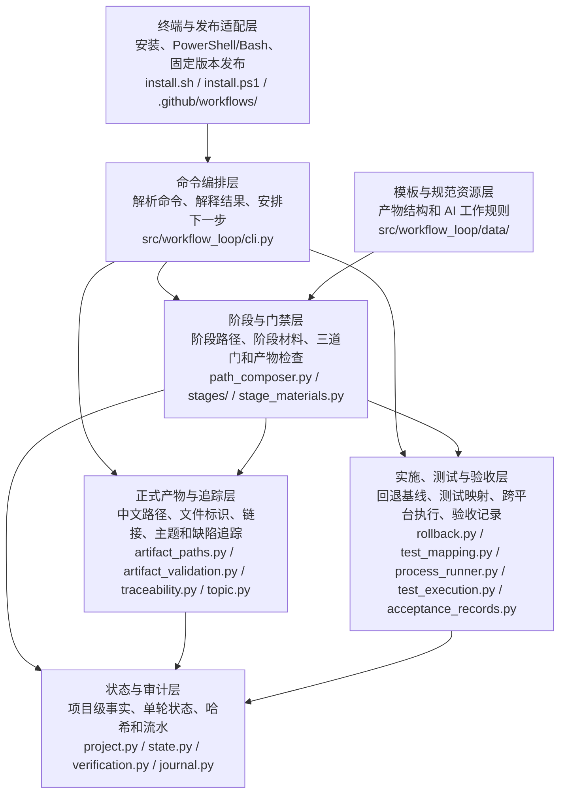

### 4.2 终端与发布适配层

- **承接内容**：安装到项目、固定版本、Windows 原生支持。
- **代码职责**：`install.sh` 是 macOS/Linux 安装适配器；计划新增的 `install.ps1` 是 PowerShell 安装适配器；二者只做环境检查、终端确认、固定 uv 0.11.33 下载校验和 Python 安装事务调度。脚本按操作系统和处理器选择官方发布资产，使用脚本内固定的 SHA-256 预期摘要校验文件，不把同时下载的摘要当作唯一信任来源。`.github/workflows/release.yml` 计划负责标签 `v0.1.0` 的测试、构建、PyPI 发布和三平台安装验证。
- **边界**：不在 Shell 中复制项目骨架；不自动下载 Python；不提供升级；不使用 Windows 10 或 Windows 11 版本号代替 PowerShell 和 Python 的真实运行条件。
- **穿刺依据**：Apple Silicon macOS 已实际确认 uv 0.11.33 可以使用现有 Python、禁止托管和下载 Python，并在指定的 `UV_TOOL_DIR`（工具环境目录）与 `UV_TOOL_BIN_DIR`（命令目录）中安装和运行 `workflow-loop` 0.1.0；Windows 和 Linux 留给对应平台发布测试。GitHub 托管 Windows 作业只能证明它实际使用的 Windows Server 环境，不作为某个 Windows 桌面版本的执行证据。
- **验证位置**：`tests/test_installer.py` 和三平台发布任务。

### 4.3 命令编排层

- **承接内容**：开工、继续、讨论、门禁、返回、收工和作废。
- **代码位置**：`src/workflow_loop/cli.py`。
- **主要符号**：`cmd_start()` 是“开始或继续轮次”；`cmd_discuss()` 是“列出必读材料”；`cmd_gate()` 是“执行阶段门禁”；`cmd_return()` 是“返回上游”；`cmd_done()` 是“正式收工”；`cmd_abort()` 是“整轮作废”。
- **计划修改**：增加 `workflow --version` 身份输出；把公开 `install-project` 改成只接受一次性事务的内部 `_install-project`；抽离材料、路径、进程和事务逻辑；所有用户可见命令增加中文说明。
- **验证位置**：`tests/test_commands.py`。

### 4.4 阶段与门禁层

- **承接内容**：三种工作意图的阶段顺序、每阶段材料和固定检查。
- **代码位置**：`path_composer.py` 的 `build_stage_path()` 是“生成阶段路径”；`stages/base.py` 的 `StageStrategy` 是“阶段共同接口”；`stages/stages.py` 保存具体阶段。
- **计划接口**：`StageStrategy.materials()` 是“阶段材料清单”，返回顺序、用途和项目内真实文件路径；`stage_materials.py` 负责检查文件并计算清单内容哈希。
- **边界**：门禁能证明材料清单被加载、文件结构和固定字段满足规则，不能证明 AI 真正理解了正文，也不能代替用户判断语义。
- **验证位置**：`tests/test_path_composer.py`、`tests/test_stages.py`、`tests/test_commands.py`。

### 4.5 正式产物与追踪层

- **承接内容**：中文正式文件名、稳定文件标识、产品链接、主题关系和交付追踪。
- **计划代码位置**：`artifact_paths.py` 是“正式产物路径唯一来源”。固定常量保存产品总说明、代码设计、各索引和追踪表路径；动态函数根据已登记文件标识生成主题、穿刺和缺陷路径。
- **项目状态**：`ProjectState.artifact_file_keys` 是“显示名称到稳定文件标识的项目级映射”，按功能、主题、穿刺和缺陷分组，跨轮次保存。显示名称仍写入正文，不能用文件标识代替。
- **依赖**：`artifact_validation.py`、`verification.py`、`topic.py`、`topic_relations.py`、`traceability.py`、`bug_record.py` 和各 Stage 都只能调用本层，不能自行拼接后缀。
- **验证位置**：计划新增 `tests/test_artifact_paths.py`，并更新全部文档结构测试。

### 4.6 实施、测试与验收层

- **承接内容**：实施前副本、测试代码映射、机器执行记录、主题验收和最终回归。
- **代码位置**：`rollback.py`、`test_mapping.py`、`test_execution.py`、`test_runner.py`、`acceptance_records.py`。
- **计划新增**：`test_entry.py` 是“项目全量测试入口选择器”；`process_runner.py` 是“跨平台受控进程执行器”。
- **边界**：测试代码阶段的局部运行只用于开发反馈；正式主题结果只能来自测试执行机器记录；最终回归只使用项目配置的全量入口。
- **验证位置**：`tests/test_rollback.py`、`tests/test_test_mapping.py`、`tests/test_test_execution.py`、`tests/test_test_runner.py`、`tests/test_acceptance_records.py`。

### 4.7 状态与审计层

- **承接内容**：跨轮次项目事实、单轮阶段状态、验证哈希、恢复进度和流水。
- **代码位置**：`project.py` 的 `ProjectState` 是“项目级状态”；`state.py` 的 `WorkflowState` 是“单轮状态”；`verification.py` 是“下游有效性检查”；`journal.py` 是“追加式流水记录”。
- **计划状态变化**：
  - `ProjectState.test_entry` 改为操作系统到参数数组的映射，不再默认 `scripts/test_all.sh`。
  - 删除修改前全量测试的 `TestBaselineState` 业务用途。
  - `RollbackState` 增加受管文档、项目字段和逐项恢复进度。
  - `StageState` 保存最新版实施计划确认哈希和材料清单哈希。
- **验证位置**：`tests/test_project.py`、`tests/test_state.py`、`tests/test_verification.py`、`tests/test_rollback.py`。

### 4.8 模板与规范资源层

- **承接内容**：正式文档结构、阶段调查与讨论规则、全局写作要求。
- **代码位置**：`src/workflow_loop/data/Template_Repository/` 是“产物模板仓库”；`src/workflow_loop/data/Standardized_Repository/` 是“阶段工作规范仓库”。项目内 `.workflow_loop/` 是安装后的运行副本。
- **计划修改**：模板正文和规范正文全部改用中文正式产物路径；模板仓库内部文件名继续使用英文。包内源文件与当前项目运行副本必须逐字节一致。
- **验证位置**：安装资源测试和材料加载测试。

## 5. 架构关键节点

### 5.1 正式产物寻址

- **为什么关键**：阶段门禁、哈希、链接、清理和恢复都依赖同一条路径；任何模块自行拼接都会导致读错或删错文件。
- **代码位置**：计划新增 `artifact_paths.py`；`ProjectState.artifact_file_keys` 保存稳定映射。
- **主要处理**：规范化显示名，过滤跨平台危险字符，处理空名称、保留名称、长度和冲突；保存映射；按产物类型生成固定中文路径。
- **状态和数据**：映射写入 `.workflow_loop/project.json`，`abort` 必须恢复本轮登记前的值。
- **失败结果**：目标冲突、路径越界、映射漂移或中英两套并存时停止门禁，不覆盖文件。
- **验证位置**：危险字符、Unicode 规范化、大小写冲突、Windows 保留名和重复名称测试。

### 5.2 阶段材料清单

- **为什么关键**：AI 必须读取当前阶段材料，但终端打印全文既难读也不能证明 AI 使用了文件工具。
- **代码位置**：计划新增 `stage_materials.py`，修改 `StageStrategy.materials()`、`cmd_discuss()` 和 `cmd_gate()`。
- **主要处理**：按全局规范、模板、阶段规范、附加材料顺序组成清单；逐项检查普通文件和可读性；打印绝对路径、用途和下一步；保存当前内容哈希。
- **失败结果**：任一材料缺失或不可读时，不登记加载记录；第一道门拒绝继续。
- **验证位置**：全部阶段材料、缺失文件、重复指路和材料变化测试。

### 5.3 安装事务

- **为什么关键**：全局工具、PATH、`AGENTS.md` 和 `.workflow_loop/` 必须一起成功或一起恢复。
- **代码位置**：计划扩展 `installer.py`；`install.sh` 和 `install.ps1` 调用内部 `_install-project`。
- **主要处理**：无写入预检；打印完整范围；一次确认；保存原内容和不存在记录；准备临时骨架；用 uv 0.11.33 显式指定现有 Python，传入 `--no-managed-python`（不使用 uv 管理的 Python）和 `--no-python-downloads`（不下载 Python），并把工具环境和命令路径设为事务已经记录的位置；安装固定包；从实际命令路径验证身份；替换项目文件；成功清理事务。
- **失败结果**：按事务只撤销本次动作；恢复不完整时保留事务并停止，下次先恢复。
- **验证位置**：取消零写入、重复安装、异常骨架、失败恢复、事务重试和三平台冒烟测试。

### 5.4 整轮回退清单

- **为什么关键**：`abort` 必须恢复正式文档、项目字段、测试入口、代码和测试，不能只恢复实施代码。
- **代码位置**：扩展 `rollback.py` 的清单和恢复函数；`cmd_start()`、测试计划、实施和测试代码阶段分批追加。
- **主要处理**：开工先保存受管文档和项目字段；修改入口脚本前保存脚本与旧配置；实施和测试代码写入前保存原文件；作废前完整预检；逐项恢复并验证。
- **失败结果**：任一副本缺失、哈希不符或恢复失败时保持 `active`，保存逐项进度；重试只继续未完成项目。
- **验证位置**：早期作废、清场恢复、入口恢复、新文件删除、部分恢复重试和完成后清理测试。

### 5.5 项目全量测试入口与跨平台执行

- **为什么关键**：Qt、Node、Python 等项目使用不同工具链；Windows 也不能用 Unix 命令拆分和进程终止方式。
- **代码位置**：计划新增 `test_entry.py` 和 `process_runner.py`；修改 `project.py`、`test_runner.py`、`test_execution.py` 和 `verification.py`。
- **主要处理**：按当前操作系统选择 `windows`、`linux`、`darwin` 或 `default` 参数数组；使用 `shell=False` 直接执行；POSIX 使用进程组，Windows 使用进程树清理。
- **失败结果**：入口缺失或环境不可用时返回测试计划；不静默安装环境；最终回归失败不能进入整体验收。
- **验证位置**：入口选择、参数保真、超时清理、非零退出和三平台测试。

### 5.6 实施中重新确认计划

- **为什么关键**：实施发现代码落点需要调整时，可以在产品、验收和测试范围不变的前提下修订计划，但不能把实施中的文件当成原始副本。
- **代码位置**：`ImplStage`、`cmd_gate()` 和 `rollback.prepare_impl()`。
- **主要处理**：停止代码修改；更新实施计划；用户重新确认；保存最新版计划哈希；只为新增且尚未修改的路径补原内容；再次准备后继续。
- **失败结果**：计划涉及产品、验收、测试或新技术不确定性时，不能留在同一阶段，必须返回对应上游。
- **验证位置**：计划扩展、原副本不覆盖、未确认计划和跨阶段返回测试。

### 5.7 返回与直接影响失效

- **为什么关键**：问题原因决定返回位置；主题依赖不能替代真实影响调查。
- **代码位置**：`cmd_return()`、`verification.py`、`traceability.reset_topics_for_return()`。
- **主要处理**：AI 调查并让用户确认目标与直接受影响主题；程序验证目标在当前阶段之前；清除这些主题和对应下游状态；返回穿刺时清除跳过标记。
- **失败结果**：当前阶段、后续阶段、本轮不存在的阶段和已结束轮次全部拒绝。
- **验证位置**：任意更早阶段、无固定选项、无自动依赖扩展和局部结果保留测试。

## 6. 各产品功能的代码设计

### 6.1 【功能】安装到项目

#### 6.1.1 产品要求

用户在项目根只执行一条官方命令。macOS 和 Linux 使用 Bash；原生 Windows 使用 Windows PowerShell 5.1 或 PowerShell 7，不按 Windows 10 或 Windows 11 版本号分支。安装器先说明全部修改范围，确认 Python 3.11 或更高版本和现有 `workflow` 身份，再把固定 `0.1.0` 全局命令与项目骨架作为一个事务安装。详见[功能文档](./功能_安装到项目.md)。

#### 6.1.2 完整过程

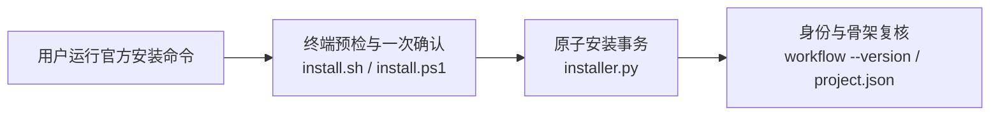

| 步骤 | 代码位置 | 处理和状态 | 失败结果 | 验证位置 |
|---|---|---|---|---|
| 预检 | 两个安装脚本，计划 | 检查 Python、命令身份、路径、uv 0.11.33 平台资产和写入范围；尚不写入 | 说明缺项并停止 | 安装脚本测试 |
| 安装 | `installer.py`，计划扩展 | 保存事务，校验固定资产摘要，使用现有 Python 安装固定包，写 `AGENTS.md`、模板规范和 `project.json` | 恢复本次动作 | `test_installer.py` |
| 复核 | `cli.py` 的版本入口，计划 | 返回 `workflow-loop 0.1.0`，骨架完整才成功 | 不把半套内容标为已安装 | 三平台冒烟测试 |

#### 6.1.3 规则和异常

| 条件 | 对应代码 | 结果 |
|---|---|---|
| 没有兼容 Python | 安装脚本预检 | 不下载 Python，不写项目 |
| 同名命令身份不符 | 版本身份检查 | 显示路径和身份后停止 |
| 项目已完整安装 0.1.0 | `installer.py` 重复安装检查 | 零修改退出 |
| 事务中途失败 | 安装恢复函数 | 恢复原内容，未恢复完整则保留事务 |

### 6.2 【功能】开始或继续一轮工作

#### 6.2.1 产品要求

AI 先执行只读状态检查。存在进行中轮次时继续；否则根据用户需求选择从零创建、修改产品或修复缺陷，并生成固定阶段路径。详见[功能文档](./功能_开始或继续一轮工作.md)。

#### 6.2.2 完整过程

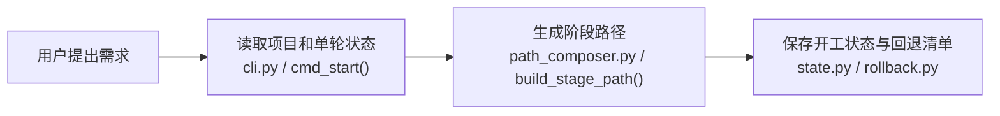

| 步骤 | 处理和状态 | 失败结果 | 验证位置 |
|---|---|---|---|
| 状态检查 | 只读 `project.json` 和 `state.json` | 未安装时说明官方安装方式，不创建状态 | `test_commands.py` |
| 新建轮次 | 创建 `WorkflowState`，首阶段为进行中 | 已有 active 状态时拒绝 | `test_state.py` |
| 开工基线 | 计划保存受管文档和项目字段；从零清场在保存后执行 | 无可靠副本时不清场 | `test_rollback.py` |

#### 6.2.3 规则和异常

| 条件 | 对应代码 | 结果 |
|---|---|---|
| 已有进行中轮次 | `cmd_start()` | 输出当前阶段和下一步 |
| 未给工作意图 | `cmd_start()` | 只读指路，不初始化 |
| 修复缺陷且设计未初始化 | `build_stage_path()` | 前置项目设计初始化 |

### 6.3 【功能】推进并确认工作环节

#### 6.3.1 产品要求

程序指出必读材料，AI 用文件工具读取并与用户讨论。每阶段依次通过“讨论完成、程序检查、用户确认”，并把命令含义说清楚。详见[功能文档](./功能_推进并确认工作环节.md)。

#### 6.3.2 完整过程

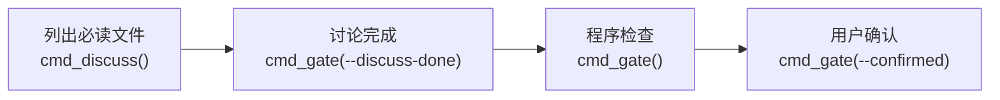

| 步骤 | 处理和状态 | 失败结果 | 验证位置 |
|---|---|---|---|
| 材料指路 | 计划只打印绝对路径、用途和顺序，保存内容哈希 | 缺失或不可读时不登记 | 材料清单测试 |
| 讨论门 | 写 `discussion_complete=true` | 材料记录不匹配时拒绝 | 门禁顺序测试 |
| 检查门 | 执行 Stage 固定校验 | 产物不满足时停在当前阶段 | 阶段测试 |
| 确认门 | 重新校验后写用户确认并推进 | 文件后来失效时清除旧校验 | 命令测试 |

#### 6.3.3 规则和异常

程序不声称能证明 AI 已经读懂文件；这是阶段规范和用户确认负责的语义判断。重复 `discuss` 只重新指路，不自动回滚已经通过的门禁；材料内容改变时，后续第一道门必须使用最新哈希。

### 6.4 【功能】维护产品设计

#### 6.4.1 产品要求

产品总说明保存通用规则和当前功能入口，每个当前功能有一份中文功能文档。修改产品时只改受影响内容；移除已经交付的功能时保留历史文档并标记移除。详见[功能文档](./功能_维护产品设计.md)。

#### 6.4.2 完整过程

| 步骤 | 处理和状态 | 失败结果 | 验证位置 |
|---|---|---|---|
| 分配路径 | 计划生成并保存功能显示名到文件标识映射 | 冲突或危险路径时停止 | `test_artifact_paths.py` |
| 写文档 | `spec/产品总说明.md` 和实际链接的功能文档 | 不能保留中英两套 | 产品结构测试 |
| 门禁 | 检查章节、链接、追踪和本轮变化 | 共同规则修改不强迫无关功能变化 | `test_stages.py` |

#### 6.4.3 规则和异常

产品设计哈希只覆盖产品总说明和它实际链接的功能文档，不扫描目录中全部历史文件。修复缺陷需要改变产品行为时，作废修复轮次并新开修改产品轮次。

### 6.5 【功能】维护代码设计

#### 6.5.1 产品要求

同一份 `spec/代码架构设计.md` 先保存可实施设计，最终再按真实代码同步；不能让代码现状反过来制造产品要求。详见[功能文档](./功能_维护代码设计.md)。

#### 6.5.2 完整过程

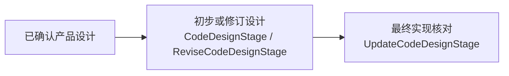

| 场景 | 代码位置 | 处理结果 | 失败结果 |
|---|---|---|---|
| 从零设计 | `CodeDesignStage` | 标记计划模块和接口 | 产品未确认时不开始 |
| 已有项目初始化 | `ProjectDesignInitStage` | 同时形成真实调查证据 | 证据不足不标记初始化 |
| 产品修改 | `ReviseCodeDesignStage` | 只修改受影响设计 | 不能写成已实现 |
| 最终同步 | `UpdateCodeDesignStage` | 每个功能映射真实代码和测试 | 产品变化返回产品设计，代码缺失返回实施 |

#### 6.5.3 规则和异常

前段确认写 `architecture.preliminary_done`，最终确认写 `architecture.detailed_done`。文件存在不能代替任何完成标记。

### 6.6 【功能】复现产品缺陷

#### 6.6.1 产品要求

一轮修复只处理一个具体缺陷。AI 必须在真实环境记录输入、实际结果、期望结果、根因位置和证据，并由用户确认一个验收主题。详见[功能文档](./功能_复现产品缺陷.md)。

#### 6.6.2 完整过程

| 步骤 | 代码位置 | 状态或输出 | 失败结果 |
|---|---|---|---|
| 文件寻址 | 计划 `artifact_paths.py` | `bug/缺陷_<标识>.md`、`bug/索引.md` | 多缺陷混入同轮时拒绝 |
| 结构校验 | `validate_reproduce_documents()` | 当前轮次、根因和证据一致 | 无真实路径或证据时失败 |
| 登记主题 | `ProjectState.topic_history` | 保存永久唯一主题显示名和文件标识 | 历史重名时拒绝 |

#### 6.6.3 规则和异常

复现失败或根因未确认时不能进入穿刺。发现需要改变产品要求时，本轮不退到不存在的产品阶段，而是作废后新开修改产品。

### 6.7 【功能】验证技术不确定性

#### 6.7.1 产品要求

只有现有事实无法回答且会改变后续决定的技术问题才进入穿刺。用户确认清单或明确跳过；真实结论影响设计时先更新设计。详见[功能文档](./功能_验证技术不确定性.md)。

#### 6.7.2 完整过程

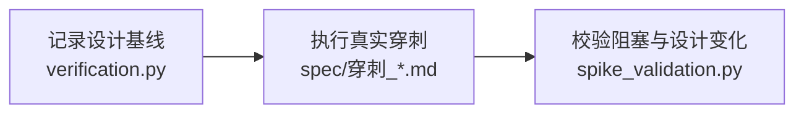

| 步骤 | 状态或输出 | 失败结果 | 验证位置 |
|---|---|---|---|
| 入场 | 保存产品和代码设计哈希 | 旧轮次无基线且要求证明变化时失败 | 穿刺基线测试 |
| 执行 | 中文清单、详情和临时目录 | 敏感外部动作需再次确认 | 穿刺规范 |
| 门禁 | 检查编号、轮次、状态、风险和影响 | 任一项阻塞则不能推进 | `test_spike_validation.py` |

#### 6.7.3 规则和异常

临时文件确认后清理；正式结论文档保留。跳过只在用户明确确认后执行，不生成虚假结论。

### 6.8 【功能】制定验收与测试计划

#### 6.8.1 产品要求

验收计划先确定主题、关系和可判断的验收条件；测试计划再建立测试项、直接影响范围和项目自己的全量测试入口。本阶段不执行修改前全量测试。详见[功能文档](./功能_制定验收与测试计划.md)。

#### 6.8.2 完整过程

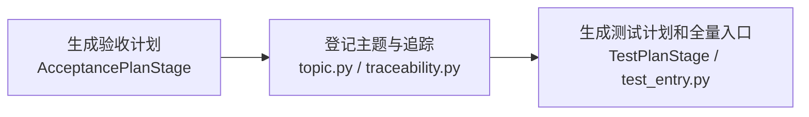

| 步骤 | 状态或输出 | 失败结果 | 验证位置 |
|---|---|---|---|
| 验收计划 | 中文索引、主题计划、需求交付追踪表 | 主题遗漏、重名或循环时失败 | 验收结构测试 |
| 测试计划 | 每条 AC 有 TC；按平台配置入口参数数组 | 环境缺失且用户不准备时停留 | 测试计划测试 |
| 入口脚本 | 修改前先加入回退清单 | 无原始副本时禁止写入 | 回退测试 |

#### 6.8.3 规则和异常

测试入口不随安装包下发。需要管道或多条命令时写入项目脚本，再把脚本作为单一参数数组入口。验收条件不能判断时返回验收计划，产品结果未定义时返回产品设计。

### 6.9 【功能】实施并保护项目修改

#### 6.9.1 产品要求

全部主题的实施前计划经用户确认并建立真实文件副本后，才能修改代码。同阶段计划变化必须停止修改、更新计划、重新确认和补充回退路径。详见[功能文档](./功能_实施并保护项目修改.md)。

#### 6.9.2 完整过程

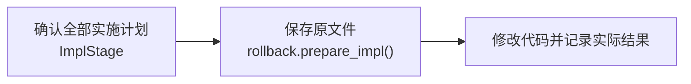

| 步骤 | 状态或输出 | 失败结果 | 验证位置 |
|---|---|---|---|
| 计划 | 中文实施索引和每主题实施记录 | 有未决问题时第一道门失败 | `test_stages.py` |
| 准备 | 清单保存旧内容或不存在记录 | 路径已提前变化时拒绝 | `test_rollback.py` |
| 实施 | 实际结果必须符合最新版确认计划 | 产品或测试范围变化时返回上游 | 实施门禁测试 |

#### 6.9.3 规则和异常

不要求实施前全量测试通过。已经离开实施阶段才发现计划需改时，使用 `return` 返回；不能用重新建立基线把实施中内容冒充原状态。

### 6.10 【功能】编写并执行测试

#### 6.10.1 产品要求

测试代码要能追踪到主题、测试项、验收条件和产品代码入口。正式执行前按测试项登记参数数组；程序实际运行并保存机器事实；不同测试项不能共用一条执行记录。详见[功能文档](./功能_编写并执行测试.md)。

#### 6.10.2 完整过程

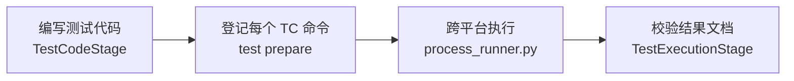

| 步骤 | 状态或输出 | 失败结果 | 验证位置 |
|---|---|---|---|
| 测试代码 | `Workflow-Test` 追踪标识和测试文件副本 | 产品代码变化时失败 | `test_test_mapping.py` |
| 登记 | 每个自动化或混合 TC 一个任务 | 纯人工 TC 不登记命令 | `test_test_execution.py` |
| 执行 | 参数数组、时间、退出码、代码和测试哈希 | 失败清除旧成功记录；依赖项停止 | 执行测试 |
| 结果 | 中文主题测试结果与机器记录一致 | 第二、第三道门不重跑 | 结果校验测试 |

#### 6.10.3 规则和异常

Windows 使用原生进程树终止，macOS/Linux 使用进程组。工具链或环境问题返回测试计划；产品代码、测试代码、验收条件或产品规则问题按真实来源返回对应阶段。

### 6.11 【功能】验收并完成交付

#### 6.11.1 产品要求

主题验收逐条确认验收条件；所有主题通过后程序运行最终全量回归；用户再判断整轮结果；最后同步代码设计并正式收工。详见[功能文档](./功能_验收并完成交付.md)。

#### 6.11.2 完整过程

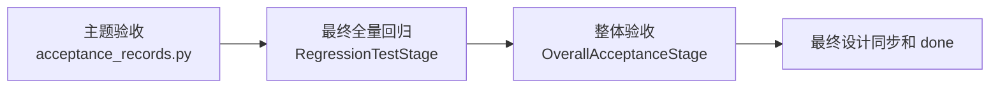

| 步骤 | 状态或输出 | 失败结果 | 验证位置 |
|---|---|---|---|
| 主题验收 | 每条 AC 当前有效记录和中文结果文档 | 自动化或人工证据不全时不能通过 | 验收记录测试 |
| 最终回归 | 第二道门运行项目全量入口并保存机器记录 | 非零退出时不进整体验收 | `test_test_runner.py` |
| 整体验收 | 用户确认主题合并后满足需求；无独立结果文档 | 不通过时调查并返回 | 命令测试 |
| 收尾 | 最终代码设计确认后 `done` 清理临时副本 | 不增加第二次用户结束确认 | 完成测试 |

#### 6.11.3 规则和异常

缺陷在主题验收通过时仍不关闭；最终回归与整体验收都通过后才写“已修复并验收”。最终回归和整体验收都不生成独立正式文档。

### 6.12 【功能】返回上游重新处理

#### 6.12.1 产品要求

AI 调查问题来源，向用户说明建议目标和直接受影响主题；用户确认后，程序返回本轮更早阶段并清除对应旧结果。详见[功能文档](./功能_返回上游重新处理.md)。

#### 6.12.2 完整过程

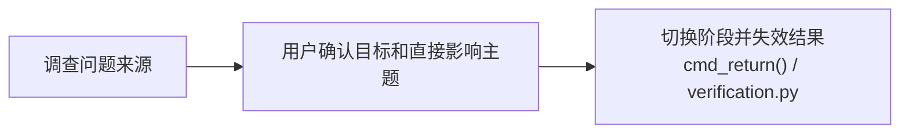

| 步骤 | 状态或输出 | 失败结果 | 验证位置 |
|---|---|---|---|
| 目标检查 | 目标必须存在于当前 `stage_path` 且更早 | 固定选项、当前或后续阶段不允许 | 返回命令测试 |
| 失效 | 清门禁、主题机器记录、结果文档和追踪状态 | 不自动扩大到全部依赖主题 | 验证失效测试 |
| 恢复 | 写原因和恢复上下文，从目标阶段重新讨论 | 修改上游后才调用 return 属于非法流程 | Journal 测试 |

#### 6.12.3 规则和异常

返回穿刺时清除原跳过状态。修复缺陷需要改变产品行为时，不返回本轮不存在的产品阶段，而是整轮作废后新开修改产品。

### 6.13 【功能】整轮作废并恢复

#### 6.13.1 产品要求

用户放弃整个进行中轮次时，程序把受管文档、代码、测试、测试入口和项目字段恢复到开工前，并删除本轮新文件。本轮作废内容不归档。详见[功能文档](./功能_整轮作废并恢复.md)。

#### 6.13.2 完整过程

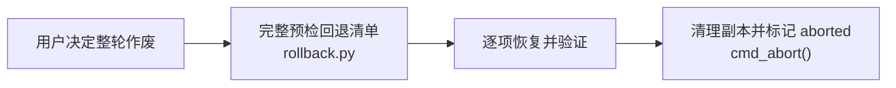

| 步骤 | 状态或输出 | 失败结果 | 验证位置 |
|---|---|---|---|
| 预检 | 核对全部清单、副本、哈希和项目字段 | 缺失时保持 active | 回退完整性测试 |
| 恢复 | 旧文件还原、新文件删除、字段恢复 | 保存逐项进度，不伪装成功 | 部分恢复测试 |
| 完成 | 验证与开工基线一致，删除临时副本，写 `aborted_at` | 清理失败仍保持 active | 作废命令测试 |

#### 6.13.3 规则和异常

取消一个功能不使用整轮作废。已完成、已作废或没有进行中状态时拒绝。重试只继续未完成恢复项，不能再次覆盖已经恢复后产生的新修改。

## 7. 多个功能共同使用的代码

### 7.1 正式产物引用

计划由 `artifact_paths.py` 和 `ProjectState.artifact_file_keys` 共同提供。它服务产品设计、穿刺、计划、实施、测试、验收、追踪、缺陷和作废。修改它会影响所有正式文档，因此必须集中测试固定路径、动态文件标识、链接和清理范围。

### 7.2 阶段策略和材料

`StageStrategy` 是各阶段共同接口；计划的 `materials()` 统一描述材料顺序和用途。`stage_materials.py` 负责文件事实，`cmd_discuss()` 只负责用户可读输出，`cmd_gate()` 只负责检查登记和推进。三者不能互相复制规则。

### 7.3 项目状态、单轮状态和流水

`ProjectState` 保存安装版本、设计初始化、主题历史、文件标识映射和按系统测试入口；`WorkflowState` 保存当前轮次和门禁；Journal 只追加命令事实。正式文档内容不写入状态或流水，回退真实副本只放在临时回退目录。

### 7.4 验证失效

`verification.py` 分别计算验收计划、测试计划、实施、测试代码、主题测试结果、主题验收结果和最终回归的当前哈希。返回上游只清除用户确认的直接受影响主题。独立主题可以保留旧代码快照哈希；整项目哈希变化本身不能删除独立主题结果，最终全量回归负责发现更广影响。

### 7.5 受控进程执行

计划的 `process_runner.py` 同时服务主题测试和最终回归，接受工作目录、参数数组、环境和超时，返回开始结束时间、退出码和输出摘要。它不解析 Shell 字符串，不安装依赖，不判断失败属于哪一层。

### 7.6 整轮回退

扩展后的 `rollback.py` 为开工、测试入口、实施和测试代码提供同一份原始清单。追加新路径时不得覆盖第一次保存的原内容；`done` 和成功 `abort` 都删除副本；失败 `abort` 保留副本和恢复进度。

## 8. 产品设计与代码实现的差异

| 差异 | 产品设计要求 | 当前代码或计划状态 | 影响 | 处理决定 | 证据状态 |
|---|---|---|---|---|---|
| 正式产物仍用英文路径 | 正式文档使用中文文件名 | 多个模块硬编码旧路径 | 所有文档功能 | 新增统一路径模块，一次迁移并删除旧文件 | 代码确认，待实施 |
| 文件名直接使用主题文字 | 显示名称与稳定文件标识分离 | 当前从文件名反推主题 | 计划、测试、验收、缺陷 | 增加项目级映射和统一解析 | 代码确认，待实施 |
| 安装依赖已有工具且不可整体回退 | 一次、固定版本、三平台、原子安装 | 只有旧 Bash 路径 | 安装到项目 | 新增 PowerShell、事务和发布任务 | 代码确认，待实施 |
| `discuss` 打印全文 | 只列绝对必读路径，AI 用工具读取 | 当前终端输出全部正文 | 全部阶段 | 抽离材料清单并统一第一道门检查 | 运行确认，待实施 |
| 作废只覆盖部分代码 | 恢复全部受管内容和项目字段 | 早期文档和字段无副本 | 整轮作废 | 开工建立清单，各阶段追加 | 代码确认，待实施 |
| 测试入口是字符串并默认本项目脚本 | 按系统保存参数数组，无通用脚本 | 使用 `shlex` 和默认 `scripts/test_all.sh` | 计划、测试、回归 | 新增入口选择器，删除修改前全量测试 | 代码确认，待实施 |
| Windows 进程处理缺失 | 原生 Windows 超时后无遗留进程 | 当前只用 POSIX 进程组 | 测试与回归 | 新增跨平台执行器 | 代码确认，待实施 |
| 返回目标固定并自动扩展依赖主题 | AI 调查、用户确认，程序只验更早阶段 | argparse 固定选项并扩展依赖主题 | 返回和重做 | 删除固定选项与自动扩展 | 代码确认，待实施 |
| 实施中不能安全扩展计划 | 可重新确认且保留最初原副本 | 重复准备会被阻止 | 实施与作废 | 保存最新版计划哈希，只补未修改路径 | 代码确认，待实施 |
| 13 个产品功能尚未全部映射到代码设计 | 每项产品功能都有实现流程 | 旧文档只有两个功能 | 全部功能 | 本文已补计划映射，最终阶段按真实代码复核 | 文档已修订，待代码验证 |

## 9. 最终同步结论

暂无。

当前工作流编号是 `2026-07-30-0740-product_change`。本文现在记录计划设计，不声明本轮代码已经实现。只有实施、主题测试、主题验收、最终全量回归和整体验收全部完成，并且真实代码与 13 个功能逐项核对后，才能在 `update_code_design`，中文含义是“最终代码设计同步”阶段填写本轮最终同步结论。

上一轮 `2026-07-20-0637-from_scratch` 的最终同步记录只作为旧实现历史基线保留在 Git 历史和对应追踪记录中，不冒充本轮证据。
